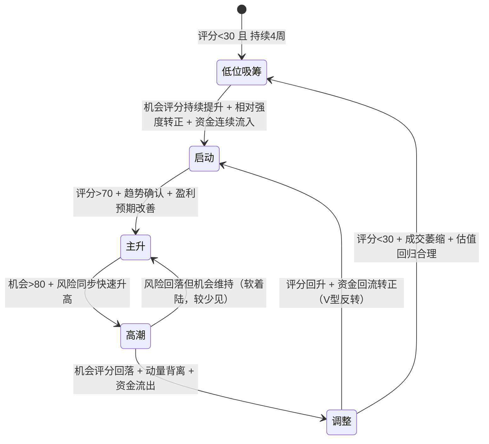

# 市场板块智能监控系统研究报告 V2.2.2

## 1. 系统定位与目标

### 1.1 系统本质定义

本系统不是：

- ❌ **每日行情扫描器** — 不关注"今天哪个板块涨了"
- ❌ **涨幅排名工具** — 不输出"今日板块涨幅榜"
- ❌ **RSI超买超卖工具** — 不提供单一技术指标的买卖建议
- ❌ **短线交易信号机** — 不预测明天涨跌，不推荐买卖时点

本系统是：

- ✅ **板块生命周期智能识别系统（Sector Intelligence System）**
- ✅ 面向**中长期投资决策**（3–5年维度）的产业趋势与板块状态分析平台
- ✅ 通过**多周期、多因子、多源数据融合**，识别不同产业板块所处的**发展阶段、资金状态、情绪状态和风险水平**
- ✅ 为投资组合的**方向性调整**提供决策输入，而非交易执行指令

### 1.2 非交易系统约束（V2.1新增）

> 本系统不是短线交易信号生成器，不预测单日涨跌，不直接输出买卖建议。系统目标是识别板块生命周期状态，为投资组合管理和V6决策系统提供结构化证据。

**防止Agent开发偏移**：系统负责"认知"，不是"执行"。不得将系统演化为涨幅榜、RSI策略或买卖提醒工具。

### 1.3 信息处理链条

```
产业趋势分析
     ↓
板块状态识别（所处生命周期阶段）
     ↓
机会/风险评估（双维度量化）
     ↓
板块轮动排序（相对强度比较）
     ↓
结构化信号输出
     ↓
输入 V6 决策系统（Evidence Engine）
```

### 1.4 系统能力边界

| 能力      | 说明                             |
| ------- | ------------------------------ |
| **识别**  | 板块处于哪个生命周期阶段（启动/主升/高潮/调整/低位吸筹） |
| **评估**  | 当前的机会水平（成长空间）和风险水平（过热程度）       |
| **比较**  | 板块间的相对强弱和资金轮动方向                |
| **预警**  | 泡沫风险等级、阶段转换信号、资金异常             |
| **不负责** | 仓位管理、买卖执行、短线择时                 |

***

## 2. 指标体系概览

指标体系分为宏观层、板块层和技术层三级，覆盖全方位因素：

- **宏观/流动性**：经济增长率、利率（央行利率、贷款市场报价利率LPR）、通胀（CPI/PPI）、货币供应量M2增速、信贷规模增速、外汇储备、全球风险溢价（VIX、BRENT油价）等。用于判断整体风险偏好和流动性环境。
- **资金流向**：**ETF/基金净流入**（例如追踪各板块主题ETF的每日/周净流入额）、**融资融券余额**（反映配资杠杆）、**机构持仓集中度**（如公募基金/券商资管/保险在该板块的持仓占比变动）、**主力大单成交**（板块内大额买卖记录）等。资金流指标可作为市场情绪的领先反应；比如权益类ETF吸金创纪录且科技ETF流入最大，说明技术板块资金偏好。
- **估值与盈利匹配**：静态估值水平（PE、PB与历史均值或其他板块比较）、动态估值（估值/盈利增速差值）、隐含市盈率（EPS预期PE）、PEG等。关注估值是否已远高于盈利增长预期、是否出现泡沫风险。
- **成交量/换手/集中度**：板块整体成交额、换手率、个股集中度（头部个股占比）、滚动成交量均线与历史比等。成交及换手异常放大往往提示泡沫或主力派发期。
- **高管/产业资本行为**：板块内上市公司董监高减持、PE/VC退出、产业链上下游大宗交易等。高管集中减持往往是估值过高的信号。
- **社会舆情与关注度**：利用**百度指数**、**微博/雪球/知乎话题热度**、**新闻报道量**、**Google/百度搜索量**等指标衡量大众关注度。学术研究表明，关注度上升会加速股价上涨，但在泡沫高位时也可能加速回落。
- **期权/衍生品信号**：板块相关期权隐含波动率（IV）及斜度，期货持仓净多/净空、期权交易量、OI变化等。IV飙高往往伴随恐慌；期权卖方压力可提示未来波动。
- **技术面指标**：趋势强度（板块指数均线、ADX）、动量指标（相对强弱指数RSI、MACD背离）、布林带宽度、均线系统（多头排列）、K线形态等。用于捕捉趋势变化和超买超卖状态。
- **政策信号**：跟踪中央和行业政策，如五年规划、国务院重要文件、行业指导目录、减税政策等。比如碳达峰行动方案明确2030年前风光发电装机12亿千瓦；"十五五规划建议"重点强调AI、生物医药等科技领域，可作为板块前景重要参考。

### 2.1 指标量化与标准化

下表列举主要指标类别、计算方法、频率与标准化建议（初始权重需回测验证）：

| 指标类别    | 具体指标及公式                                                                                                    | 数据频率  | 标准化/缺失处理                              | 建议权重（示例） |
| ------- | ---------------------------------------------------------------------------------------------------------- | ----- | ------------------------------------- | :------: |
| 宏观/流动性  | GDP增速、CPI/PPI、LPR(1M/贷款基准)、M2同比、社融增速、美元指数、VIX、国债收益率差等                                                      | 月度或季报 | 与同期历史中值比较归一化；缺失用最近值或移动平均              |    10%   |
| 资金流向    | **ETF净流入**：(\frac{\text{本期ETF份额变动} \times 基金净值}{\text{板块流通市值}})；**公募资金流向**（机构研报估计）；**融资余额变化率**；**大宗买卖净额**等 | 周/日级  | 流入额除以板块市值归一化；缺失设0                     |    20%   |
| 估值/盈利匹配 | 板块PE与10年均值差值、PE增速-盈利增速、PEG（PE/盈利增速）、PB、市销率等                                                                | 季度    | PE等取全样本分位数或Z分数；盈利缺失可用滚动年化值            |    15%   |
| 成交/换手   | 板块平均换手率、月成交额/流通市值、振幅（High-Low）/Open、前十大权重大盘股占比                                                             | 周度    | 当周成交除过去N周均值归一化；换手率Z-score化；缺失视为0      |    15%   |
| 高管/产业资本 | 董监高减持次数率（减少人数/总董监高数）、大股东股权变化、产业链大额交易（公告）                                                                   | 月度    | 减持公告+1计数，用衰减因子加权求和；比率归一化              |    10%   |
| 社会热度    | **百度搜索指数**（行业关键词）Z分数；**微博舆情数**（情绪倾向）与量；**新闻提及量**                                                           | 日/周   | 各渠道指数归一化（如通过Min-Max）；舆情可用情感分析得情绪偏差标准化 |    10%   |
| 衍生品暗示   | 板块或相关指数**期权隐含波动率IV**、**期权未平仓量变化**、**期货多空比**（含持仓前N%）                                                        | 日/周   | IV除以历史均值归一化；期货多空比取0–100数值化；空白视为前值     |    5%    |
| 技术面     | 板块指数**RSI(14)**、**布林带上下轨偏离度**、短期动量（如5周涨幅）、**MACD柱状图**                                                      | 周度    | RSI/振幅直接利用；Boll宽度除以长期均值；可直接评分0–100    |    10%   |
| 政策信号    | 重大政策公布数（倒计周）、政府发表关键词指数（如"碳达峰"百度指数）                                                                         | 周度/月度 | 事件出现计1，否则0；关键字指数Z分数；缺失为0              |    5%    |

- **标准化示例**：对连续型指标（流动性、估值、舆情等），可计算过去5年同周期均值与标准差，转换为Z-score；对比率类指标（换手率、资金流占比等），可直接按比例归一化到0–1区间。**缺失值**如大股东行为或衍生品指标无数据，可按"无风险"处理（填补0或平均值），并通过异常值截尾或分位映射避免极端噪声。

***

## 3. 时间尺度体系（三周期融合模型）

### 3.1 设计动机

原报告指标频率混杂（日/周/月混合），导致系统容易被短期波动干扰。例如"一周上涨30%"可能被误判为主升阶段启动。为此引入**三周期融合模型**，将不同指标按时间尺度归类，最终加权合成综合评分。

### 3.2 三周期定义

| 周期           | 窗口长度    | 目的           | 核心指标                  |  权重 |
| ------------ | ------- | ------------ | --------------------- | :-: |
| **短周期 S₅**   | 5个交易日   | 捕捉市场行为变化     | ETF资金流、成交异常、情绪变化、技术突破 | 20% |
| **中周期 S₂₀**  | 20个交易日  | 判断当前趋势阶段     | 趋势强度、相对强弱、资金持续性、板块轮动  | 50% |
| **长周期 S₁₂₀** | 120个交易日 | 判断产业趋势和估值合理性 | 盈利预期、PE分位、政策周期、产业资本行为 | 30% |

### 3.3 综合评分公式

\[
\text{SectorScore} = 0.2 \times S\_{5} + 0.5 \times S\_{20} + 0.3 \times S\_{120}
]

### 3.4 周期计算细则

**短周期 S₅（5个交易日）**：

- ETF周度资金净流入/板块流通市值比
- 周度成交额 vs 前20周均值偏离度
- 百度指数/社交媒体周度变化率
- 板块指数5日涨跌幅及突破关键均线情况
- 数据更新频率：周度（每周一计算前周数据）

**中周期 S₂₀（20个交易日 / 约1个月）**：

- 板块相对大盘超额收益（20日）
- MACD状态、ADX趋势强度
- 融资余额20日变化趋势
- 板块间轮动排名变化
- 数据更新频率：双周或月度

**长周期 S₁₂₀（120个交易日 / 约6个月）**：

- PE/PB处于近5年历史分位
- 盈利预期调整方向（分析师一致预期变化）
- 政策周期阶段（宽松/紧缩/中性）
- 高管增减持累计净额
- 数据更新频率：月度

### 3.5 防误判机制

通过三周期加权，避免以下典型误判：

| 误判场景       | 单一短周期      | 三周期融合                        |
| ---------- | ---------- | ---------------------------- |
| 事件驱动的一周急涨  | 可能触发"主升"信号 | S₅高分但S₂₀、S₁₂₀无变化，总分不足以触发阶段切换 |
| 长期趋势中的短期回调 | 可能触发"调整"信号 | S₂₀和S₁₂₀仍为正，S₅低分仅拉低总分，不改变阶段  |
| 估值泡沫末期最后拉升 | S₅动量仍强     | S₁₂₀估值分位已极高，风险评分拉高，发出预警      |

***

## 4. 双评分体系：超级RSI 2.0

原报告采用单一综合评分（0–100分），无法区分"成长空间"和"过热风险"。V2.0升级为**双评分体系**。

### 4.1 双评分定义

#### 机会评分（Opportunity Score）

**回答的问题**：这个板块还有没有成长空间？

**组成因子**：

- 资金流趋势（短/中周期净流入持续性）
- 价格趋势强度（中周期动量、均线系统）
- 盈利预期变化（分析师一致预期上调/下调比）
- 政策支持力度（政策事件密度与强度）
- 相对市场强度（板块 vs 大盘超额收益）

#### 风险评分（Risk Score）

**回答的问题**：当前是否过热？回调风险多大？

**组成因子**：

- 估值水平（PE/PB历史分位）
- 社会热度（搜索指数、社交媒体声量 Z-score）
- 高管/产业资本减持力度
- 成交异常度（换手率 vs 历史均值偏离）
- 波动率（历史波动率 HV 及衍生品 IV）
- 融资杠杆水平（融资余额/流通市值比）

### 4.2 评分计算流程

1. **指标分周期归一化**：按三周期分别计算各类指标的 Z-score 或 0–100 分
2. **周期内加权**：各周期内按指标权重合成周期子分
3. **机会评分计算**：从各周期中提取与"成长空间"相关的因子，按 0.2:0.5:0.3 加权
4. **风险评分计算**：从各周期中提取与"过热"相关的因子，按 0.2:0.5:0.3 加权
5. **平滑去噪**：指数加权移动平均（EMA），衰减因子 α=0.3

### 4.3 双评分解读矩阵

| 机会评分   | 风险评分   | 含义               | 建议操作倾向 |
| ------ | ------ | ---------------- | ------ |
| 高（>70） | 低（<30） | 理想状态：趋势强劲且未过热    | 持有/关注  |
| 高（>70） | 高（>70） | 主升后期：机会仍在但风险快速积累 | 警惕，不追涨 |
| 低（<30） | 低（<30） | 调整底部：无人问津但估值合理   | 关注反转信号 |
| 低（<30） | 高（>70） | 泡沫破裂/深度调整        | 回避     |

**示例解读**（AI板块，2026年7月数据）：

```
AI 板块评分解读：
  ├─ 机会评分: 82  → 趋势强劲，资金持续流入，盈利预期上修
  ├─ 风险评分: 76  → 估值处于历史高位，热度极端，减持增加
  └─ 结论: 主升后期，机会仍存但已进入高风险区域，不适合追涨
```

***

## 5. 板块生命周期状态机（升级版）

保留原五阶段结构（低位吸筹 → 启动 → 主升 → 高潮 → 调整），但升级判定逻辑，增加**严格准入条件**。

### 5.1 状态转换图



### 5.2 各阶段准入/维持条件

#### 低位吸筹阶段

**进入条件**：

- 综合评分 < 30 且持续 ≥ 4 周
- 板块成交量萎缩至近半年低位
- PE/PB 处于近5年 30% 分位以下

**维持条件**：

- 评分维持在 < 40
- 无资金持续流入迹象

**退出条件**：

- 机会评分连续3周回升
- 或相对市场强度转正

#### 启动阶段

**必须同时满足**：

- 20日评分（中周期S₂₀）持续提升 ≥ 3 周
- 相对市场强度（板块收益 - 市场收益）转正
- 资金连续流入（ETF + 融资合计净流入为正）

**维持条件**：

- 评分在 40–70 区间
- 机会评分 > 风险评分

#### 主升阶段

**必须同时满足**：

- 综合评分 > 70（由三周期加权）
- 中周期趋势确认（ADX > 25，且方向向上）
- 盈利预期改善（分析师一致预期上调数量 > 下调数量）

**维持条件**：

- 机会评分 > 60
- 风险评分 < 机会评分

#### 高潮阶段

**触发条件（不是上涨结束，而是机会与风险并存）**：

- 机会评分 > 80
- **且** 风险评分同步快速升高（周增速 > 5%）

**典型特征**：

- 社会热度处于历史 90% 分位以上
- PE 处于历史 80% 分位以上
- 高管减持数量显著增加
- 换手率处于历史高位

**维持条件**：

- 机会评分 > 80 但风险评分持续上升

#### 调整阶段

**进入条件**：

- 机会评分连续 4 周回落
- 或 动量出现顶背离（价格新高但 RSI/MACD 未新高）
- 或 资金连续 2 周净流出

**退出条件**：

- 评分 < 50 且 成交量萎缩

### 5.3 阶段转换信号置信度

| 转换类型      | 置信度基准 | 确认要求           |
| --------- | ----- | -------------- |
| 低位吸筹 → 启动 | 0.6   | 满足全部3项准入条件     |
| 启动 → 主升   | 0.7   | 满足条件 + 多因子确认   |
| 主升 → 高潮   | 0.65  | 机会/风险双高 + 热度验证 |
| 高潮 → 调整   | 0.75  | 动量背离确认         |
| 调整 → 低位吸筹 | 0.6   | 估值+成交双重验证      |

### 5.4 阶段概率输出（V2.1新增）

市场状态不是离散事件，避免"今天主升、明天高潮"的跳变。系统在判定当前阶段的同时，输出各阶段的概率分布。

**输出格式**：

```
AI板块阶段判定：
  当前阶段: 主升（置信度0.72）
  阶段概率分布:
    低位吸筹:  3%
    启动:     12%
    主升:     68%
    高潮:     15%
    调整:     2%
```

**计算方法**：基于各阶段准入条件的满足程度，使用Softmax归一化：

\[
P(\text{phase}\_i) = \frac{e^{s\_i / T}}{\sum\_j e^{s\_j / T}}
]

其中 (s\_i) 为阶段 i 的准入条件匹配得分，(T) 为温度参数（默认1.0，值越小分布越尖锐）。

**应用**：

- 当最高概率阶段与次高概率阶段差距 < 20%时，标记为"阶段转换中"，置信度降级
- 概率分布变化趋势（如主升概率逐周下降、高潮概率逐周上升）可作为早期预警信号

***

## 6. 板块轮动引擎（Sector Rotation Engine）

### 6.1 设计动机

原报告缺少板块间的横向比较能力。新增轮动引擎用于识别资金在板块间的迁移方向，寻找"下一阶段主线"。

### 6.2 相对强度计算

\[
\text{RelativeStrength}_{i,t} = \text{SectorReturn}_{i,t} - \text{MarketReturn}\_t
]

其中：

- (\text{SectorReturn}\_{i,t})：板块 i 在周期 t 内的收益率（使用中周期20日窗口，兼顾敏感性和稳定性）
- (\text{MarketReturn}\_t)：同期市场基准收益率（如沪深300或全A指数）

### 6.3 轮动方向识别

**资金轮动路径跟踪**：

```
输入：各板块的中周期评分变化 + 相对强度变化
过程：计算板块间的评分排名变化率
输出：资金轮动方向向量

示例输出：
  资金轮动方向: 新能源 ↓ → 机器人 ↑ → AI基础设施 ↑
  解释: 资金正从新能源板块流出，向机器人和AI基础设施转移
```

### 6.4 板块排序输出

每周输出板块相对强度排名：

| 排名  | 板块     | 相对强度  | 评分变化方向 | 资金状态 |
| --- | ------ | ----- | ------ | ---- |
| 1   | AI基础设施 | +8.2% | ↑↑     | 流入加速 |
| 2   | 机器人    | +5.1% | ↑      | 流入   |
| 3   | 医疗健康   | +1.3% | →      | 中性   |
| ... | ...    | ...   | ...    | ...  |
| 8   | 新能源    | -3.7% | ↓      | 流出   |

***

## 7. 泡沫风险检测模块（Bubble Detection）

### 7.1 设计动机

结合科技基金回撤经验，增加独立的泡沫风险检测层，在主升/高潮阶段提供额外风控视角。

### 7.2 检测输入

| 维度       | 具体指标                 | 数据来源   |
| -------- | -------------------- | ------ |
| 涨幅速度     | 板块60日涨幅 vs 近3年均值     | 价格数据   |
| 成交量异常    | 换手率 vs 近1年均值（倍数）     | 成交数据   |
| ETF流入极端度 | 周度ETF净流入 vs 近52周均值偏离 | ETF资金流 |
| 搜索热度     | 百度指数 Z-score         | 百度指数   |
| 社交媒体     | 微博/雪球讨论量 Z-score     | 社交平台   |
| PE分位     | 当前PE处于近5年百分位         | 估值数据   |
| 高管减持     | 近30日减持公告数量           | 公告数据   |

### 7.3 泡沫等级判定

每项指标触发阈值计1分，总分0–7分：

| 触发指标数 | 泡沫等级    | 含义   | 建议操作     |
| ----- | ------- | ---- | -------- |
| 0–1   | Low     | 正常状态 | 正常持有     |
| 2–3   | Medium  | 需关注  | 加强监控，不追涨 |
| 4–5   | High    | 显著过热 | 考虑减仓     |
| 6–7   | Extreme | 极端泡沫 | 规避或对冲    |

### 7.4 泡沫信号整合

泡沫检测结果不直接决定阶段，但影响**风险评分**和**信号置信度**：

```
Bubble Risk: High (5/7)
  触发项: 涨幅速度, ETF流入极端度, 搜索热度, PE分位, 高管减持
  影响: 风险评分 +15, 阶段信号置信度 -0.1
```

***

## 8. 板块清单与比较表

### 8.1 板块池管理机制（V2.1新增）

板块池采用**人工维护为主，系统辅助发现为辅**的原则。

**原因**：ETF映射不是纯技术问题。例如"AI"可对应AI ETF、科技ETF、半导体ETF、通信ETF，需要人为定义映射关系。

```
核心观察池（人工维护，固定跟踪）
      │
      │ 系统辅助发现：新板块关键词频次超阈值
      ▼
动态候选池（系统生成，待审核）
      │
      │ 人工审核：确认ETF映射和板块定义
      ▼
加入观察池（升级为核心跟踪）
```

**核心观察池**：当前9大板块（见8.2节），由人工定义并持续跟踪。
**动态候选池**：系统通过新闻关键词频次、ETF资金异动等信号自动发现潜在新板块，但**必须经人工审核后**方可加入核心观察池。

### 8.2 板块ETF映射配置文件（V2.1新增）

板块信息不硬编码在代码中，采用外部配置文件 `sector_config.yaml` 管理。

**设计原因**：Agent开发时必须知道板块 ≠ 股票集合，需要人工输入ETF/指数/关键词映射。

**配置文件示例**：

```yaml
# sector_config.yaml
sectors:
  - name: AI基础设施
    priority: S
    etf:
      - code: 588300
        name: 中证云计算
      - code: 515880
        name: 通信ETF
      - code: 588790
        name: 科创AI
    index:
      - 中证人工智能指数
      - 中证云计算指数
    keywords:
      - 算力
      - GPU
      - 光模块
      - 大模型
      - AI服务器
    representative_stocks:
      - 000977  # 浪潮信息
      - 603019  # 中科曙光

  - name: 半导体自主化
    priority: S
    etf:
      - code: 588200
        name: 科创芯片
    index:
      - 中华半导体芯片指数
    keywords:
      - 集成电路
      - 芯片
      - 半导体
      - 国产替代
      - EDA
    representative_stocks:
      - 688981  # 中芯国际
      - 002371  # 北方华创

  - name: 机器人/智能制造
    priority: S
    etf:
      - code: 562500
        name: 机器人ETF
      - code: 159886
        name: 机床ETF
    index:
      - 中证机器人指数
    keywords:
      - 机器人
      - 具身智能
      - 智能制造
      - 工业互联网
    representative_stocks:
      - 002747  # 埃斯顿
      - 300124  # 汇川技术
```

**加载机制**：

```python
import yaml

class SectorConfig:
    def __init__(self, config_path="sector_config.yaml"):
        with open(config_path, 'r', encoding='utf-8') as f:
            self.config = yaml.safe_load(f)

    def get_sector(self, name):
        return next(s for s in self.config['sectors'] if s['name'] == name)

    def get_etf_codes(self, name):
        return [e['code'] for e in self.get_sector(name)['etf']]

    def get_keywords(self, name):
        return self.get_sector(name)['keywords']
```

### 8.3 板块优先级分级

根据**长期价值**（产业趋势、政策确定性、市场空间）和**交易价值**（流动性、资金容量、轮动活跃度）的综合评估，将板块分为三个优先级梯队：

|  优先级  | 板块          |  长期价值 |  交易价值 | 定位说明                  |
| :---: | ----------- | :---: | :---: | --------------------- |
| **S** | AI基础设施      | ★★★★★ | ★★★★★ | 核心主线，兼具强产业趋势和高交易活跃度   |
| **S** | 半导体自主化      | ★★★★★ |  ★★★★ | 战略稀缺性极高，交易容量略低于AI基础设施 |
| **S** | 机器人/智能制造    | ★★★★★ | ★★★★★ | 产业爆发前夜，交易活跃度快速提升      |
| **A** | 电力能源基础设施    | ★★★★★ |  ★★★★ | 稳健底仓型板块，波动小容量大        |
| **A** | 新能源（储能/智能车） |  ★★★★ |  ★★★★ | 成熟赛道，基本面+政策双驱动        |
| **A** | 生物医药创新      |  ★★★★ |  ★★★  | 长坡厚雪但交易活跃度较低          |
| **B** | 消费升级        |  ★★★  |   ★★  | 与经济周期强相关，目前β机会有限      |
| **B** | 金融科技        |  ★★★  |  ★★★  | 政策监管周期影响大，阶段性机会       |
| **B** | 军工科技        |  ★★★★ |  ★★★  | 事件驱动型，适合战术配置          |

### 8.4 板块详细信息

下表列出各板块的长期价值论证、关键驱动因素、代表标的及数据源：

|  优先级  | 板块              | 长期价值论证                                                                                      | 关键驱动因素                                          | 代表ETF/指数/龙头股票                                                                                                                                            | 数据源示例（中文优先）                        | 主要风险                             |
| :---: | --------------- | ------------------------------------------------------------------------------------------- | ----------------------------------------------- | -------------------------------------------------------------------------------------------------------------------------------------------------------- | ---------------------------------- | -------------------------------- |
| **S** | **AI基础设施**      | 大模型训练和推理需求爆发式增长，算力成为核心生产力。全球科技巨头资本开支持续上修，AI服务器、数据中心、光模块、高速互联需求确定性强。中美AI竞赛加速国内自主算力体系构建。      | 大模型训练算力需求、推理端放量、科技巨头Capex周期、GPU/ASIC迭代、数据中心建设政策 | **ETF/指数**：中证云计算（588300.SH）、通信ETF（515880.SH）、科创AI（588790.SH）；**龙头股**：浪潮信息（000977.SZ）、中科曙光（603019.SH）、中兴通讯（000063.SZ）、光迅科技（002281.SZ）、工业富联（601138.SH）。    | 工信部数据、IDC报告、CAICT白皮书、Wind云计算指数、财联社 | 技术迭代快、国际供应链风险、估值泡沫、资本开支不及预期      |
| **S** | **半导体自主化**      | 中美科技脱钩背景下，半导体设备和材料国产化是国家级战略任务。国内晶圆厂持续扩产，设备国产化率从低个位数向30%+迈进，RISC-V和Chiplet架构提供弯道超车路径。        | 国产替代率提升、晶圆厂扩产周期、设备/材料验证突破、EDA工具国产化、大基金投资方向      | **ETF/指数**：中华半导体芯片（990001.SI）、科创芯片（588200.SH）；**龙头股**：中芯国际（688981.SH）、北方华创（002371.SZ）、中微公司（688012.SH）、华大九天（301269.SZ）、长川科技（300604.SZ）。                   | 工信部半导体产业报告、大基金公告、SEMI数据、Wind半导体指数  | 技术突破不及预期、制裁升级、估值高波动、周期性强         |
| **S** | **机器人/智能制造**    | 人口老龄化加速+制造业升级双重驱动。人形机器人从0到1突破，工业机器人国产替代加速，具身智能成为AI最大应用场景之一。政策端"机器人+"行动方案持续加码。               | 人形机器人量产进度、工业机器人国产化率、AI+机器人融合、制造业PMI、自动化投资周期     | **ETF/指数**：机器人ETF（562500.SH）、机床ETF（159886.SZ）；**龙头股**：埃斯顿（002747.SZ）、汇川技术（300124.SZ）、绿的谐波（688017.SH）、拓普集团（601689.SH）、三花智控（002050.SZ）。                    | 工信部机器人产业数据、机器人协会报告、Wind智能制造指数      | 技术量产不及预期、全球需求疲软、估值透支、供应链瓶颈       |
| **A** | **电力能源基础设施**    | 新能源装机爆发倒逼电网升级，特高压+配电网+储能建设进入高景气周期。新型电力系统建设是"十五五"核心基建方向，投资确定性极高。电力市场化改革提升运营效率。               | 电网投资计划、特高压建设节奏、储能配比要求、电力市场化改革、风光装机量             | **ETF/指数**：电力ETF（159611.SZ）、绿电ETF（159669.SZ）；**龙头股**：长江电力（600900.SH）、国电南瑞（600406.SH）、许继电气（000400.SZ）、阳光电源（300274.SZ）、宁德时代（300750.SZ）（储能侧）。               | 国家能源局数据、电网招标公告、Wind电力指数            | 政策节奏不确定、投资回报周期长、原材料价格波动、利率敏感     |
| **A** | **新能源（储能/智能车）** | 储能是新型电力系统的关键环节，需求爆发确定性强。智能电动车进入智能化竞争下半场，自动驾驶和座舱升级持续驱动。产业链出海打开第二增长曲线。                        | 储能招标量、碳酸锂价格周期、智能驾驶渗透率、新能源车销量、充电基础设施             | **ETF/指数**：新能源车ETF（515030.SZ）、储能ETF（159755.SZ）、光伏ETF（515790.SH）；**龙头股**：比亚迪（002594.SZ）、宁德时代（300750.SZ）、德业股份（605117.SH）、理想汽车（02015.HK）、小鹏汽车（09868.HK）。    | 新能源车协会数据、储能招标公告、乘联会数据、Wind新能源指数    | 产能过剩、价格战、补贴退坡、海外贸易壁垒、原材料波动       |
| **A** | **生物医药创新**      | 人口老龄化和健康消费升级驱动长期需求。创新药进入价值定价阶段，审批提速，国际化（出海License-out）加速。AI+药物研发提高管线成功率。GLP-1、ADC等重磅赛道持续催化。 | 创新药审批进度、医保谈判结果、出海临床数据、AI制药突破、GLP-1/ADC赛道景气度     | **ETF/指数**：创新药ETF（159992.SZ）、医疗ETF（512010.SH）、生物医药ETF（512290.SH）；**龙头股**：恒瑞医药（600276.SH）、百济神州（688235.SH）、信达生物（01801.HK）、药明康德（603259.SH）、迈瑞医疗（300760.SZ）。 | 国家药监局公告、CDE临床试验登记、医保局政策、Wind医药指数   | 研发失败风险、集采降价、出海受阻、估值修复节奏不确定       |
| **B** | **消费升级**        | 中国消费市场庞大且消费升级长期趋势不变。理性消费+情绪消费并行，新消费品牌崛起。政策面"扩大内需"提供支撑，居民收入预期修复后弹性较大。                        | 居民收入预期、CPI/PPI趋势、消费刺激政策、社零数据、新零售渠道变革            | **ETF/指数**：消费ETF（159928.SZ）、食品饮料ETF（515170.SH）；**龙头股**：贵州茅台（600519.SH）、美团-W（03690.HK）、拼多多（PDD.US）、安踏体育（02020.HK）、泡泡玛特（09992.HK）。                         | 国家统计局社零数据、商务部报告、Wind消费指数、阿里研究院     | 经济下行压制购买力、消费降级趋势、监管政策变动、竞争激烈     |
| **B** | **金融科技**        | 数字人民币推广、金融信创、AI+金融应用（智能投顾/风控）带来结构性机会。支付、资管IT、银行IT系统升级需求持续。监管框架逐步清晰，合规龙头受益。                  | 数字人民币试点进展、金融信创招标、AI金融应用落地、监管政策明朗化               | **ETF/指数**：金融科技ETF（159851.SZ）、软件ETF（515230.SH）；**龙头股**：东方财富（300059.SZ）、恒生电子（600570.SH）、同花顺（300033.SZ）、中科金财（002657.SZ）、神州信息（000555.SZ）。                   | 央行数字人民币公告、金融信创招标、Wind金融科技指数        | 强监管压制估值、竞争格局分散、技术替代风险、板块容量有限     |
| **B** | **军工科技**        | 国防装备升级和"备战打仗"要求下的刚性需求。航空航天、导弹、卫星互联网等领域景气度持续。军工电子化和智能化趋势提升科技属性权重。国企改革和资产证券化提供催化剂。            | 国防预算增速、装备采购周期、卫星互联网组网、国企改革、军贸出口                 | **ETF/指数**：军工ETF（512660.SH）、国防ETF（512670.SH）；**龙头股**：中航沈飞（600760.SH）、航发动力（600893.SH）、中国船舶（600150.SH）、中航光电（002179.SZ）、振华科技（000733.SZ）。                    | 国防部公告、军工集团财报、Wind军工指数、军贸数据         | 订单透明度低、事件驱动型行情难以捕捉、改革进度不确定、估值波动大 |

表中列出的**ETF/指数**为示例（A股相应分类指数），**龙头股票**为各板块代表公司。板块优先级分级需结合市场环境动态调整（例如当AIβ行情结束可能降级，军工出现催化可能升级）。数据源以官方公告、行业报告、Wind/Choice行情及券商研报等为优先。

***

## 9. 数据获取与数据工程体系设计

### 9.1 核心问题

前面的模型设计（指标体系、评分模型、状态机）约占系统价值的 **30%**，真正决定系统能否长期稳定运行的是：

> 数据从哪里来？是否稳定？是否可量化？是否能自动更新？

如果 Agent 开发时发现"指标设计很好，但是数据接口不存在"，系统将无法落地。因此，必须为每一个指标明确数据来源、获取方式、更新频率和可靠性评级。

### 9.2 数据分类总览

板块监控系统所需数据分为五大类：

| 类型    | 例子         | 更新频率 | 获取难度 | 说明          |
| ----- | ---------- | ---- | ---- | ----------- |
| 行情数据  | 价格、成交量、指数  | 日/周  | 低    | 最基础，接口成熟    |
| 资金数据  | ETF流入、融资余额 | 日/周  | 中    | 系统核心，需稳定接口  |
| 基本面数据 | PE、盈利预测    | 月/季  | 中    | 免费源有限，付费源完善 |
| 事件数据  | 政策、高管减持    | 实时   | 高    | 需文本解析+LLM分类 |
| 情绪数据  | 搜索指数、舆情    | 日    | 高    | 价值高但噪声大     |

不同数据需要不同的获取方案和工程架构。

### 9.2.1 数据源优先级表（V2.1新增）

禁止Agent自行选择数据源，必须按以下优先级严格执行：

| 数据类型   | 优先数据源    | 备用数据源          | 说明          |
| ------ | -------- | -------------- | ----------- |
| 行情数据   | AkShare  | Tushare / 东方财富 | 基础数据，接口最成熟  |
| ETF资金流 | 东方财富基金数据 | 交易所披露          | 核心指标，东财覆盖最全 |
| 高管减持公告 | 巨潮资讯网    | 东方财富公告栏        | 巨潮为官方信源     |
| 新闻热度   | 财联社      | 东方财富新闻         | 财联社电报时效性最佳  |
| 估值数据   | AkShare  | 手工补充           | 免费源足够V1使用   |
| 融资余额   | 交易所官方    | AkShare        | 官方数据最权威     |
| 政策文本   | 国务院/部委官网 | 财联社            | 官方原文优先      |
| 搜索热度   | 百度指数     | —              | 需申请权限       |

### 9.2.2 数据缺失处理机制（V2.1新增）

**量化系统最怕假数据。** 严格禁止伪造、随机填充、插值猜测缺失数据。

**处理链路**：

```
Real Provider（优先数据源）
       ↓ 失败
Fallback Provider（备用数据源）
       ↓ 失败
Unavailable Flag（标记不可用）
       ↓
置信度下降（该指标贡献置零，整体置信度下调）
```

**示例**：

```python
def get_social_heat(sector):
    """获取社会热度，带降级处理"""
    # 优先：百度指数
    data = baidu_index_provider.get(sector)
    if data is not None:
        return {"value": data, "source": "baidu_index", "available": True}

    # 备用：新闻数量替代
    data = news_count_provider.get(sector)
    if data is not None:
        return {"value": data, "source": "news_count_fallback", "available": True}

    # 不可用：标记缺失，置信度下降
    return {"value": None, "source": "unavailable", "available": False}
```

**输出示例**：

```
AI板块评分：
  机会评分: 82（置信度: 0.86）
  风险评分: 76（置信度: 0.72）  ← 置信度下降
  数据缺失: [社会热度: 暂无数据]
  说明: 风险评分因社会热度缺失，置信度由0.86降至0.72
```

***

### 9.3 第一层：行情与技术数据（最容易）

这一部分技术成熟，接口丰富，应作为系统最先落地的数据层。

**数据来源**（A股）：

| 数据源          | 类型        | 覆盖范围             |  推荐度  |
| ------------ | --------- | ---------------- | :---: |
| **AkShare**  | 开源Python库 | 指数/ETF/个股行情、技术指标 | ★★★★★ |
| **Tushare**  | 开源Python库 | 全面，需积分           |  ★★★★ |
| **东方财富接口**   | HTTP API  | 实时/历史行情          |  ★★★★ |
| **Baostock** | 开源Python库 | 基础行情数据           |  ★★★  |

**可获取的数据**：

- 指数行情（日线/周线）：开高低收、成交量、成交额
- ETF行情：净值、价格、份额
- 行业指数：中证行业指数、申万行业指数
- 技术指标计算所需的基础数据

**示例代码**：

```python
# 获取板块指数日线数据（伪代码示意）
sector_price = get_sector_daily("人工智能")
# 返回: date, close, volume, turnover
```

**可计算的指标**：MA、RSI、MACD、ADX、布林带、动量、换手率

**可靠性评级**：★★★★★（最成熟的数据层）

***

### 9.4 第二层：资金流数据（系统核心）

资金流数据是本系统的**核心指标层**，直接驱动机会评分和风险评分。

#### 9.4.1 ETF资金流

**重要性**：★★★★★

ETF资金流反映了最直接的机构/散户资金偏好，是板块轮动判断的关键输入。

**数据内容**（每日）：

- 份额变化
- 净申购/赎回
- 规模变化
- 成交额

**数据来源**：

| 数据源               | 获取方式          | 覆盖      |  推荐度  |
| ----------------- | ------------- | ------- | :---: |
| 东方财富基金数据          | HTTP API / 爬虫 | 全市场ETF  | ★★★★★ |
| 交易所披露             | 官方数据          | ETF份额数据 |  ★★★★ |
| AkShare fund\_etf | Python库       | 部分支持    |  ★★★  |

**计算公式**：

\[
\text{FlowScore} = \frac{\text{周度ETF资金净流入}}{\text{板块流通市值}}
]

#### 9.4.2 主力资金

**数据来源**：东方财富、同花顺

**注意**："主力资金"（大单净流入）指标争议较大，且算法不透明。建议：

- **不作为核心指标**
- **权重降低**（仅作为辅助验证）
- 优先使用ETF资金流替代

#### 9.4.3 融资余额

**数据来源**：交易所官方披露

**意义**：观察杠杆资金是否进入板块，辅助判断市场情绪。

**可用指标**：融资余额变化率、融资买入额/板块成交额比

#### 9.4.4 数据可靠性评级

| 指标     |   价值  | 获取难度 | 数据稳定性 | V1优先级 |
| ------ | :---: | :--: | :---: | :---: |
| ETF资金流 | ★★★★★ |   中  |   稳定  |   必须  |
| 融资余额   |  ★★★★ |   低  |   稳定  |   必须  |
| 主力资金   |  ★★★  |   低  |  波动大  |   辅助  |

***

### 9.5 第三层：估值数据

**数据内容**：

- PE（静态/动态/TTM）
- PB
- 盈利预测（分析师一致预期）

#### 9.5.1 数据来源

| 数据源             | 估值数据       | 盈利预测   |   费用   |
| --------------- | ---------- | ------ | :----: |
| AkShare         | 部分支持（指数PE） | 不支持    |   免费   |
| Tushare         | 较全面        | 有限     |   积分制  |
| **Wind/Choice** | **全面**     | **全面** | **付费** |
| 东方财富            | 基础PE/PB    | 有限     |   免费   |

#### 9.5.2 V1版本建议

对于个人/小型量化系统，**第一版不追求机构级盈利预测**，仅实现：

```python
# 核心估值指标（V1可用）
pe_history = get_sector_pe_hist("人工智能")  # 历史PE序列
pe_percentile = compute_percentile(pe_history)  # 近5年分位
pb_percentile = compute_percentile(pb_history)  # 近5年分位
```

**可靠性评级**：★★★★（免费源足够支撑V1）

***

### 9.6 第四层：高管减持事件（你特别关注）

#### 9.6.1 为什么重要

结合之前的科技基金回撤复盘：

> 高管集中减持 + 高关注度 + 高位横盘 = 典型顶部结构

高管减持是**风险评分**中最重要的独立信号之一，且与资金流、热度形成交叉验证。

#### 9.6.2 数据来源

| 数据源       | 内容       | 获取方式     |  推荐度  |
| --------- | -------- | -------- | :---: |
| **巨潮资讯网** | 上市公司原始公告 | 爬虫       | ★★★★★ |
| 东方财富公告栏   | 结构化减持数据  | HTTP API |  ★★★★ |
| 交易所披露     | 董监高持股变动  | 官方数据     |  ★★★★ |

#### 9.6.3 数据获取流程

```
爬取公告标题/全文
       ↓
关键词识别（减持/减持计划/股份变动）
       ↓
结构化提取（公司、比例、方式、时间）
       ↓
板块归因（映射到9大板块）
       ↓
计算减持强度（减持比例/总股本、减持人数/董监高总数）
```

#### 9.6.4 LLM增强的事件识别

对于非结构化公告文本，推荐引入LLM进行事件分类：

```json
输入: "公司董事计划在未来6个月内减持不超过总股本2%"
输出: {
  "event_type": "executive_sell",
  "sector": "AI",
  "impact_score": 5,
  "confidence": 0.95
}
```

**架构**：

```
公告文本 → LLM分类器 → 事件数据库 → Risk Score因子
```

**可靠性评级**：★★★★（数据可得，需工程投入）

***

### 9.7 第五层：社会热度与舆情

这是难度最高但价值很高的数据层。

#### 9.7.1 搜索热度（百度指数）

**可获取数据**：

| 关键词         | 对应板块     |
| ----------- | -------- |
| 人工智能、算力、大模型 | AI基础设施   |
| 机器人、具身智能    | 机器人/智能制造 |
| 光伏、储能、新能源车  | 新能源      |
| 创新药、GLP-1   | 生物医药     |

**输出指标**：`search_index`（日度搜索量）、周度变化率、同比变化率

**数据来源**：百度指数平台（需申请权限）

#### 9.7.2 新闻热度

**可获取数据**：

```python
# 示例：AI板块新闻热度
news_count_this_week = 1200    # 本周AI相关新闻数
news_count_avg = 500           # 近半年周均
heat_ratio = +140%             # 热度变化率
```

**数据来源**：

- 财联社（电报/快讯）
- 东方财富新闻
- 百度新闻搜索

**统计方式**：关键词匹配 → 按板块分类 → 周度汇总 → 计算同比/环比变化

#### 9.7.3 社交媒体（雪球/微博）

**现状**：噪声极大，情感分析准确率有限。

**V1建议**：**不接入**。优先使用搜索指数和新闻热度替代。

**可靠性评级**：

| 指标      |  价值  | 获取难度 | 数据稳定性 | V1优先级 |
| ------- | :--: | :--: | :---: | :---: |
| 百度指数    | ★★★★ |   中  |   稳定  |  第二阶段 |
| 新闻数量    | ★★★★ |   低  |   稳定  |   必须  |
| 新闻情感    |  ★★★ |   中  |  波动大  |  第二阶段 |
| 雪球/微博情绪 |  ★★★ |   高  |  噪声大  |   后期  |

***

### 9.8 政策数据

#### 9.8.1 数据来源

| 来源    | 内容          | 获取方式   |
| ----- | ----------- | ------ |
| 国务院官网 | 宏观政策、产业规划   | 爬虫/RSS |
| 发改委   | 产业指导目录、投资计划 | 爬虫     |
| 工信部   | 行业政策、补贴标准   | 爬虫     |
| 国家能源局 | 新能源政策       | 爬虫     |

#### 9.8.2 关键词监控

针对每个板块设定关键词列表：

| 板块       | 监控关键词              |
| -------- | ------------------ |
| AI基础设施   | 人工智能、算力、大模型、数字经济   |
| 半导体自主化   | 集成电路、芯片、半导体、国产替代   |
| 机器人/智能制造 | 机器人、智能制造、自动化、工业互联网 |
| 电力能源     | 电网、特高压、新型电力系统、储能   |
| 新能源      | 新能源车、光伏、风电、充电桩     |
| 生物医药     | 创新药、医保、药审、GLP-1    |
| 金融科技     | 数字人民币、金融信创、科技金融    |

#### 9.8.3 评分机制

```
政策事件触发 → +10分（基础分）
└─ 3个月后衰减 → 影响线性下降至0
```

**可靠性评级**：★★★★（人工标注关键词后自动化程度高）

***

### 9.9 数据分级与版本规划

不要在一开始追求全指标覆盖。按版本渐进式构建：

|   版本   | 数据层                                            | 核心目标                        | 复杂度 |
| :----: | ---------------------------------------------- | --------------------------- | :-: |
| **V1** | ✅ 行情数据 ✅ ETF资金流 ✅ 技术指标 ✅ PE/PB分位 ✅ 高管减持 ✅ 新闻热度 | 建立一个 **80%价值、20%复杂度** 的稳定系统 |  低  |
| **V2** | + ✅ 百度指数 ✅ 政策文本 ✅ LLM事件识别                      | 增强情绪和政策维度                   |  中  |
| **V3** | + ✅ 社交媒体情绪 ✅ 机构持仓 ✅ 期权衍生品                      | 完善机构级数据覆盖                   |  高  |

**V1核心组合**（已足够捕捉典型顶部结构）：

```
价格趋势 + 资金流 + 估值 + 高管行为 + 新闻热度 + 政策
```

> 这个组合已经可以覆盖之前复盘发现的典型顶部结构：
> 6月科技板块高位横盘、社会热度爆炸、高管减持、最终回撤

***

### 9.10 工程架构：数据适配器模式

数据层必须解耦，不能写死数据源。采用**适配器模式**：

```
                    评分引擎
                        │
                        ▼
                数据抽象层（Data Layer）
                        │
     ┌──────────────────┼──────────────────┐
     │         │         │         │         │
  行情提供者  资金提供者  新闻提供者  政策提供者  情绪提供者
     │         │         │         │         │
  AkShare/   东方财富/   财联社/   国务院/    百度指数/
  Tushare    交易所    东方财富   工信部    新闻API
```

**接口定义**：

```python
class DataProvider(ABC):
    """数据提供者基类"""
    @abstractmethod
    def get_market_data(self, sector, start_date, end_date):
        pass

    @abstractmethod
    def get_fund_flow(self, sector, start_date, end_date):
        pass

    @abstractmethod
    def get_valuation(self, sector, date):
        pass

class AkShareProvider(DataProvider):
    """AkShare实现"""
    def get_market_data(self, sector, start_date, end_date):
        # AkShare具体实现
        ...

class WindProvider(DataProvider):
    """Wind实现（付费版）"""
    def get_market_data(self, sector, start_date, end_date):
        # Wind具体实现
        ...
```

**优势**：

- 未来换数据源（如从AkShare切换到Wind）不用改模型代码
- 可同时使用多个数据源做交叉验证
- 便于单元测试（Mock Provider）

***

### 9.11 数据可行性综合评级

下表对全部指标进行"价值-获取难度-可实施性"评级，作为开发排期的直接依据：

| 指标              |  模型价值 | 获取难度 | 数据稳定性 |  V1实施  | 数据源方案           |
| --------------- | :---: | :--: | :---: | :----: | --------------- |
| 指数行情（价格/量）      | ★★★★★ |   低  |   稳定  | **必须** | AkShare/东方财富    |
| ETF资金流          | ★★★★★ |   中  |   稳定  | **必须** | 东方财富基金数据        |
| 技术指标（RSI/MACD等） |  ★★★★ |   低  |   稳定  | **必须** | 自行计算（从行情衍生）     |
| PE/PB历史分位       |  ★★★★ |   中  |   稳定  | **必须** | AkShare/Tushare |
| 高管减持事件          | ★★★★★ |   中  |   稳定  | **必须** | 巨潮资讯+LLM分类      |
| 新闻数量热度          |  ★★★★ |   低  |   稳定  | **必须** | 财联社/东方财富        |
| 融资余额            |  ★★★★ |   低  |   稳定  | **必须** | 交易所             |
| 政策事件            |  ★★★★ |   中  |   稳定  |  第二阶段  | 部委官网关键词监控       |
| 百度指数            |  ★★★★ |   中  |   稳定  |  第二阶段  | 百度指数平台          |
| 新闻情感分析          |  ★★★  |   中  |   波动  |  第二阶段  | NLP/Sentiment   |
| 板块相对强度          | ★★★★★ |   低  |   稳定  | **必须** | 自行计算（从行情衍生）     |
| 板块轮动排名          | ★★★★★ |   低  |   稳定  | **必须** | 自行计算（从评分衍生）     |
| 社交媒体情绪          |  ★★★  |   高  |  噪声大  |   后期   | 雪球/微博API        |
| 机构持仓变动          |  ★★★★ |   高  |   滞后  |   后期   | Wind/Choice付费   |
| 期权IV/衍生品        |   ★★  |   高  |  数据少  |   后期   | 交易所/彭博          |

> **核心原则**：V1不做"全指标量化怪兽"，而是用最少的数据源（3–5个免费/低成本接口）覆盖80%的信号价值。先跑通，再丰富。

***

## 10. 信号定义与API规范

### 10.1 输出形式：周度板块报告

系统**不输出"今日市场机会"**，改为输出**周度结构化报告**（每周一发布上周数据）：

```
================================
Weekly Sector Intelligence Report
周期: 2026-W31

板块排名（按综合评分降序）:

AI（人工智能/高新技术）
  综合评分: 82 | 阶段: 主升后期
  机会评分: 85 | 风险评分: 78
  轮动排名: 1/6 | 相对强度: +8.2%
  泡沫风险: High ⚠
  核心驱动: 算力需求持续超预期，ETF资金连续8周净流入

机器人（高端制造与机器人）
  综合评分: 65 | 阶段: 启动
  机会评分: 70 | 风险评分: 35
  轮动排名: 2/6 | 相对强度: +5.1%
  泡沫风险: Low
  核心驱动: 制造业PMI回升+国产替代加速

医疗健康
  综合评分: 38 | 阶段: 调整
  机会评分: 42 | 风险评分: 28
  轮动排名: 6/6 | 相对强度: -2.3%
  泡沫风险: Low
  核心驱动: 集采压力持续，资金流出，等待政策拐点

...
================================
```

### 10.2 信号类型与优先级

| 优先级 | 信号类型   | 说明                    | 触发频率预期 |
| --- | ------ | --------------------- | ------ |
| 最高  | 阶段转换信号 | 板块生命周期阶段切换            | 月度级别   |
| 高   | 轮动方向信号 | 资金轮动方向变化，新主线出现        | 双周级别   |
| 中   | 泡沫预警   | 泡沫等级达到 High 或 Extreme | 月度级别   |
| 中   | 情绪异常预警 | 资金/舆论出现极端变化           | 周度级别   |
| 低   | 衍生品异常  | 期权IV剧增、期货多空比突变        | 不定期    |

### 10.3 误报控制

- **持续条件**：阶段转换要求信号条件连续多周成立（≥2–4周），避免因单周波动触发假信号
- **多因子确认**：信号发布前需至少两类核心指标一致（如价格趋势 + 资金流同步转向）
- **三周期过滤**：短周期信号必须得到中/长周期的确认才触发阶段转换
- **置信度阈值**：只发布高置信度信号（置信度 > 0.7）

### 10.4 JSON输出接口（V6对接）

板块监控系统输出的信号通过API接口传递给V6决策系统的 Evidence Engine：

```json
{
  "report_type": "weekly_sector_intelligence",
  "timestamp": "2026-07-28T17:00:00Z",
  "period": "2026-W31",
  "sectors": [
    {
      "sector_id": "AI",
      "sector_name": "人工智能/高新技术",
      "composite_score": 82.3,
      "opportunity_score": 85.1,
      "risk_score": 77.8,
      "phase": "主升后期",
      "prev_phase": "主升前期",
      "phase_confidence": 0.72,
      "phase_probabilities": {
        "低位吸筹": 0.03,
        "启动": 0.12,
        "主升": 0.68,
        "高潮": 0.15,
        "调整": 0.02
      },
      "rotation_rank": 1,
      "relative_strength": 0.082,
      "bubble_risk": "High",
      "bubble_trigger_count": 5,
      "indicators": {
        "short_term": { "flow_score": 82.5, "momentum_5d": 1.15 },
        "mid_term": { "rsi_20d": 64.3, "adx": 32.0, "excess_return": 0.056 },
        "long_term": { "pe_percentile": 0.87, "earnings_momentum": 0.12 }
      },
      "evidence": {
        "opportunity_evidence": [
          "ETF连续8周净流入，累计+12.3亿",
          "中周期超额收益+5.6%，趋势强度ADX=32",
          "盈利预期上修：上调8家/下调2家",
          "政策：工信部发布AI基础设施行动计划"
        ],
        "risk_evidence": [
          "PE处于近5年87%分位，估值偏高",
          "百度搜索指数Z-score=2.1，热度极端",
          "近30日高管减持公告7份，环比+75%",
          "换手率1.8倍于近1年均值"
        ],
        "bubble_evidence": [
          "60日涨幅+38% vs 3年均值+12%",
          "ETF单周净流入偏离52周均值2.5倍",
          "搜索热度Z-score=2.1",
          "PE 87%分位",
          "高管减持7份"
        ]
      },
      "signals": {
        "new_phase": false,
        "rotation_alert": false,
        "bubble_warning": true,
        "alert_text": "机会评分85/风险评分78，进入高机会高风险区域，禁止追涨"
      },
      "confidence": 0.86
    }
  ],
  "rotation_summary": {
    "inflow_sectors": ["AI基础设施", "机器人"],
    "outflow_sectors": ["新能源"],
    "narrative": "资金从新能源向AI基础设施和机器人方向轮动"
  }
}
```

### 10.5 接口规范

- **输出接口**：RESTful API，V6 Evidence Engine 每周一主动拉取
- **输入接口**：V6可传递参数定制过滤器（如只关注置信度 > 0.8 的信号，或只关注特定板块）
- **更新频率**：主数据每周更新一次，延迟 < 1天
- **鉴权方式**：API密钥 + IP白名单

***

## 11. 可视化要求

系统必须生成以下4类可视化图表，用于内部监控和决策辅助。

### 11.1 板块评分排行榜（横向比较）

```
        评分 0────20────40────60────80──100
AI       ████████████████████████████████ 82
机器人     ██████████████████████████ 65
消费升级   ██████████████████ 48
新能源     ██████████████ 42
云计算     ████████████ 38
医疗健康   ████████████ 38
```

作用：一目了然看出各板块综合评分排名。

### 11.2 生命周期地图（四象限图）

```
                    机会评分
                    高 (70+)
                      │
      ┌───────────────┼───────────────┐
      │               │               │
      │  关注区       │  繁荣区       │
      │  (机器人)     │  (AI)         │
      │               │               │
      │  低风险       │  高风险       │
      │  高机会       │  高机会       │
      │               │               │
      ├───────────────┼───────────────┤ 风险评分
  低  │               │               │  高
(30-) │               │               │  (70+)
      │  冷淡区       │  危险区       │
      │  (医疗)       │  (——)         │
      │               │               │
      │  低风险       │  高风险       │
      │  低机会       │  低机会       │
      │               │               │
      └───────────────┼───────────────┘
                      │
                    低 (30-)
```

X轴：风险评分 | Y轴：机会评分

四个象限：

- **繁荣区**（高机会 + 高风险）：机会仍在但需警惕
- **关注区**（高机会 + 低风险）：理想配置区域
- **冷淡区**（低机会 + 低风险）：等待反转
- **危险区**（低机会 + 高风险）：回避

### 11.3 历史评分曲线

以时间为X轴，绘制双线图：

- 蓝色线：机会评分历史走势
- 红色线：风险评分历史走势
- 标注：阶段转换标记（启动/主升/高潮/调整）
- 标注：关键事件（政策出台、资金异动等）

作用：观察板块何时进入/退出某个阶段，顶部风险的可视化追溯。

### 11.4 因子贡献雷达图

每个板块输出一张雷达图，展示各因子得分：

```
          资金流
            ▲
           / \
          /   \
   政策  /     \  趋势动量
        /       \
       /         \
      /           \
     ●─────────────▶ 估值
   社会热度
           \
            \  高管减持
             \
              ▼
            成交异常
```

作用：回答"为什么板块得这个分"，提供归因分析。

### 11.5 组合暴露页面（V2.1新增）

**设计动机**：系统最终服务真实投资组合，需要展示当前持仓在各板块的暴露程度及风险集中度。

```
当前组合板块暴露:
─────────────────────────────────────────
科技基金:
  AI暴露: 70%  ████████████████░░░░░
  半导体: 20%  ████░░░░░░░░░░░░░░░░
  机器人: 10%  ██░░░░░░░░░░░░░░░░░░

稳健基金:
  电力能源: 45%  ██████████░░░░░░░░░░
  消费:    35%  ████████░░░░░░░░░░░░
  医药:    20%  ████░░░░░░░░░░░░░░░░

板块状态摘要:
  AI基础设施:   机会85  风险80  ⚠ 组合集中风险升高
  机器人:      机会70  风险35  ✓ 安全
  电力能源:    机会55  风险25  ✓ 安全

⚠ 风险提示: AI板块占组合70%暴露，且风险评分80，集中风险过高
  建议: 考虑向机器人/电力能源方向分散
```

**核心功能**：

- 展示每个投资组合在各板块的暴露比例
- 叠加板块的机会/风险评分，识别集中风险
- 当单一板块暴露 > 50% 且风险评分 > 70 时，触发集中风险预警

***

## 12. 回测方案与结果示例

### 12.1 防未来函数规范（V2.1新增）

**核心原则**：任何时刻的评分/信号只能使用该时刻之前的数据，严格禁止未来数据泄露。

**必须采用的回测方法**：

| 方法                 | 说明                     | 作用       |
| ------------------ | ---------------------- | -------- |
| **Walk Forward**   | 滚动训练-测试，训练窗口固定向前滑动     | 避免全样本拟合  |
| **Rolling Window** | 指标计算只使用回溯窗口内数据，不使用未来数据 | 防止信息前移   |
| **Out-of-Sample**  | 保留至少20%数据作为样本外验证       | 检验真实泛化能力 |

**严格禁止**：

```python
# ❌ 禁止：使用全样本标准化（泄露未来分布信息）
pe_percentile = rank(current_pe, all_pe_history)  # all_pe_history包含未来数据

# ✅ 正确：只使用回溯窗口标准化
pe_percentile = rank(current_pe, pe_history[:current_date])  # 仅使用当前日期之前数据

# ❌ 禁止：周评分使用该周尚未产生的数据
weekly_score = compute_score(data_up_to_week_end)  # 如果在周三计算，用到周五数据

# ✅ 正确：周评分只使用上周结束前的数据
weekly_score = compute_score(data_up_to_last_week_end)
```

**检查清单**：

- 每个指标计算是否仅依赖历史数据？
- 评分时间戳是否早于所有输入数据的时间戳？
- 回测时是否存在"先看后判"的数据对齐问题？

### 12.2 回测框架

- **回测标的**：选取历史市场上代表上述板块的指数或ETF作为模拟对象。例如，以A股行业指数或美元计价ETF为基础（A股板块指数、中证行业ETF、标普行业指数ETF等）。回测期至少取过去10年（或更长，视数据可得性），涵盖不同市场周期。
- **模拟策略**：根据模型输出的"阶段信号"进行仓位调整。例如当板块从"调整"上升到"启动/主升"时分配重仓，当进入"高潮"则减仓或空仓，保持"低位吸筹"阶段时观察待买入。可以采取类似轮动策略，每周或每月再平衡。
- **评价指标**：包括策略年化收益率、最大回撤、夏普比率、胜率（盈利轮动次数占比）、信号命中率（信号后若干月内板块跑赢基准的概率）、信号平均提前期（相对板块转折点的预警周数）等。
- **稳健性测试**：利用**蒙特卡洛方法**重采样历史回测结果，对收益分布、最大回撤分布进行分位数估计。进行**参数敏感性分析**（网格搜索不同阈值和权重），观察策略表现对参数的稳定性。可采用交叉验证（分段验证）确保模型不过度拟合单一周期。

### 12.3 双评分体系专项回测

需额外验证：

- **机会评分**的有效性：高机会评分板块在未来3–6个月是否显著跑赢低机会评分板块
- **风险评分**的有效性：高风险评分板块在未来1–3个月是否出现显著回撤
- **泡沫信号**的有效性：High/Extreme泡沫等级后板块是否出现 >10% 回撤

### 12.4 示例回测结果（假想）

> **假设**：使用中证新能源车指数和相关ETF数据，时间跨度2012–2025年。\
> **触发条件**：当「机会评分 > 70 且 风险评分 < 50」时建仓50%；当「泡沫风险 ≥ High」时减仓50%；当「阶段切换为调整」时清仓。\
> **结果**：年度收益优于指数5–7%，最大回撤降低约3个百分点，夏普比率提升，信号命中率（6个月内反转率）约70%，泡沫预警平均提前2–4周。

***

## 13. 工程部署建议与时间线

### 13.1 数据管道与存储

- **数据源接口**：建议采用**中台数据库+外部API**混合模式。宏观和行业数据（GDP、利率、官方统计）可通过Wind/Choice等数据接口获取；ETF和基金净值数据可用Wind API或交易所披露数据；社交舆情可调用微博、知乎公开API或爬虫定期抓取；百度指数可通过百度指数平台API；期权数据可通过交易所或彭博路透API。
- **调度策略**：因系统面向中周期决策，主数据每周合成更新一次（每周一计算前周数据足够）。宏观和企业公告按月度调度。无需日内高频更新。
- **存储与计算**：构建时序数据库（如InfluxDB）或数据仓库（如ClickHouse）存储原始数据及指标，使用批处理框架每日/每周计算。无需流式计算（非高频场景）。
- **可视化**：部署交互式面板，展示第11节规定的4类图表。
- **监控与告警**：实现自动监控流程（如Apache Airflow）定时运行计算，若信号触发或数据更新失败自动报警。同时监控数据质量（缺失率、异常波动）。

### 13.2 接口与V6对接

- **输出接口**：提供RESTful API，V6 Evidence Engine 每周一拉取。输出字段见第10.4节JSON规范。
- **输入接口**：V6可传递参数定制过滤器（关注板块列表、置信度阈值等）。

### 13.3 权限与安全

- **权限管理**：不同层级用户（研发、量化、运维）分配访问权限。敏感数据加密存储，API接口带鉴权。
- **安全性**：采取VPN或专线接入关键数据源，定期审计API调用，防止数据泄露。

### 13.4 扩展性与多市场支持

- 本系统可通过增加数据集成接入其他市场（港股、欧美ETF等），对接本地交易时间。核心指标算法与模型跨市场通用，只需替换标的池和基准。
- 对于不同市场，可采用相似流程：选取代表性板块指数/ETF，调研对应本地新闻和社交源（如Bloomberg Terminal、Twitter数据等）。

### 13.5 开发路线（V2.1修改：删除具体时间甘特图，改为分阶段）

Agent不需要项目管理日期，采用分阶段递进式开发：

**Phase 1 — MVP（最小可行系统）**

- 目标：建立80%价值、20%复杂度的稳定系统
- 内容：行情数据 + ETF资金流 + 技术指标 + PE/PB分位 + 高管减持 + 新闻热度
- 输出：周度板块评分报告（双评分 + 生命周期阶段）
- 依赖：AkShare + 东方财富 + 巨潮资讯

**Phase 2 — 数据增强**

- 目标：扩展数据维度，提升情绪和政策因子覆盖
- 内容：百度指数 + 政策文本监控 + LLM事件识别
- 输出：增强版评分（含情绪和政策因子）

**Phase 3 — 智能分析**

- 目标：完善轮动、泡沫、组合暴露功能
- 内容：板块轮动引擎 + 泡沫检测模块 + 组合暴露页面 + 阶段概率输出
- 输出：完整智能分析报告

**Phase 4 — V6融合**

- 目标：与V6决策系统Evidence Engine对接
- 内容：RESTful API + Evidence Chain输出 + 置信度校准 + 回测验证
- 输出：标准化信号接口，V6可消费

**阶段间依赖关系**：Phase N+1 必须在 Phase N 稳定运行后启动，不可并行。

***

## 14. 系统定位与V6决策系统的关系

### 14.1 系统边界定义

板块监控系统（Sector Intelligence System）与 V6 决策系统的关系如下：

```
┌─────────────────────────────────────┐
│       板块智能监控系统                │
│  (Sector Intelligence System)       │
│                                     │
│  职责范围：                           │
│  1. 产业趋势分析                      │
│  2. 板块状态识别（生命周期阶段）        │
│  3. 机会/风险双维度量化评估            │
│  4. 板块相对强弱比较与轮动方向检测      │
│  5. 泡沫风险预警                      │
│  6. 结构化信号输出                    │
└─────────────────┬───────────────────┘
                  │ 输出: {sector, phase,
                  │  opportunity, risk,
                  │  rotation_rank, bubble,
                  │  confidence}
                  ▼
┌─────────────────────────────────────┐
│       V6 决策系统 (Evidence Engine)  │
│                                     │
│  职责范围：                           │
│  1. 接收板块信号作为证据输入           │
│  2. 综合多源证据做投资决策            │
│  3. 仓位管理                         │
│  4. 买卖执行决策                      │
│  5. 投资组合再平衡                    │
└─────────────────────────────────────┘
```

### 14.2 证据链示例

```
板块监控系统输出:
{
  sector: "AI",
  phase: "主升后期",
  opportunity: 85,
  risk: 72,
  rotation_rank: 1,
  bubble: "High",
  confidence: 0.86
}

→ V6 Evidence Engine 接收后可以:
  - 结合自身风控规则判断是否调整AI仓位
  - 结合板块轮动信息关注机器人板块
  - 因泡沫风险为High，可能减仓而非加仓
  - 生成决策日志："AI板块机会85/风险72/泡沫High，维持现有仓位，不追涨"
```

### 14.3 关键原则

- **板块监控系统不替代V6**：它只负责"发现机会/评估风险"，不负责"买/卖/仓位"
- **V6不替代板块监控**：V6需要板块监控提供的结构化证据作为决策输入之一
- **解耦设计**：两系统独立运行，通过标准化JSON接口通信。任一系统可独立升级

***

**参考文献：** 本方案参考了市场研究报告和学术文献等，如：J.P. Morgan等机构对科技、金融、工业部门的展望；界面新闻对中国"十四五/十五五"投资主线的解析；统计局和政府发布的新能源发展目标；国金证券关于资金流与行业轮动的研究；以及百度搜索指数对投资者关注度影响的实证研究等。这些资料为板块筛选和指标构建提供了依据。

***

# 板块智能监控系统 V2.2 优化建议清单

> **定位**：V2.2 不改变 V2.1 的核心架构，不增加不必要的数据复杂度，而是在原有"板块智能监控系统"基础上，引入**参数优化体系、自适应参数机制和更严格的回测验证框架**。
>
> **核心目标**：从"人工规则驱动系统"升级为"人工定义逻辑框架 + 机器优化参数"的半自适应量化研究系统。

***

## 一、增加参数优化引擎（Parameter Optimization Engine）

### 1. 新增模块

在现有架构：

```
Data Layer
    ↓
Indicator Engine
    ↓
Scoring Engine
    ↓
Lifecycle Engine
    ↓
Evidence Engine(V6)
```

增加：

```
Optimization Layer
        ↓
Parameter Optimization Engine
```

目录建议：

```
optimization/
├── parameter_space.yaml    # 参数搜索空间定义
├── optimizer.py            # 优化器主逻辑
├── objective.py            # 目标函数定义
├── backtest_engine.py      # 回测引擎
├── result_database.py      # 优化结果存储
└── regime_optimizer.py     # 市场状态自适应优化
```

***

## 二、明确参数优化边界

**原则：机器优化数值参数，不优化投资逻辑。**

### 1. 人工固定部分（不可优化）

保持人工设计：

**市场逻辑**：

- 板块生命周期定义
- 风险来源分类
- 指标方向
- 数据来源优先级

```
资金流入 → 正面
高估值 → 风险
减持增加 → 风险
```

这些属于经济逻辑，不允许机器修改。

### 2. 机器优化部分

#### A. 技术参数

包括：MA周期、RSI周期、ROC周期、波动率窗口、动量周期

```yaml
MA_short: 5~30
MA_mid: 20~80
MA_long: 100~250
RSI: 7~30
STD: 10~120
```

#### B. 评分权重

机会评分：

```
Opportunity Score = 资金 × W1 + 趋势 × W2 + 盈利 × W3 + 政策 × W4 + 强度 × W5
```

V2.2：加入权重搜索。

约束：`W1 + W2 + W3 + W4 + W5 = 1`

搜索：不同市场环境下的最佳权重组合。

#### C. 生命周期阈值（重点优化）

启动阶段示例：

- 原：资金改善 + 趋势改善 + 估值合理
- V2.2：寻找资金改善阈值、趋势斜率阈值、估值百分位阈值

```
ETF 20日资金流入 > X%
MA20斜率 > Y%
PE百分位 < Z%
```

***

## 三、增加三阶段参数搜索体系

### Stage 1：粗粒度网格搜索

**目标**：寻找参数区域。

```
MA: 5-100
权重: 0.1步长
阈值: 10%步长
```

**输出**：候选参数区域。

### Stage 2：贝叶斯优化

**工具**：推荐 Optuna、Hyperopt

**原因**：参数数量可能达到 50\~100 维，传统 Grid Search 效率不足。

**优化目标**：寻找高性能参数区域。

### Stage 3：遗传算法优化

**用于**：复杂非连续参数。

```
随机初始化 → 历史回测 → 保留优秀参数 → 交叉 → 变异 → 下一代 → 最终收敛
```

**适合**：生命周期模型、多指标组合、权重组合。

***

## 四、建立目标函数（Objective Function）

**禁止只优化收益率**——容易产生高收益 + 巨大回撤。

新增综合评分：

```
Optimization Score = 收益能力 30% + 风险控制 30% + 提前预警能力 20% + 稳定性 20%
```

### 具体指标

#### 1. 收益能力

- 年化收益
- 超额收益
- 胜率

#### 2. 风险控制

- 最大回撤
- 回撤恢复时间
- 波动率

#### 3. 预警能力（重点）

系统判断"高潮"之后，未来30天是否出现明显回撤。

评价提前期：5天、20天、60天。

#### 4. 稳定性

防止偶然有效。指标：

- 不同年份表现
- 不同板块表现
- 参数扰动稳定性

***

## 五、升级回测系统

### 1. 强制 Walk Forward 验证

**禁止全周期优化**。

```
❌ 错误：2015-2026 寻找最佳参数

✅ 正确：
训练: 2015-2020 → 测试: 2021
训练: 2015-2021 → 测试: 2022
训练: 2015-2022 → 测试: 2023
...
```

### 2. 增加 Out-of-Sample 测试

所有参数必须经过未参与优化的数据验证。

### 3. 增加参数稳定性测试

```
最佳参数: MA20
测试: MA18, MA19, MA20, MA21, MA22

只有20有效 → 过拟合
18~22均有效 → 稳定
```

***

## 六、增加市场状态自适应参数系统

**这是 V2.2 核心升级。**

新增 Regime Adaptive Parameter System：

```
Market Regime Detector
        ↓
Parameter Selector
        ↓
Scoring Engine
```

根据市场状态自动选择参数。

### 1. 牛市参数

特点：趋势持续。

调整：提高趋势权重、动量权重；降低估值权重。

```
趋势 40% | 资金 35% | 估值 10%
```

### 2. 熊市参数

特点：风险优先。

提高：估值、资金流；降低：趋势追踪。

### 3. 震荡市场参数

提高：波动指标、资金变化。

***

## 七、增加板块归因模型优化

针对高管减持：

- 当前：公司 → 一个板块
- 改为：公司 → 多板块暴露

```
某公司:
  AI: 60%
  机器人: 30%
  半导体: 10%
```

避免减持信息错误归因。

***

## 八、生命周期模型优化

### 增加 Transition 状态

当前：

```
低位吸筹 → 启动 → 主升 → 高潮 → 调整
```

增加：**Transition（阶段转换期）**

原因：真实市场大量时间处于过渡状态。

### 使用概率状态

输出：

```
主升: 45%
高潮: 35%
调整: 20%
```

如果最高概率不足 60%，则状态为 Transition。

***

## 九、增加参数数据库

新增 `result_database`，保存每轮优化结果：

| 日期     | 市场状态  | 最佳参数 | 收益  | 回撤  |
| ------ | ----- | ---- | --- | --- |
| 2025牛市 | Bull  | 参数A  | 35% | -8% |
| 2024震荡 | Range | 参数B  | 18% | -5% |

形成长期经验库。

***

## 十、V2.2 最终架构

升级后：

```
                Data Layer
                     |
                     ↓
             Indicator Engine
                     |
                     ↓
            Market Regime Detector
                     |
          ---------------------
          |                   |
          ↓                   ↓
  Lifecycle Engine       Parameter Selector
          |                   |
          --------→ Scoring Engine
                     |
                     ↓
             Evidence Engine V6

                     ↑
          Optimization Engine
                     ↑
              Backtest System
```

***

## 十一、开发优先级调整

不要影响 V1 上线。

推荐：

### V1.0

- 数据获取
- 指标计算
- 基础评分
- 生命周期判断

### V1.5

- 回测框架
- Walk Forward

### V2.0

- 参数优化引擎

### V2.2

- 自适应参数
- Regime Parameter Switching
- 参数数据库

***

## 十二、最终评价

V2.2 升级后，系统定位从：

> "规则驱动板块监控工具"

升级为：

> "具有历史学习能力和参数自优化能力的板块智能研究系统"

核心原则保持：**人定义市场逻辑，机器寻找最佳参数。**

***

# 板块智能监控系统 V2.2.1 工程强化版修改建议清单

## 版本定位

V2.2 已完成：

- 参数优化体系设计
- 网格搜索 / 贝叶斯优化 / 遗传算法框架
- 自适应参数思想
- 大规模历史回测能力

但进一步分析发现，V2.2 仍存在量化系统中最核心的问题：

> **优化结果的可靠性、泛化能力和长期有效性缺少约束。**

因此 V2.2.1 不增加新的预测指标，不扩大数据范围，而重点强化：

1. 参数生命周期管理
2. 防止参数过拟合
3. 优化结果竞争机制
4. 回测真实性
5. 因子独立性
6. 生命周期标签可靠性
7. 模型解释能力

目标：

> 从"参数自动优化系统"升级为"可长期运行、可验证、可迭代的量化研究平台"。

***

## 一、新增参数生命周期管理系统

### 1. 问题

V2.2 默认：

```text
历史数据 → 寻找最佳参数 → 未来使用
```

存在风险：市场结构不断变化。

- 2015年：小盘成长牛市
- 2021年：新能源趋势牛市
- 2024-2026：AI结构牛市

最佳参数不可能永久有效。

### 2. 新增模块

```
optimization/
├── parameter_registry.py    # 参数注册表
├── parameter_version.py     # 参数版本管理
└── parameter_history.db     # 参数历史数据库
```

### 3. 参数必须绑定三个属性

每组参数保存：

```json
{
  "parameter_version": "V1.3",
  "market_regime": "bull_growth",
  "training_period": "2018-2021",
  "validation_score": 0.82
}
```

即：参数不是单独存在，而是：

```
参数 + 市场环境 + 有效时间 + 验证结果
```

### 4. 参数淘汰机制

增加 Parameter Expiration。

如果过去6个月参数表现持续下降，触发：

```
Parameter degradation detected → 重新优化
```

***

## 二、新增优化器竞争机制（Model Tournament）

### 1. 问题

V2.2 包含 Grid Search、Bayesian Optimization、Genetic Algorithm，但没有定义最终选择规则。

### 2. 新增模块

```
optimization/
└── model_tournament.py
```

### 3. 统一评价体系

所有优化方法输出统一进入 Model Tournament，评分：

```
Final Score = 收益能力 30% + 风险控制 30% + 预测提前量 20% + 稳定性 20%
```

### 4. 禁止单指标冠军

禁止：`收益最高 = 最优模型`

必须考虑：收益、回撤、稳定性、泛化能力。

***

## 三、增加参数漂移监控系统

### 1. 问题

市场变化会导致最佳参数持续变化。

```
趋势周期:
  2024: MA20
  2025: MA40
  2026: MA60
```

说明市场结构改变。

### 2. 新增模块

```
optimization/
└── drift_monitor.py
```

### 3. 监控内容

**参数漂移**：MA周期 20 → 30 → 45 → 60，持续变化。

**权重漂移**：趋势权重 30% → 40% → 55%。

### 4. 输出

```
WARNING: Trend factor parameter drift detected.
Recommend: Regime reassessment.
```

***

## 四、强化回测真实性模型

### 1. 增加交易成本模型

V2.2 回测必须加入 `cost_model.yaml`：

```yaml
commission: 0.0003
slippage: 0.001
execution_delay: 1
```

包括：手续费、滑点、信号延迟。

### 2. 禁止未来函数

严格执行：信号产生 → 下一交易周期执行。

```
❌ 错误：使用当天收盘价买入
✅ 正确：当天收盘产生信号，下一交易日执行
```

### 3. 增加 Walk Forward 标准

必须采用训练 → 验证 → 滚动推进：

```
2015-2020训练 → 2021测试
2015-2021训练 → 2022测试
...
```

***

## 五、新增基准比较体系

### 1. 问题

系统收益必须证明不是市场 β 收益。

### 2. 新增模块

```
evaluation/
└── benchmark.py
```

### 3. 对比对象

至少包括：

**市场指数**：沪深300、中证500

**行业 ETF**：长期持有策略

**简单轮动策略**：月度涨幅最高板块

### 4. 输出指标

```
Annual Return | Alpha | Beta | Sharpe Ratio | Maximum Drawdown | Information Ratio
```

***

## 六、新增生命周期标签生成器

### 1. 问题

生命周期模型（低位吸筹 → 启动 → 主升 → 高潮 → 调整）需要历史标签，但人工定义会产生主观偏差。

### 2. 新增模块

```
lifecycle/
└── lifecycle_labeler.py
```

### 3. 半自动生成标签

**启动阶段**条件：

```
过去60日横盘 + 未来120日上涨>20% + 资金流开始增强
```

**高潮阶段**条件：

```
估值百分位>90% + 成交异常放大 + 未来60日出现明显回撤
```

### 4. 标签用途

回测、参数优化、模型评价，而不是直接交易。

***

## 七、新增因子相关性分析模块

### 1. 问题

多个指标可能表达同一信息（如成交额、换手率、资金流入高度相关），导致评分系统重复计权。

### 2. 新增模块

```
factor_analysis/
└── correlation.py
```

### 3. 分析内容

- Pearson 相关
- Spearman 相关
- PCA 降维

### 4. 输出

```
ETF资金流 vs 成交额变化 → Correlation: 0.86
建议：降低其中一个权重
```

***

## 八、新增异常市场处理机制

### 1. 问题

极端行情会污染优化结果（2015股灾、2020疫情、极端政策行情等）。

### 2. 新增模块

```
market/
└── extreme_event.py
```

### 3. 事件分类

保存 Extreme Event Database：

| 时间      | 事件    |
| ------- | ----- |
| 2015-06 | 股灾    |
| 2020-02 | 疫情    |
| 2022-04 | 流动性冲击 |

### 4. 回测支持三种模式

**完整模式**：包含所有历史。

**稳健模式**：降低极端事件权重。

**危机模式**：单独测试抗风险能力。

***

## 九、升级板块管理体系

### 1. 问题

当前板块池人工维护，长期运行需要结构化管理。

### 2. 新增 Sector Registry

```
config/
└── sector_registry.yaml
```

结构：

```yaml
sector:
  name: AI
  ETF: xxx
  stocks: xxx
  keywords: AI服务器
  created: 2025
```

统一管理：ETF 映射、股票归属、新闻关键词、减持归因。

***

## 十、高管减持归因升级

### 1. 问题

公司可能属于多个产业，不能简单归属一个板块。

### 2. 改进

采用多标签暴露模型：

```
公司A:
  AI: 60%
  机器人: 30%
  工业: 10%
```

***

## 十一、新增优化结果解释系统

### 1. 问题

优化器可能输出 `MA37, RSI19, 资金权重0.27`，但无法解释。

### 2. 新增模块

```
optimization/
└── optimization_report.py
```

### 3. 输出内容

**参数变化**：`MA20 → MA35`

**原因**：`降低震荡环境假突破`

**贡献**：`收益: +4%, 回撤: -3%`

***

## 十二、优化计算资源管理

拥有大量算力并不代表无限暴力搜索。

建议分层计算：

| 层级  | 资源   | 任务     |
| --- | ---- | ------ |
| 第一层 | CPU  | 粗网格搜索  |
| 第二层 | GPU  | 机器学习模型 |
| 第三层 | 长期后台 | 遗传算法   |

***

## 十三、V2.2.1 开发优先级

### P0（必须，开发前完成）

1. Walk Forward 回测
2. 成本模型
3. 参数版本管理
4. Benchmark 评价

### P1（强烈建议，开发过程中加入）

1. 模型竞技
2. 参数漂移检测
3. 因子相关性分析

***

## 十四、最终评价

V2.2：

> 自动寻找更优参数。

V2.2.1：

> 确保找到的参数可信、稳定、可长期使用。

完成 V2.2.1 后，系统具备：

- 参数优化能力
- 防过拟合能力
- 市场适应能力
- 历史验证能力
- 模型解释能力

***

# 板块智能监控系统 V2.2.2 工程可靠性强化版修改建议清单

## 版本定位

V2.2.1 已完成：

- 参数优化过拟合风险控制
- Walk Forward 验证框架
- Benchmark 比较体系
- 参数生命周期管理
- 因子相关性分析
- Regime 状态切换
- 回测真实性强化

但进入真实开发阶段后，还存在一类风险：

> **系统运行正常，但由于数据、时间、逻辑、工程实现问题，输出错误结论。**

因此 V2.2.2 不再扩展更多指标，而重点强化：

> 数据可信 → 计算可信 → 决策可解释 → 长期稳定运行

***

## 一、数据时间一致性系统（P0）

### 1.1 新增 Data Availability Layer

#### 问题

不同数据具有不同"可获得时间"。

例如：

| 数据   | 事件时间  | 公布时间  |
| ---- | ----- | ----- |
| 股价   | 7月30日 | 7月30日 |
| 减持公告 | 7月28日 | 7月30日 |
| 财报   | 6月30日 | 8月30日 |
| 新闻   | 7月29日 | 7月29日 |

如果直接按日期合并，会产生未来函数。

#### 修改方案

新增：

```
data_engine/
├── timestamp_manager.py
├── availability_checker.py
└── data_calendar.py
```

所有数据必须保存：

```json
{
  "value": 123,
  "event_time": "2026-07-28",
  "publish_time": "2026-07-30",
  "available_time": "2026-07-30"
}
```

模型调用规则：

```python
data.available_time <= current_date
```

否则禁止进入计算。

### 1.2 增加未来函数自动检测

新增：

```
tests/
└── test_future_leak.py
```

自动检查：

- 财报数据
- 新闻数据
- 公告数据
- 资金数据

禁止：

```python
# ❌ 禁止：未来数据进入当前信号
future_data[t+1] → signal[t]

# ✅ 正确：只有已公布数据进入信号
data.where(data.available_time <= current_date) → signal[t]
```

***

## 二、指标方向注册系统（P0）

### 2.1 新增 Indicator Registry

#### 问题

目前评分：

```python
score += indicator_value
```

容易出现方向错误。例如 PE 越高 → 机会越高（实际应为风险越高）。

#### 修改

新增：

```
config/
└── indicator_registry.yaml
```

示例：

```yaml
valuation_pe:
  category: valuation
  direction: negative
  weight: 0.15

fund_flow:
  category: capital
  direction: positive
  weight: 0.25

executive_sell:
  category: risk
  direction: negative
  weight: 0.1
```

评分引擎禁止人工判断方向，统一：

```python
score += value * direction * weight
```

其中 `direction` 取值为 `+1`（正面）或 `-1`（负面），由注册表配置，代码中不允许硬编码方向逻辑。

***

## 三、数据质量评分系统（P0）

### 3.1 新增 Data Quality Engine

目录：

```
data_quality/
├── validator.py
├── anomaly_detector.py
└── quality_score.py
```

检测维度：

#### 完整性

- 缺失率
- 数据连续性

#### 合理性

例如：ETF 规模从 100 亿跳变至 10000 亿，标记为异常。

#### 稳定性

例如：接口字段变化、数据格式突变。

输出：

```json
{
  "price": 0.99,
  "fund_flow": 0.92,
  "news": 0.75,
  "overall": 0.88
}
```

最终置信度：

```
Final Confidence = Model Confidence × Data Quality Score
```

当 `Data Quality Score < 0.5` 时，该数据源标记为不可信，对应指标贡献置零并触发告警。

***

## 四、状态机记忆机制（P1）

### 4.1 增加 State Memory

#### 当前问题

每日独立判断容易产生状态跳跃：

```
主升 → 调整 → 主升
```

#### 新增

```
regime/
├── state_memory.py
└── transition_matrix.py
```

保存：

```json
{
  "previous_state": "main_rise",
  "duration": 15,
  "confidence": 0.72
}
```

状态切换增加约束。例如 主升 → 高潮 要求：

- 概率 > 70%
- 持续 3 天以上
- 情绪指标确认

不满足约束时，维持当前状态，输出"转换中"标记。

***

## 五、参数优化约束机制（P1）

### 5.1 权重边界限制

#### 问题

优化器可能找到：

```
资金流 90% | 趋势 5% | 估值 0%
```

历史有效，未来失效。

#### 增加

```yaml
weight_constraints:
  trend:
    min: 0.15
    max: 0.5
  capital:
    min: 0.15
    max: 0.5
  valuation:
    min: 0.05
    max: 0.25
  emotion:
    min: 0
    max: 0.2
```

优化器在搜索空间中强制遵守上述边界，任何违反约束的参数组合直接丢弃。

### 5.2 增加模型复杂度惩罚

优化目标修改：

```
原：Score = Return - Risk

修改：Score = Return - Risk - Complexity Penalty
```

其中 `Complexity Penalty = λ × (参数数量 / 基准参数数量)`，防止 100 个参数模型战胜 10 个参数模型。

***

## 六、增加 Baseline Benchmark 系统（P1）

### 6.1 新增基准模型

所有优化模型必须超过以下基准：

#### Benchmark 1：Buy & Hold

长期持有对应板块 ETF，不调仓。

#### Benchmark 2：简单均线策略

```
MA20 策略：
  价格 > MA20 → 持有
  否则 → 空仓
```

#### Benchmark 3：固定权重模型

```
趋势 40% | 资金 30% | 估值 20% | 情绪 10%
```

输出对比表：

| 模型         | 收益     | 最大回撤   | 夏普     |
| ---------- | ------ | ------ | ------ |
| 优化模型       | <br /> | <br /> | <br /> |
| MA20       | <br /> | <br /> | <br /> |
| 固定模型       | <br /> | <br /> | <br /> |
| Buy & Hold | <br /> | <br /> | <br /> |

优化模型必须在至少 2 个指标上超过所有 Benchmark，否则不采纳。

***

## 七、因子有效性监控系统（P1）

### 7.1 新增 Factor Monitor

目录：

```
factor/
├── ic_monitor.py
├── decay_analysis.py
└── correlation.py
```

监控指标：

#### IC（Information Coefficient）

预测能力：因子值 vs 未来收益的秩相关系数。

#### Rank IC

避免异常值影响，使用 Spearman 秩相关。

#### 因子衰减

例如：

- 2025 年：IC = 0.18
- 2026 年：IC = 0.05

说明因子失效，触发告警并降低权重。

当 `IC` 连续 6 个月低于 0.03 时，标记为"失效因子"，自动降权至 0。

***

## 八、板块相关性风险控制（P2）

### 问题

系统可能同时推荐 AI、半导体、CPO、算力，实际上属于同一风险来源。

#### 新增

```
portfolio/
└── sector_correlation.py
```

计算：

```
Correlation Matrix

例如：
  AI - 半导体: 0.85
  AI - 机器人: 0.72
```

输出：

```
有效机会数量 = 原始机会 × 相关性调整
```

当推荐板块间相关性 > 0.7 时，合并为同一风险簇，按簇计算有效暴露。

***

## 九、ETF 映射版本管理（P2）

### 问题

ETF 会更名、清盘、替代。

#### 新增

```
sector_registry/
└── mapping_history.yaml
```

例如：

```yaml
AI:
  2024:
    - ETF_A
  2026:
    - ETF_B
```

保证历史回测一致性：回测 2024 年数据时使用 ETF\_A，回测 2026 年数据时使用 ETF\_B。

***

## 十、LLM 事件解析安全层（P2）

### 问题

LLM 可能把"未来计划发展 AI"理解为"AI 业务增长"，直接输出利好评分。

#### 修改

LLM 只负责文本结构化。输出：

```json
{
  "type": "business_plan",
  "confidence": 0.8,
  "evidence": "AI布局"
}
```

禁止 LLM 直接输出 `利好评分 = 80`。

评分交给 Rule Engine，由 `indicator_registry.yaml` 中的规则完成从结构化事件到评分的映射。

***

## 十一、决策审计日志系统（P2）

新增：

```
audit/
├── decision_log.py
├── evidence_snapshot.py
└── replay_report.py
```

每一次判断保存完整证据快照。例如：

```
2026-07-30
板块: AI
评分: 82
原因:
  + 资金流连续3周净流入
  + 趋势恢复（ADX从18升至28）
风险:
  - PE处于90%分位
  - 减持公告环比增加50%
数据质量: 0.88
置信度: 0.76
```

支持未来复盘："为什么当时买？"

***

## 十二、缓存与异常恢复系统（P2）

新增：

```
cache/
├── raw_cache/
├── processed_cache/
└── api_status/
```

功能：

- 防止重复请求（相同参数 24 小时内使用缓存）
- API 失败自动恢复（指数退避重试 + 降级到备用数据源）
- 数据源切换（主数据源不可用时自动切换备用源，并标记置信度下降）

***

## 十三、自动化测试体系（P0/P1）

新增：

```
tests/
├── test_data.py
├── test_indicator.py
├── test_score.py
├── test_state.py
├── test_backtest.py
└── test_future_leak.py
```

核心测试：

#### 数据测试

```python
assert missing_rate < threshold
```

#### 方向测试

```python
assert PE_high_score < PE_low_score  # PE越高，机会评分应越低
```

#### 时间测试

```python
assert signal_date >= available_date  # 信号时间不得早于数据可获得时间
```

#### 回归测试

每次参数优化后，运行全量测试套件，确保新参数不会在已有测试场景上退化。

***

## 十四、V2.2.2 开发优先级

### P0（必须，开发前完成）

1. 数据时间一致性系统（Data Availability Layer + 未来函数检测）
2. 指标方向注册系统（Indicator Registry）
3. 数据质量评分系统（Data Quality Engine）
4. 自动化测试体系（数据/方向/时间/回归）

### P1（强烈建议，开发过程中加入）

1. 状态机记忆机制（State Memory）
2. 参数优化约束机制（权重边界 + 复杂度惩罚）
3. Baseline Benchmark 系统
4. 因子有效性监控（IC / Rank IC / 衰减分析）

### P2（后续迭代加入）

1. 板块相关性风险控制
2. ETF 映射版本管理
3. LLM 事件解析安全层
4. 决策审计日志系统
5. 缓存与异常恢复系统

***

## 十五、最终评价

> 确保系统输出的每个数字，从数据源头到最终结论，全程可验证、可解释、可信任。

系统具备完整可靠性链条：

- 数据可信（时间一致性 + 质量评分）
- 计算可信（方向注册 + 约束优化 + 未来函数检测）
- 决策可解释（审计日志 + 证据快照）
- 长期稳定运行（状态记忆 + 缓存恢复 + 因子监控）

