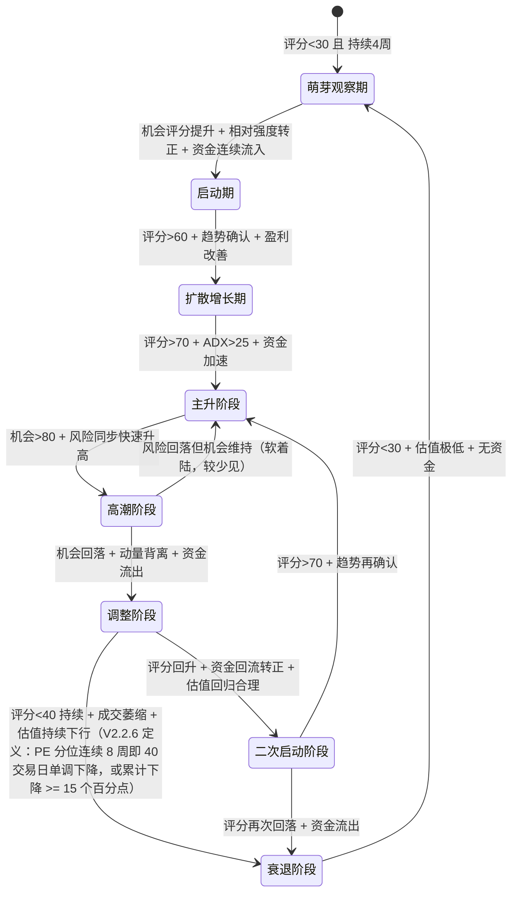

# 市场板块智能监控系统研究报告 V2.2.6

> **版本性质**：开发定稿版（消除 V2.2.3 全部歧义 + V2.2.4 二次复查补齐 + V2.2.5 三次评析修复 + V2.2.6 审查修复与 AI 可执行性强化，可直接进入 V0.9 编码）
> **相比 V2.2.2 的变化**：明确 V0.9 / V1.0 双版本分层；重构因子体系为六大一级因子；生命周期扩展为8阶段概率模型；泡沫检测由计数法改为连续评分；新增 Sector Exposure Matrix；新增完整工程化设计（目录/依赖/DB/接口/路线/测试/部署）；删除黑箱评分与直接交易逻辑。
> **相比 V2.2.3 的变化（V2.2.4 裁决清单）**：
> 1. **评分体系统一**：RiskScore 以 8.3 节六类风险公式为唯一定义；composite_score 明确定义为三周期融合机会评分；状态机统一以 composite_score 驱动
> 2. **置信度统一公式**：`SignalConfidence = 基准 + 持续性奖励 + 多因子确认奖励 − 泡沫惩罚`，解决基准 0.6 低于发布阈值 0.7 的死锁
> 3. **时间单位统一**：1周 = 5个交易日，全文所有"周"条件按滚动 5 交易日窗口判定
> 4. **补齐全部子指标→[0,100]标准映射函数**（6.3.1 节），消除公式空白
> 5. **缺失数据规则定稿**：权重重归一化 + DataCoverage 覆盖度，禁止置零缩水
> 6. **Softmax 定稿**：s_i 连续满足度计算方法明确，温度 T=0.15；二次启动改为资格门控
> 7. **数据层定稿**：存储采用 SQLite + Parquet 混合；暴露矩阵增加时间维度（point-in-time）；ETF 资金流按 T+1 披露时序修正调度
> 8. **V0.9 首发范围定稿**：S+A 级 6 板块；历史数据回填 10 年；输出接口以 JSON 文件为主、REST API 可选
> 9. **情绪因子方向定稿**：热度分为反向因子；资金拥挤度与资金流方向解耦
> 10. **修复 V2.2.3 全部示例代码缺陷**（跳变检测单向、drift threshold 未定义、标签生成器前视等）
> 11. **全文二次复查补齐**：风险子项缺失同样重归一化（8.3）；BubblePenalty 与 9.5 分档表统一（7.6）；signal_confidence 与 7.6 SignalConfidence 分工澄清（12.4）；部署架构存储层对齐 SQLite+Parquet（27.1）；回填进度表 DDL（4.12）；风险权重不参与优化（6.11）；示例板块名/evidence 与首发数据可用性对齐（12.3/12.4/12.5/18.3/8.6）
> **相比 V2.2.4 的变化（V2.2.5 裁决清单）**：
> 1. **phase_confidence 公式定稿**：`clip(P_max + 0.5×(P_max − P_second), 0, 1) × 降级系数`（7.5 节）
> 2. **三周期窗口双层定义**：信号窗口 L（随周期取 5/20/120）与标准化基线窗口 W（固定）分离（6.13 节）
> 3. **泡沫缺失维度重归一化**：与 6.11/8.3 统一（9.3 节）
> 4. **方向约定统一**：反转只发生在因子合成层；PE/PB/PEG 映射方向对齐（6.3.1/6.6 节）
> 5. **events 去重修复**：company_code NOT NULL DEFAULT 'NA'，消除 SQLite NULL 唯一约束失效（22.2.3 节）
> 6. **s_i 过渡带除零修复**：θ≤0 时采用绝对过渡带 δ = max(|θ|×0.1, 0.05×std)（7.5 节）
> 7. **信号规则补齐**：rotation_alert/sentiment_anomaly 触发规则、发布边界统一 ≥0.70、冷却期 20 交易日（12.1 节）
> 8. **daily/signals schema 定稿**（12.4.1/12.4.2 节）；组合暴露页面删除改 V1.0 预留（12.5.5 节）
> 9. **ETF 资金流口径定稿**：板块流入 = Σ 各 ETF 周净申赎总额（4.4.1 节）
> 10. **其余细节钉死**：DataProvider 接口补齐、exposure 转 sector_id、覆盖度归属与质量分取 min、月度相关性任务入调度、audit_log 唯一约束等
> **相比 V2.2.5 的变化（V2.2.6 审查修复清单）**：
> 1. 修复 5.2.4 节 ETF 聚合注释未同步更新（规模加权->总额聚合）
> 2. 明确 phase_confidence 降级系数为连乘关系
> 3. 统一持续N周判定模式为滚动5交易日均值
> 4. 量化全部模糊条件（成交量萎缩、估值下行、资金连续流入等）
> 5. 补齐全部状态机转换确认时长
> 6. 补充 PEG 负值处理规则
> 7. 修复 s_i 过渡带冷启动降级方案
> 8. 补充 StateMemory 多板块实例声明与 phase 枚举定义
> 9. 明确 bubble_bonus 传递路径
> 10. 补充 BubbleDetector metrics 完整 key schema
> 11. 补充 jump_detection 后续处理流程
> 12. 修复 pca_analysis fillna(0) 与 10.7 节矛盾
> 13. 修复 LifecycleLabeler pandas 索引问题
> 14. 统一全文术语（composite_score、因子 key 名）
> 15. 补充核心代码示例（评分合成、状态机循环、容错函数）
> 16. 新增第30节 从零到运行启动指南
> 17. 新增第31节 现有代码与 V2.2.6 设计对照表
> 18. 补充模块间接口 dataclass 定义
> 19. 补充三周期窗口 L<自然周期时的行为说明
> 20. 补充 exposure_matrix 返回结构注释
> **核心原则**：系统负责"认知"，不负责"执行"。

---

## 目录

```
Part I  系统定位与版本规划
  1. 系统定位修正
  2. 版本规划：V0.9 与 V1.0
  3. 与 V6 决策系统的边界

Part II  V0.9 基础完整运行版
  4. 数据采集层设计
  5. 板块体系与 Sector Exposure Matrix
  6. 因子体系优化（六大一级因子）
     6.3.1 标准映射函数规范（V2.2.4 新增）
  7. 板块生命周期模型（8阶段概率）
  8. 风险监控体系
  9. 泡沫检测模型（连续评分）
  10. 数据可信度系统
  11. 回测验证体系
  12. 信号输出与可视化

Part III  V1.0 究极智能版设计
  13. AI 市场理解引擎
  14. Replay Memory 历史记忆系统
  15. Machine Learning 预测层
  16. Emotion Intelligence 情绪引擎
  17. LLM 研究助手
  18. 自动研究报告生成
  19. 自动模型优化系统

Part IV  工程重构
  20. 完整目录结构
  21. 模块依赖关系
  22. 数据库设计
  23. 接口设计
  24. V0.9 开发路线
  25. V1.0 演进路线
  26. 测试方案
  27. 部署方案

Part V  降级删除清单与最终评价
  28. 必须延后或删除的内容
  29. V2.2.3 最终评价
```

---

# Part I  系统定位与版本规划

## 1. 系统定位修正（最高优先级）

### 1.1 本系统不是

- ❌ 自动交易系统
- ❌ ETF 择时系统
- ❌ 单板块预测模型
- ❌ 买卖信号生成器
- ❌ 短线行情扫描器
- ❌ 涨幅排名工具

### 1.2 本系统是

✅ **市场板块智能监控系统（Sector Intelligence & Monitoring System）**

通过多源数据融合，对 A 股市场所有重点板块进行：

1. **状态识别** —— 板块当前处于生命周期哪个阶段
2. **生命周期分析** —— 阶段转换概率与持续性
3. **资金行为分析** —— ETF/融资/产业资本的资金流向与拥挤度
4. **情绪分析** —— 搜索热度、新闻声量、社交舆情
5. **风险监测** —— 估值、杠杆、波动、拥挤等多维风险
6. **热度监控** —— 社会关注度与情绪极端度
7. **产业趋势分析** —— 政策周期、产业资本行为、技术周期

### 1.3 最终输出定位

> 辅助投资研究的**信息系统**，输出结构化证据（Evidence），不输出交易指令。

系统能力边界：

| 能力 | 说明 |
|------|------|
| 识别 | 板块生命周期阶段及转换概率 |
| 评估 | 机会水平与风险水平（双维度） |
| 比较 | 板块间相对强弱与轮动方向 |
| 预警 | 泡沫风险、阶段转换、资金异常 |
| 归因 | 各因子对评分的贡献分解 |
| 不负责 | 仓位管理、买卖执行、短线择时 |

### 1.4 防偏移约束

> Agent 开发防偏移红线：系统负责"认知"，不是"执行"。任何将系统演化为涨幅榜、RSI 策略、买卖提醒、自动下单的尝试均为越界。

---

## 2. 版本规划：V0.9 与 V1.0

最终产品分为两个明确版本，V0.9 是 V1.0 的前置依赖，不可并行。

### 2.1 V0.9 基础完整运行版

**目标**：完成完整监控闭环。

**特点**：

- 稳定 —— 数据管道容错，单点失败不崩溃
- 可部署 —— 标准化环境，一键启动
- 可每日运行 —— 调度自动化，产出可信
- 可产生可信分析结果 —— 数据可信度系统兜底

**技术形态**：规则驱动 + 参数可配置。人工定义市场逻辑框架，机器按规则执行。

**V0.9 闭环**：

```
数据采集 → 标准化 → 六大因子计算 → 生命周期识别 → 风险/泡沫评估
   → 可信度标注 → 结构化信号输出 → 可视化报告
```

### 2.2 V1.0 究极智能版

**目标**：打造智能化市场研究平台。

**特点**：

- AI 增强 —— LLM 理解新闻/公告/政策
- 自学习 —— 因子有效性自动监控，失效自动降权
- 自动理解市场 —— AI 市场理解引擎形成市场状态叙事
- 自动总结 —— 每日日报、板块周报、风险提示自动生成
- 自动发现机会与风险 —— ML 预测层 + Replay Memory 相似匹配

**V1.0 不是简单升级，而是最终形态。** V1.0 的所有智能模块都建立在 V0.9 可信数据与因子体系之上，不得跳过 V0.9 直接开发。

### 2.3 版本关系图

```
┌─────────────────────────────────────────────┐
│  V0.9 基础完整运行版（规则驱动，必须先完成）        │
│  ─────────────────────────────────────────  │
│  数据采集层 / 板块体系 / 六大因子 / 8阶段生命周期   │
│  风险监控 / 泡沫检测 / 数据可信度 / 回测验证       │
└──────────────────┬──────────────────────────┘
                   │ 提供：可信数据 + 因子体系 + 生命周期标签
                   ▼
┌─────────────────────────────────────────────┐
│  V1.0 究极智能版（AI 增强，最终形态）             │
│  ─────────────────────────────────────────  │
│  AI市场理解 / Replay Memory / ML预测          │
│  情绪引擎 / LLM研究助手 / 自动报告 / 自动优化     │
└─────────────────────────────────────────────┘
```

---

## 3. 与 V6 决策系统的边界

### 3.1 职责划分

```
┌─────────────────────────────────────┐
│  板块智能监控系统（本系统）            │
│  职责：                              │
│  1. 产业趋势分析                     │
│  2. 板块生命周期识别                  │
│  3. 机会/风险双维度评估               │
│  4. 板块轮动方向检测                  │
│  5. 泡沫风险预警                     │
│  6. 结构化证据输出                   │
└──────────────────┬──────────────────┘
                   │ JSON Evidence
                   ▼
┌─────────────────────────────────────┐
│  V6 决策系统（Evidence Engine）       │
│  职责：                              │
│  1. 综合多源证据                     │
│  2. 仓位管理                         │
│  3. 买卖执行决策                     │
│  4. 投资组合再平衡                   │
└─────────────────────────────────────┘
```

### 3.2 关键原则

- 本系统不替代 V6，只提供结构化证据
- V6 不替代本系统，需要本系统输出作为决策输入
- 两系统解耦，通过标准化 JSON 接口通信，任一系统可独立升级

---

# Part II  V0.9 基础完整运行版

## 4. 数据采集层设计

### 4.1 设计原则

- **统一数据接口** —— 所有数据源通过适配器模式接入，模型代码不感知具体数据源
- **数据源优先级** —— 禁止 Agent 自行选择数据源，按优先级表严格执行
- **可降级** —— 主源失败自动切换备用源，并标记置信度下降
- **不伪造** —— 严格禁止随机填充、插值猜测缺失数据

### 4.2 数据分类总览

| 类型 | 例子 | 更新频率 | 获取难度 | V0.9 优先级 |
|------|------|----------|----------|-------------|
| 市场数据 | 指数、行业板块、概念板块、ETF、个股 | 日/周 | 低 | 必须 |
| 资金数据 | ETF 资金流、成交额、主力资金、融资余额 | 日/周 | 中 | 必须 |
| 估值数据 | PE、PB、历史百分位 | 月/季 | 中 | 必须 |
| 产业资本 | 高管增减持、大股东行为 | 月 | 中 | 必须 |
| 信息数据 | 新闻、公告、政策 | 实时 | 高 | 第二阶段 |
| 情绪数据 | 搜索指数、舆情 | 日 | 高 | 第二阶段 |

### 4.3 市场数据

**覆盖范围**：

- 指数行情（沪深300、中证500、中证1000、中证全指等）
- 行业板块指数（中证行业、申万行业）
- 概念板块指数
- ETF 行情（净值、价格、份额、成交额）
- 个股关联数据（用于板块归因）

**数据源优先级**：

| 优先级 | 数据源 | 类型 | 推荐度 |
|--------|--------|------|--------|
| 主源 | AkShare | 开源 Python 库 | ★★★★★ |
| 备用1 | Tushare | 开源 Python 库 | ★★★★ |
| 备用2 | 东方财富接口 | HTTP API | ★★★★ |

**可计算指标**：MA、RSI、MACD、ADX、布林带、动量、换手率、相对强度

**可靠性评级**：★★★★★（最成熟的数据层）

### 4.4 资金数据

#### 4.4.1 ETF 资金流（核心指标）

**重要性**：★★★★★

ETF 资金流反映最直接的机构/散户资金偏好，是板块轮动判断的关键输入。

**数据内容（每日）**：份额变化、净申购/赎回、规模变化、成交额

**披露时序约束（V2.2.4 定稿）**：基金份额数据为 **T+1 披露**（交易所/基金公司次日公布 T 日份额）。因此：

- T 日的 ETF 资金流在 **T+1 日 08:30 后**才可获取，调度必须按此时序执行（见 27.2 节）
- **净申赎计算公式**：`净申赎金额(T) = (T日份额 − T-1日份额) × T日单位净值`
- **板块多 ETF 聚合规则（V2.2.5 定稿：总额口径）**：同一板块映射多只 ETF 时，板块资金流取**净申赎总额**：`板块流入(T) = Σ_i 净申赎金额_i(T)`。理由：FlowScore 分子为板块总净流入，与分母板块流通市值同为板块整体口径；规模加权平均反映的是单只 ETF 强度，与分母口径不匹配，废弃。

**数据源**：

| 优先级 | 数据源 | 获取方式 | 推荐度 |
|--------|--------|----------|--------|
| 主源 | 东方财富基金数据 | HTTP API / 爬虫 | ★★★★★ |
| 备用 | 交易所披露 | 官方数据 | ★★★★ |
| 备用 | AkShare fund_etf | Python 库 | ★★★ |

**计算公式**：

```
FlowScore = 周度ETF资金净流入 / 板块流通市值
```

其中**板块流通市值（V2.2.4 定义）** = Σ(暴露矩阵覆盖成分股流通市值 × 该股对本板块的暴露权重)。流通市值数据由 AkShare 个股行情接口获取。融资余额同理按暴露权重聚合到板块。

**融资聚合口径局限（V2.2.5 注记）**：个股融资余额仅两融标的可得，非两融标的记 0，板块融资余额因此系统性低估。此局限在报告附注与 DataCoverage 说明中明示，不做任何估算填充。

#### 4.4.2 成交额

**数据源**：AkShare / 东方财富

**可用指标**：板块成交额、成交额历史分位、成交额/流通市值比

#### 4.4.3 主力资金

**注意**："主力资金"算法不透明，争议较大。

**V0.9 定位**：不作为核心指标，仅作辅助验证，权重降低。优先使用 ETF 资金流替代。

#### 4.4.4 融资余额

**数据源**：交易所官方披露

**意义**：观察杠杆资金是否进入板块，辅助判断市场情绪。

**可用指标**：融资余额变化率、融资买入额/板块成交额比

**资金数据可靠性评级**：

| 指标 | 价值 | 获取难度 | 稳定性 | V0.9 |
|------|------|----------|--------|------|
| ETF 资金流 | ★★★★★ | 中 | 稳定 | 必须 |
| 成交额 | ★★★★ | 低 | 稳定 | 必须 |
| 融资余额 | ★★★★ | 低 | 稳定 | 必须 |
| 主力资金 | ★★★ | 低 | 波动大 | 辅助 |

### 4.5 估值数据

**数据内容**：PE（静态/动态/TTM）、PB、历史百分位

**数据源**：

| 数据源 | 估值数据 | 盈利预测 | 费用 |
|--------|----------|----------|------|
| AkShare | 部分支持（指数PE） | 不支持 | 免费 |
| Tushare | 较全面 | 有限 | 积分制 |
| Wind/Choice | 全面 | 全面 | 付费 |
| 东方财富 | 基础 PE/PB | 有限 | 免费 |

**V0.9 策略**：不追求机构级盈利预测，仅实现 PE/PB 历史分位。

```python
# V0.9 核心估值指标
pe_percentile = compute_percentile(pe_history)  # 近5年分位
pb_percentile = compute_percentile(pb_history)  # 近5年分位
```

**可靠性评级**：★★★★（免费源足够支撑 V0.9）

### 4.6 产业资本数据

#### 4.6.1 高管增减持（重点）

**重要性**：★★★★★

> 高管集中减持 + 高关注度 + 高位横盘 = 典型顶部结构

高管减持是风险评分中最重要的独立信号之一，与资金流、热度形成交叉验证。

**数据源**：

| 优先级 | 数据源 | 内容 | 获取方式 | 推荐度 |
|--------|--------|------|----------|--------|
| 主源 | 巨潮资讯网 | 上市公司原始公告 | 爬虫 | ★★★★★ |
| 备用1 | 东方财富公告栏 | 结构化减持数据 | HTTP API | ★★★★ |
| 备用2 | 交易所披露 | 董监高持股变动 | 官方数据 | ★★★★ |

**数据获取流程**：

```
爬取公告标题/全文
    ↓
关键词识别（减持/减持计划/股份变动）
    ↓
结构化提取（公司、比例、方式、时间）
    ↓
板块归因（通过 Sector Exposure Matrix 多标签归属）
    ↓
计算减持强度（减持比例/总股本、减持人数/董监高总数）
```

**董监高总数数据源（V2.2.5 定义）**：东方财富 F10 高管名录（AkShare 高管相关接口）为主源，巨潮资讯网公司披露为备用；两者均失败时该股减持强度仅用“减持金额/总股本”口径，并在报告中标注。

#### 4.6.2 大股东行为

**数据源**：巨潮资讯网、交易所披露

**可用指标**：大股东股权变动、大宗交易

**可靠性评级**：★★★★（数据可得，需工程投入）

### 4.7 信息数据（第二阶段）

#### 4.7.1 新闻热度

**数据源**：财联社（电报/快讯）、东方财富新闻、百度新闻搜索

**统计方式**：关键词匹配 → 按板块分类 → 周度汇总 → 计算同比/环比变化

#### 4.7.2 政策数据

**数据源**：国务院官网、发改委、工信部、国家能源局

**关键词监控**：针对每个板块设定关键词列表（见板块体系章节）

**评分机制**：

```
政策事件触发 → +10分（基础分）
└─ 3个月后衰减 → 影响线性下降至0
```

#### 4.7.3 搜索热度

**数据源**：百度指数平台（需申请权限）

**输出指标**：search_index（日度搜索量）、周度变化率、同比变化率

**可靠性评级**：

| 指标 | 价值 | 获取难度 | 稳定性 | V0.9 |
|------|------|----------|--------|------|
| 新闻数量 | ★★★★ | 低 | 稳定 | 必须 |
| 政策事件 | ★★★★ | 中 | 稳定 | 第二阶段 |
| 百度指数 | ★★★★ | 中 | 稳定 | 第二阶段 |
| 新闻情感 | ★★★ | 中 | 波动 | 第二阶段 |
| 社交媒体情绪 | ★★★ | 高 | 噪声大 | V1.0 |

### 4.8 数据源优先级总表

禁止 Agent 自行选择数据源，必须按以下优先级严格执行：

| 数据类型 | 主数据源 | 备用数据源 | 说明 |
|----------|----------|------------|------|
| 行情数据 | AkShare | Tushare / 东方财富 | 接口最成熟 |
| ETF 资金流 | 东方财富基金数据 | 交易所披露 | 东财覆盖最全 |
| 高管减持公告 | 巨潮资讯网 | 东方财富公告栏 | 巨潮为官方信源 |
| 新闻热度 | 财联社 | 东方财富新闻 | 电报时效性最佳 |
| 估值数据 | AkShare | 手工补充 | 免费源足够 |
| 融资余额 | 交易所官方 | AkShare | 官方最权威 |
| 政策文本 | 国务院/部委官网 | 财联社 | 官方原文优先 |
| 搜索热度 | 百度指数 | — | 需申请权限 |

### 4.9 数据适配器模式

数据层必须解耦，采用适配器模式：

```
                    评分引擎
                        │
                        ▼
                数据抽象层（Data Layer）
                        │
     ┌──────────────────┼──────────────────┐
     │         │         │         │         │
  行情提供者  资金提供者  新闻提供者  政策提供者  情绪提供者
     │         │         │         │         │
  AkShare/   东方财富/   财联社/   国务院/    百度指数/
  Tushare    交易所    东方财富   工信部    新闻API
```

**接口定义**：

```python
from abc import ABC, abstractmethod

class DataProvider(ABC):
    """数据提供者基类（V2.2.5 接口补齐：覆盖全部 V0.9 数据类型）"""
    @abstractmethod
    def get_market_data(self, sector, start_date, end_date):
        """指数/板块/ETF 行情"""

    @abstractmethod
    def get_fund_flow(self, sector, start_date, end_date):
        """ETF 份额/净申赎"""

    @abstractmethod
    def get_valuation(self, sector, date):
        """PE/PB/分位"""

    @abstractmethod
    def get_margin_balance(self, sector, start_date, end_date):
        """融资余额（个股级，按暴露聚合）"""

    @abstractmethod
    def get_insider_events(self, start_date, end_date):
        """高管增减持公告（个股级）"""

    def get_news_count(self, sector, start_date, end_date):
        """新闻声量（第二阶段，默认返回 None 触发降级）"""
        return None

    def get_policy_events(self, sector, start_date, end_date):
        """政策事件（第二阶段，默认返回 None 触发降级）"""
        return None

    def get_search_index(self, sector, start_date, end_date):
        """搜索热度（第二阶段，默认返回 None 触发降级）"""
        return None

class AkShareProvider(DataProvider):
    """AkShare 实现"""
    def get_market_data(self, sector, start_date, end_date):
        ...

class WindProvider(DataProvider):
    """Wind 实现（付费版）"""
    def get_market_data(self, sector, start_date, end_date):
        ...
```

**优势**：

- 换数据源不用改模型代码
- 多数据源交叉验证
- 便于单元测试（Mock Provider）

### 4.10 数据降级处理链路

```
Real Provider（优先数据源）
       ↓ 失败
Fallback Provider（备用数据源）
       ↓ 失败
Unavailable Flag（标记不可用）
       ↓
置信度下降（该指标从计算中剔除，剩余权重重归一化，见 6.11/10.7 节）
```

```python
def get_social_heat(sector):
    """获取社会热度，带降级处理"""
    data = baidu_index_provider.get(sector)
    if data is not None:
        return {"value": data, "source": "baidu_index", "available": True}

    data = news_count_provider.get(sector)
    if data is not None:
        return {"value": data, "source": "news_count_fallback", "available": True}

    return {"value": None, "source": "unavailable", "available": False}
```

### 4.11 容错与重试规范（V2.2.4 新增）

V0.9 目标"单点失败不崩溃"的具体实现规则：

| 场景 | 策略 |
|------|------|
| 单次接口调用失败 | 重试 3 次，指数退避（5s / 30s / 120s） |
| 限流（akshare/东财频控） | 请求间随机延迟 1–3s；触发限流后休眠 60s 再重试 |
| 主源连续失败 ≥ 3 次 | 切换备用源（按 4.8 优先级表），记录降级日志，对应指标 DataCoverage 下调 |
| 全部源失败 | 标记 Unavailable，该指标从因子计算中剔除（权重重归一化，见 10.7 节），禁止伪造数据 |
| 单日任意数据源失败 | 不阻断当日管道，产出报告中标注受影响指标 |

**降级映射表**（哪些指标依赖哪些源）必须配置在 `data_source_priority.yaml` 中，禁止硬编码。

### 4.12 历史数据回填（V2.2.4 定稿）

首次部署必须完成 **10 年（约 2015-01 起）**历史数据回填，理由：

- 满足 11.6 节 Walk Forward 从 2015 开始滚动训练的要求
- 覆盖 2015 股灾、2020 疫情、2022 流动性冲击三个极端事件（11.8 节）
- PE/PB 近5年分位、换手率近1年均值等长周期指标需要足够历史

回填范围：指数/ETF 行情、成交额、换手率、PE/PB、ETF 份额、融资余额、高管减持公告。回填完成后运行完整性校验（缺失率 < 5%）方可进入日常调度。回填脚本位于 `scripts/backfill.py`，支持断点续传（按日期分片，已完成的分片记录在 SQLite 元数据表）。

**回填进度元数据表（V2.2.4 定稿，建于 sector_data.db）**：

```sql
CREATE TABLE backfill_progress (
    id INTEGER PRIMARY KEY AUTOINCREMENT,
    data_type VARCHAR(30) NOT NULL,   -- index_daily / etf_daily / etf_flow / margin / index_pe / insider
    shard_date DATE NOT NULL,         -- 分片日期（按月分片）
    status VARCHAR(20) NOT NULL,      -- done / failed / pending
    row_count INTEGER,
    missing_rate DECIMAL(5,4),        -- 该分片缺失率
    updated_at TIMESTAMP DEFAULT CURRENT_TIMESTAMP,
    UNIQUE(data_type, shard_date)
);
```

`backfill.py` 每完成一个分片即写入 `done` 记录；重启后跳过已 `done` 的分片，重跑 `failed` 分片。

---

## 5. 板块体系与 Sector Exposure Matrix

### 5.1 设计动机

V2.2.2 的板块体系存在两个问题：

1. **单板块归属**：一只股票只归一个板块，但现实是一家公司可能横跨 AI、半导体、机器人多个产业
2. **资金/估值/新闻/风险按硬归属计算**：导致归因错误，例如某 AI 公司减持被错误归因到半导体板块

V2.2.3 引入 **Sector Exposure Matrix（板块暴露矩阵）**，按暴露比例归属所有指标。

### 5.2 Sector Exposure Matrix 设计

#### 5.2.1 暴露矩阵定义

每只股票对每个板块有一个暴露权重，所有板块权重之和为 1。

```
某公司（如浪潮信息）:
  AI产业链:    60%
  半导体:      30%
  云计算:      10%
```

所有维度数据（资金、估值、新闻、风险）均按暴露比例归属到对应板块。

#### 5.2.2 暴露矩阵结构

```
              AI产业链  半导体  机器人  新能源  医药  消费  ...
公司A(浪潮)     0.60    0.30   0.00   0.00   0.00  0.00
公司B(中芯)     0.10    0.80   0.00   0.00   0.00  0.00
公司C(汇川)     0.05    0.05   0.70   0.10   0.00  0.10
...
```

#### 5.2.3 暴露权重来源

| 来源 | 方式 | 优先级 |
|------|------|--------|
| 主营业务披露 | 年报/季报业务收入构成 | 主 |
| 行业分类 | 申万/中证行业分类 | 辅 |
| 关键词匹配 | 公司公告/研报关键词 | 辅 |
| 人工标注 | 人工审核调整 | 兜底 |

#### 5.2.4 指标按暴露归属计算（V2.2.4 收窄适用范围）

以高管减持为例：

```python
# 某公司减持金额 1 亿元，暴露矩阵: AI 60% / 半导体 30% / 云计算 10%
# 归属计算：
AI板块减持      += 1亿 × 0.60 = 6000万
半导体板块减持  += 1亿 × 0.30 = 3000万
云计算板块减持  += 1亿 × 0.10 = 1000万
```

**暴露归属仅适用于个股类数据（V2.2.4 裁决）**：

| 数据 | 归属方式 |
|------|----------|
| 高管减持/增持 | ✅ 按暴露权重归属 |
| 融资余额 | ✅ 按暴露权重归属 |
| 个股成交额/换手 | ✅ 按暴露权重归属 |
| ETF 资金流 | ❌ 不按暴露归属，ETF 代码已在 sector_config 中直接映射板块（总额聚合，4.4.1 节定稿） |
| 估值（PE/PB） | ❌ 不按暴露归属，直接使用板块对应指数的 PE/PB |
| 新闻热度 | ❌ 关键词直接匹配板块，不经个股归属 |

### 5.3 板块池管理机制

板块池采用**人工维护为主，系统辅助发现为辅**的原则。

```
核心观察池（人工维护，固定跟踪）
      │
      │ 系统辅助发现：新板块关键词频次超阈值
      ▼
动态候选池（系统生成，待审核）
      │
      │ 人工审核：确认ETF映射和板块定义
      ▼
加入观察池（升级为核心跟踪）
```

- **核心观察池**：由人工定义并持续跟踪（见 5.5 节）
- **动态候选池**：系统通过新闻关键词频次、ETF 资金异动自动发现，必须经人工审核后方可加入核心观察池

### 5.4 板块配置文件

板块信息不硬编码，采用外部配置文件 `sector_config.yaml` 管理。

```yaml
# sector_config.yaml
sectors:
  - id: ai_infra                 # 板块唯一标识（snake_case，全局统一）
    name: AI基础设施
    priority: S
    launch_batch: 1              # V2.2.4：1=V0.9首发，2=第二批
    etf:
      - code: 588300
        name: 中证云计算
      - code: 515880
        name: 通信ETF
      - code: 588790
        name: 科创AI
    index:
      - 中证人工智能指数
      - 中证云计算指数
    keywords:
      - 算力
      - GPU
      - 光模块
      - 大模型
      - AI服务器
    representative_stocks:
      - code: 000977
        name: 浪潮信息
        exposure: {AI基础设施: 0.60, 半导体: 0.30, 云计算: 0.10}
      - code: 603019
        name: 中科曙光
        exposure: {AI基础设施: 0.70, 半导体: 0.20, 云计算: 0.10}
```

**配置校验规则（V2.2.4 新增，加载时强制执行）**：

1. 每只股票的 exposure 权重之和必须 = 1（容差 ±0.01），否则拒绝加载并报错
2. exposure 中引用的板块名必须存在于 `sectors` 列表中（未定义的板块需先声明或加入候选池）
3. `id` 全局唯一，`etf.code` 不得跨板块重复（一只 ETF 只映射一个板块）
4. 同一股票可出现在多个板块的 `representative_stocks` 中，但 exposure 字典以股票为维度全局唯一（重复定义时报错）

**加载机制**：

```python
import yaml

class SectorConfig:
    def __init__(self, config_path="sector_config.yaml"):
        with open(config_path, 'r', encoding='utf-8') as f:
            self.config = yaml.safe_load(f)

    def get_sector(self, name):
        return next(s for s in self.config['sectors'] if s['name'] == name)

    def get_etf_codes(self, name):
        return [e['code'] for e in self.get_sector(name)['etf']]

    def get_keywords(self, name):
        return self.get_sector(name)['keywords']

    def get_exposure_matrix(self):
        """返回完整的股票-板块暴露矩阵
        V2.2.4 修复：校验权重与板块存在性
        V2.2.5 修复：内层 key 统一转为 sector_id（中文名→id 映射加载时生成，
        与 DB/JSON 全链路口径一致，见 5.7 节）
        V2.2.6 补充：返回结构为 {stock_code: {sector_id: weight}}，以股票为外层 key。
        与 5.2.2 节示意图（以板块为外层 key 的矩阵形式）为转置关系，调用方需注意。"""
        valid_sectors = {s['name'] for s in self.config['sectors']}
        name_to_id = {s['name']: s['id'] for s in self.config['sectors']}
        matrix = {}
        for sector in self.config['sectors']:
            for stock in sector.get('representative_stocks', []):
                code = stock['code']
                if code in matrix:
                    raise ValueError(f"股票 {code} 的 exposure 重复定义")
                exposure = stock.get('exposure', {})
                for sec in exposure:
                    if sec not in valid_sectors:
                        raise ValueError(f"股票 {code} 引用未定义板块: {sec}")
                if abs(sum(exposure.values()) - 1.0) > 0.01:
                    raise ValueError(f"股票 {code} 暴露权重之和不为1")
                matrix[code] = {name_to_id[sec]: w for sec, w in exposure.items()}
        return matrix
```

### 5.5 板块优先级分级与 V0.9 首发范围

根据**长期价值**（产业趋势、政策确定性、市场空间）和**交易价值**（流动性、资金容量、轮动活跃度）综合评估：

| 优先级 | 板块 | sector_id | 长期价值 | 交易价值 | V0.9 批次 |
|:---:|------|------|:---:|:---:|:---:|
| **S** | AI基础设施 | ai_infra | ★★★★★ | ★★★★★ | **首发（批次1）** |
| **S** | 半导体自主化 | semiconductor | ★★★★★ | ★★★★ | **首发（批次1）** |
| **S** | 机器人/智能制造 | robotics | ★★★★★ | ★★★★★ | **首发（批次1）** |
| **A** | 电力能源基础设施 | power | ★★★★★ | ★★★★ | **首发（批次1）** |
| **A** | 新能源（储能/智能车） | new_energy | ★★★★ | ★★★★ | **首发（批次1）** |
| **A** | 生物医药创新 | biomed | ★★★★ | ★★★ | **首发（批次1）** |
| B | 消费升级 | consumption | ★★★ | ★ | 第二批 |
| B | 金融科技 | fintech | ★★★ | ★★★ | 第二批 |
| B | 军工科技 | defense | ★★★★ | ★★★ | 第二批 |

**V2.2.4 定稿：V0.9 首发覆盖 S+A 级 6 板块**（配置中 `launch_batch: 1`）。B 级板块在数据管道稳定运行 ≥ 4 周后作为第二批加入（仅需在 sector_config 中改 launch_batch 并提供暴露矩阵，无需改代码）。6 个板块也是板块相关性/风险簇分析（8.6 节）的最小有效样本量。

> 板块优先级需结合市场环境动态调整。数据源以官方公告、行业报告、Wind/Choice 行情及券商研报为优先。

### 5.6 板块详细信息

| 优先级 | 板块 | 长期价值论证 | 关键驱动因素 | 代表 ETF/龙头 | 主要风险 |
|:---:|------|------|------|------|------|
| **S** | **AI基础设施** | 大模型训练/推理需求爆发，算力成核心生产力。中美 AI 竞赛加速国内自主算力体系构建 | 大模型算力需求、科技巨头 Capex、GPU 迭代、数据中心政策 | 中证云计算(588300)、通信ETF(515880)、科创AI(588790)；浪潮信息(000977)、中科曙光(603019) | 技术迭代快、国际供应链风险、估值泡沫 |
| **S** | **半导体自主化** | 中美科技脱钩下，半导体设备/材料国产化是国家级战略任务。国产化率从低个位数向 30%+ 迈进 | 国产替代率、晶圆厂扩产、EDA 国产化、大基金投资 | 科创芯片(588200)、半导体芯片ETF(512480)；中芯国际(688981)、北方华创(002371) | 技术突破不及预期、制裁升级、周期性强 |
| **S** | **机器人/智能制造** | 人口老龄化+制造业升级双驱动。人形机器人从 0 到 1 突破，具身智能成 AI 最大应用场景 | 人形机器人量产、工业机器人国产化、AI+机器人融合、PMI | 机器人ETF(562500)、机床ETF(159886)；埃斯顿(002747)、汇川技术(300124) | 量产不及预期、估值透支、供应链瓶颈 |
| **A** | **电力能源基础设施** | 新能源装机倒逼电网升级，特高压+配电网+储能进入高景气周期。"十五五"核心基建方向 | 电网投资、特高压建设、储能配比、电力市场化改革 | 电力ETF(159611)、绿电ETF(159669)；长江电力(600900)、国电南瑞(600406) | 政策节奏不确定、回报周期长、利率敏感 |
| **A** | **新能源（储能/智能车）** | 储能是新型电力系统关键环节。智能车进入智能化竞争下半场，产业链出海打开第二曲线 | 储能招标、碳酸锂价格、智能驾驶渗透率、新能源车销量 | 新能源车ETF(515030)、储能ETF(159755)；比亚迪(002594)、宁德时代(300750) | 产能过剩、价格战、补贴退坡、贸易壁垒 |
| **A** | **生物医药创新** | 老龄化+健康消费升级。创新药进入价值定价阶段，出海 License-out 加速。GLP-1、ADC 持续催化 | 创新药审批、医保谈判、出海临床、AI制药、GLP-1/ADC | 创新药ETF(159992)、医疗ETF(512010)；恒瑞医药(600276)、百济神州(688235) | 研发失败、集采降价、出海受阻 |
| **B** | **消费升级** | 消费升级长期趋势不变。理性消费+情绪消费并行，"扩大内需"政策支撑 | 居民收入、CPI/PPI、消费刺激政策、社零数据 | 消费ETF(159928)；贵州茅台(600519)、珀莱雅(603605) | 经济下行压制购买力、消费降级 |
| **B** | **金融科技** | 数字人民币、金融信创、AI+金融应用带来结构性机会 | 数字人民币试点、金融信创招标、AI金融落地 | 金融科技ETF(159851)；东方财富(300059)、恒生电子(600570) | 强监管、竞争分散、技术替代 |
| **B** | **军工科技** | 国防装备升级+备战打仗刚性需求。航空航天、卫星互联网景气持续 | 国防预算、装备采购周期、卫星互联网、国企改革 | 军工ETF(512660)；中航沈飞(600760)、航发动力(600893) | 订单透明度低、事件驱动难捕捉 |

> **V2.2.4 修正说明**：① 原"中华半导体芯片(990001)"为国证指数代码而非 ETF 代码，已改为半导体芯片ETF(512480)；② 原"安踏体育(02020)"为港股，A 股免费数据源体系不覆盖，已替换为珀莱雅(603605)；③ **所有 ETF 代码与代表标的在上线前必须人工核验**（代码有效性、与板块的跟踪关系、流动性），核验记录存入 `docs/etf_verification.md`。

### 5.7 板块主数据表（V2.2.4 新增）

全文所有模块（因子、状态机、DB、JSON 输出）统一使用 `sector_id`（snake_case 英文标识）引用板块，中文名仅作显示用途（`name_cn`）。板块主数据存于 SQLite `sector_master` 表（建表语句见 22.2.6 节），从 sector_config.yaml 同步生成，禁止在其他位置硬编码板块名。

**命名统一约定**：5.2 节示例中的"AI产业链/云计算"等为说明性文字，正式板块名以 5.5 表为准；12.3 节示例中的"医疗健康"对应正式板块"生物医药创新"（biomed）。

---

## 6. 因子体系优化（六大一级因子）

### 6.1 设计动机

V2.2.2 的指标体系存在两个严重问题：

1. **指标直接评分**：几十个指标直接加权求和，导致指标重复计权（如成交额、换手率、资金流入高度相关，被重复计算）
2. **黑箱评分**：无法解释"为什么板块得这个分"

V2.2.3 重构为分层因子体系：

```
数据指标
   ↓
标准化
   ↓
一级因子（6个）
   ↓
分析模型
```

### 6.2 六大一级因子

| 一级因子 | 英文名 | 回答的问题 | 数据来源 |
|----------|--------|------------|----------|
| 趋势因子 | Trend | 板块价格趋势是否成立？ | 行情数据 |
| 资金因子 | Capital Flow | 资金在流入还是流出？ | ETF/融资/成交 |
| 估值因子 | Valuation | 当前估值贵不贵？ | PE/PB/分位 |
| 风险因子 | Risk | 当前风险有多大？ | 估值/杠杆/波动/拥挤 |
| 情绪因子 | Sentiment | 大众关注度是否极端？ | 搜索/新闻/社交 |
| 政策产业因子 | Policy & Industry | 政策和产业周期是否支持？ | 政策事件/产业资本 |

**因子输出标准（V2.2.6 统一定义）**：
- 输出范围：[0, 100]
- 输出 key 名：`trend` / `capital_flow` / `valuation` / `risk` / `sentiment` / `lifecycle`
- 缺失因子：值为 `None`（非 NaN、非 0）
- 输出类型：`FactorOutput = dict[str, float | None]`
- 模块间传递格式统一使用上述 dict，不使用 DataFrame 或裸 list

### 6.3 因子分层架构

```
┌─────────────────────────────────────────────┐
│  Layer 0: 原始数据指标（数十个）              │
│  价格/成交量/ETF流/PE/PB/融资/减持/搜索/新闻  │
└──────────────────┬──────────────────────────┘
                   ↓ 标准化（按 6.3.1 标准映射函数）
┌─────────────────────────────────────────────┐
│  Layer 1: 一级因子（6个）                     │
│  Trend / Capital / Valuation / Risk /        │
│  Sentiment / Policy                          │
└──────────────────┬──────────────────────────┘
                   ↓ 因子相关性分析去冗余
┌─────────────────────────────────────────────┐
│  Layer 2: 分析模型                           │
│  生命周期识别 / 机会风险评分 / 泡沫检测        │
└─────────────────────────────────────────────┘
```

### 6.3.1 标准映射函数规范（V2.2.4 新增，强制遵守）

**所有子指标必须通过以下四类标准映射之一转换为 [0, 100] 分值**，禁止自定义映射。每个子指标的映射类型与参数在 `indicator_registry.yaml` 中注册。

**类型一：Z-score 映射**（适用于有稳定历史分布的流量型指标）

```python
score = clip(50 + z * 20, 0, 100)
# z = (x - rolling_mean(x, W)) / rolling_std(x, W)，W 为指标指定窗口
# Z=0 → 50分（历史中枢），Z=±2 → 90/10分，±2.5 以外截断
```

**类型二：分位映射**（适用于存量型/估值型指标）

```python
score = percentile(x, lookback) * 100
# lookback 内滚动分位，回测时必须只用回溯窗口（11.2 节）
```

**类型三：比率锚点映射**（适用于比值型指标，需显式声明锚点）

```python
score = piecewise_linear(ratio, anchors)
# anchors 为单调锚点列表，如 [(0.5, 20), (1.0, 50), (2.0, 80), (3.0, 95)]
# 锚点之外线性截断到 [0, 100]，每个指标的锚点在 indicator_registry.yaml 中定义
```

**类型四：序数映射**（适用于离散状态型指标）

```python
# 示例：均线系统
多头排列(MA5>MA20>MA60)  → 100
价格>MA20 但非完全多头    → 60
价格<MA20 但>MA60        → 40
空头排列                 → 20
# ADX 方向性指标：score = clip(ADX, 0, 50) * 2 仅在趋势方向与因子方向一致时，否则乘以衰减系数 0.3
```

**各子指标映射分配表**：

| 因子 | 子指标 | 映射类型 | 参数 |
|------|--------|----------|------|
| Trend | 均线系统 | 序数 | 见上方示例 |
| Trend | ADX 强度 | 序数+连续 | ADX∈[0,50]线性映射，方向不一致时 ×0.3 |
| Trend | 相对强度 | Z-score | 20日超额收益，W=120 |
| Trend | 动量 | Z-score | 20日涨幅，W=250 |
| Capital | ETF资金流 | Z-score | FlowScore，W=52周 |
| Capital | 融资余额变化 | Z-score | 20日变化率，W=250 |
| Capital | 成交额偏离 | 比率锚点 | anchors: [(0.5,20),(1.0,50),(1.5,70),(2.0,85)] |
| Capital | 主力资金 | Z-score | W=60，仅作辅助验证 |
| Valuation | PE/PB分位 | 分位 | lookback=5年，输出“估值贵度”方向（高分位→高分），反转统一在 6.6 因子合成层 |
| Valuation | PEG | 比率锚点 | anchors: [(0.5,10),(1.0,40),(2.0,70),(3.0,90)]

**PEG 负值处理（V2.2.6 补充）**：当 PEG < 0（盈利增速为负）时，该子指标标记为 unavailable，不参与 Valuation 因子计算，触发 6.11 节权重重归一化。（PEG 越高分越高，与 PE/PB 同向；V2.2.5 修正方向一致性） |
| Sentiment | 搜索热度 | Z-score | W=250 |
| Sentiment | 新闻声量 | Z-score | 周度新闻数，W=52周 |
| Policy | 政策事件 | 比率锚点 | 事件强度加权和，anchors 待第二阶段标定 |
| Policy | 产业资本 | Z-score | 增持-减持净额，W=250 |

**窗口参数说明（V2.2.5）**：表中 W 均为**标准化基线窗口**（Z-score/分位的历史分布参照），不随三周期切换；信号观测窗口 L 见 6.13 节。

**方向约定（V2.2.5 统一）**：所有子指标在映射层输出“子指标自身语义强度”（如估值类输出“贵度”、情绪类输出“热度”），**反向语义一律在因子合成层处理**（6.6 估值因子、6.8 情绪因子、6.11 机会公式），禁止在映射层反转，保证单因子可解释。

### 6.4 趋势因子（Trend）

**回答**：板块价格趋势是否成立？

**子指标**：

| 子指标 | 计算方式 | 周期 | 权重 |
|--------|----------|------|------|
| 均线系统 | 价格 vs MA5/MA20/MA60 多头排列 | 中周期 | 0.3 |
| ADX 趋势强度 | ADX(14) 数值与方向 | 中周期 | 0.3 |
| 相对强度 | 板块收益 - 市场收益（20日） | 中周期 | 0.2 |
| 动量 | 5日/20日涨幅 | 短/中周期 | 0.2 |

**输出**：TrendScore ∈ [0, 100]

### 6.5 资金因子（Capital Flow）

**回答**：资金在流入还是流出？

**子指标**：

| 子指标 | 计算方式 | 周期 | 权重 |
|--------|----------|------|------|
| ETF 资金流 | 周度净流入/板块流通市值 | 短/中周期 | 0.4 |
| 融资余额变化 | 20日融资余额变化率 | 中周期 | 0.3 |
| 成交额偏离 | 当周成交/过去20周均值 | 短周期 | 0.2 |
| 主力资金 | 大单净流入（辅助验证） | 短周期 | 0.1 |

**输出**：CapitalScore ∈ [0, 100]

### 6.6 估值因子（Valuation）

**回答**：当前估值贵不贵？

**子指标**：

| 子指标 | 计算方式 | 周期 | 权重 |
|--------|----------|------|------|
| PE 分位 | 当前 PE 在近5年的百分位 | 长周期 | 0.5 |
| PB 分位 | 当前 PB 在近5年的百分位 | 长周期 | 0.3 |
| PEG | PE / 盈利增速（若有） | 长周期 | 0.2 |

**方向**：估值因子为反向因子，分位越高 → 估值越贵 → 机会评分越低、风险评分越高。

**反转位置定稿（V2.2.5，消除三处表述矛盾）**：PE/PB 分位与 PEG 在映射层均输出“估值贵度”（越贵分越高，方向一致）；**反转统一在因子合成层执行**：

```
估值贵度分 = PE分位分 × 0.5 + PB分位分 × 0.3 + PEG分 × 0.2
ValuationScore = 100 − 估值贵度分    # 转为“估值合理性”方向
```

**输出**：ValuationScore ∈ [0, 100]（“估值合理性”方向，可直接进入 6.11 机会公式）；“估值贵度分”同时供风险/泡沫模块直接使用（估值风险 = 贵度分）。

### 6.7 风险因子（Risk）（V2.2.4 重新定位）

**回答**：当前风险有多大？

**V2.2.4 裁决**：全文唯一的综合风险评分公式为 **8.3 节六类风险加权公式**。本节不再定义独立的风险评分公式，风险因子的子指标即为 8.2 节六类风险的子指标（见下表对应关系），`factor/risk.py` 负责子指标计算，`risk/risk_monitor.py` 负责按 8.3 公式合成。

**子指标 → 风险类别对应**：

| 子指标 | 计算方式 | 所属风险类别（8.2节） |
|--------|----------|------|
| PE/PB 历史分位 | 分位映射 | 估值风险 |
| 融资余额/流通市值 | Z-score | 杠杆风险 |
| 历史波动率 HV(20) | Z-score | 波动风险 |
| 换手率历史分位 | 分位映射 | 拥挤风险 |
| 高管减持强度 | Z-score | 产业资本风险 |
| 搜索/新闻热度分位 | Z-score | 情绪过热风险 |

**输出**：`risk_factor_score ∈ [0, 100]`（六类子风险的简单均值，仅作因子层展示；DB 字段名 risk_factor_score，避免与综合 risk_score 重名）。综合风险评分 = 8.3 节 RiskScore。

### 6.8 情绪因子（Sentiment）（V2.2.4 方向定稿）

**回答**：大众关注度是否极端？

**子指标**：

| 子指标 | 计算方式 | 周期 | 权重 | V0.9 可用性 |
|--------|----------|------|------|------|
| 搜索热度 | 百度指数 Z-score | 短周期 | 0.4 | 第二阶段 |
| 新闻声量 | 周度新闻数/历史均值 | 短周期 | 0.4 | 第二阶段 |
| 社交舆情 | 雪球/微博讨论量 | 短周期 | 0.2 | V1.0 |

**方向定稿**：情绪因子输出为 **SentimentHeat（热度分，越高表示关注度越极端）**。它是**反向因子**：

- 机会评分中使用 `(100 − SentimentHeat) × 权重`（热度越高 → 机会分越低）
- 风险评分/泡沫检测中直接使用热度映射（热度越高 → 风险越大）

**V0.9 首发数据裁决**：首发阶段百度指数（需申请权限）与新闻数据（第二阶段）均不可用时，情绪因子标记为 **unavailable**，按 10.7 节规则从机会/风险评分中剔除并重归一化权重，禁止用常数分填充。新闻数量接入后（第二阶段），情绪因子子权重临时调整为：新闻声量 0.7 / 搜索热度 0.3（百度指数接入后恢复原权重）。

### 6.9 政策产业因子（Policy & Industry）

**回答**：政策和产业周期是否支持？

**子指标**：

| 子指标 | 计算方式 | 周期 | 权重 |
|--------|----------|------|------|
| 政策事件 | 近3月政策事件密度与强度 | 长周期 | 0.5 |
| 产业资本行为 | 高管增持 vs 减持净方向 | 长周期 | 0.3 |
| 盈利预期 | 分析师一致预期变化（若有） | 长周期 | 0.2 |

**输出**：PolicyScore ∈ [0, 100]

**V0.9 首发数据裁决**：盈利预期（分析师一致预期）免费源不可用，政策事件为第二阶段数据。首发阶段政策因子子权重调整为：产业资本行为 1.0（高管增持-减持净方向）；政策事件接入后恢复为：政策 0.6 / 产业资本 0.4；盈利预期接入后再启用三子指标原权重。权重切换规则配置在 `indicator_registry.yaml` 中，不硬编码。

### 6.10 因子相关性分析

**问题**：多个子指标可能表达同一信息（如成交额、换手率、资金流入高度相关），导致评分系统重复计权。

**V2.2.3 强制要求**：因子体系上线前必须完成相关性分析。

```python
# factor_analysis/correlation.py
import pandas as pd
from scipy.stats import pearsonr, spearmanr
from sklearn.decomposition import PCA

class FactorCorrelationAnalyzer:
    def __init__(self, factor_data: pd.DataFrame):
        """factor_data: columns = 子指标, rows = 时间×板块"""
        self.data = factor_data

    def pearson_matrix(self):
        """Pearson 相关矩阵"""
        return self.data.corr(method='pearson')

    def spearman_matrix(self):
        """Spearman 秩相关矩阵"""
        return self.data.corr(method='spearman')

    def pca_analysis(self, n_components=None):
        """PCA 降维，识别主成分"""
        from sklearn.preprocessing import StandardScaler
        # V2.2.6 修复：PCA 为分析代码（非评分），先删除全缺失列，剩余列用均值填充
        clean_data = self.data.dropna(axis=1, how='all')
        scaled = StandardScaler().fit_transform(clean_data.fillna(clean_data.mean()))
        pca = PCA(n_components=n_components)
        pca.fit(scaled)
        return {
            "explained_variance_ratio": pca.explained_variance_ratio_,
            "components": pca.components_
        }

    def redundancy_report(self, threshold=0.7):
        """冗余报告：相关系数 > threshold 的指标对"""
        corr = self.pearson_matrix()
        pairs = []
        for i in range(len(corr.columns)):
            for j in range(i+1, len(corr.columns)):
                if abs(corr.iloc[i, j]) > threshold:
                    pairs.append({
                        "factor_a": corr.columns[i],
                        "factor_b": corr.columns[j],
                        "correlation": corr.iloc[i, j],
                        "recommendation": "降低其中一个权重或合并"
                    })
        return pairs
```

**输出示例**：

```
ETF资金流 vs 成交额变化 → Correlation: 0.86
建议：降低其中一个权重或合并为单一资金子因子
```

### 6.11 因子合成：机会评分与风险评分（V2.2.4 裁决版）

**机会评分（Opportunity Score）** —— 回答"还有没有成长空间"：

```
OpportunityScore = Trend × 0.30 + Capital × 0.30 + Valuation × 0.15
                 + (100 − SentimentHeat) × 0.10 + Policy × 0.15
（Risk 不进入机会评分；Sentiment 为反向因子，见 6.8 节）
```

**风险评分（Risk Score）** —— 回答"是否过热"：

```
★ V2.2.4 裁决：风险评分的唯一定义为 8.3 节六类风险加权公式：
RiskScore = ValuationRisk × 0.25 + SentimentRisk × 0.20
          + CrowdingRisk × 0.20 + LeverageRisk × 0.15
          + InsiderRisk × 0.10 + VolatilityRisk × 0.10
（V2.2.3 中 6.11 节的旧公式废弃，全文以此为准）
```

其中 CrowdingRisk（资金拥挤度）与 Capital 资金流方向**解耦**：拥挤度 = 换手率分位(0.5) + ETF流入极端度(0.5)，衡量的是"过热程度"而非流入方向。**ETF 流入极端度（V2.2.5 挂钩）** = 9.3 节 `fund_flow_score`（当周净流入相对 52 周分布的 Z-score 映射）；换手率分位用 6.3.1 分位映射（lookback=250 交易日）。

**缺失因子的权重重归一化（V2.2.4 定稿，替代置零方案）**：

```
当某因子 unavailable 时：
Score = Σ(w_i × s_i) / Σ(w_i, i∈可用因子)   # 剩余权重归一化，评分不缩水
DataCoverage = Σ(w_i, i∈可用因子)             # 覆盖度，进入置信度计算（10.5节）
```

**权重约束**（防止优化器走极端）：

```yaml
weight_constraints:
  trend:        {min: 0.15, max: 0.50}
  capital:      {min: 0.15, max: 0.50}
  valuation:    {min: 0.05, max: 0.25}
  sentiment:    {min: 0.00, max: 0.20}
  policy:       {min: 0.05, max: 0.30}
  # 注：risk 不在约束列表中——V0.9 综合风险评分为 8.3 节固定公式，
  #     六类风险权重不参与优化器调整（19.3 节“人工固定”项）
```

**约束归一化规则（V2.2.4 新增）**：上述约束仅作用于**机会评分五因子权重**（Trend/Capital/Valuation/Sentiment/Policy）。优化器产出的权重必须归一化为和=1 后再校验边界：`w_i' = w_i / Σw_j`；归一化后若任一项越界，投影到边界后再次归一化，迭代至收敛（最多 10 轮）。

#### 6.11.1 评分合成核心逻辑（V2.2.6 补充）

```python
# opportunity_score.py
def compute_opportunity_score(factors: dict, weights: dict) -> float:
    """机会评分 = 各因子加权和，输出 [0, 100]"""
    score = 0.0
    total_weight = 0.0
    for key, value in factors.items():
        if value is not None:  # 跳过 unavailable 因子
            score += weights[key] * value
            total_weight += weights[key]
    if total_weight == 0:
        return 0.0
    return clip(score / total_weight * 100, 0, 100)  # 重归一化

# risk_score.py
def compute_risk_score(factors: dict, bubble_bonus: float) -> float:
    """风险评分 = 基础风险 + 泡沫加成，输出 [0, 100]"""
    base_risk = factors.get('risk', 0) or 0
    return clip(base_risk + bubble_bonus, 0, 100)
```

### 6.12 双评分解读矩阵

| 机会评分 | 风险评分 | 含义 | 阶段倾向 |
|----------|----------|------|----------|
| 高(>70) | 低(<30) | 理想状态：趋势强劲且未过热 | 启动/扩散增长 |
| 高(>70) | 高(>70) | 主升后期：机会仍在但风险快速积累 | 主升后期/高潮 |
| 低(<30) | 低(<30) | 调整底部：无人问津但估值合理 | 衰退/萌芽观察 |
| 低(<30) | 高(>70) | 泡沫破裂/深度调整 | 调整/衰退 |

### 6.13 三周期融合与 composite_score 定义（V2.2.4 定稿）

| 周期 | 窗口 | 目的 | 核心指标 | 权重 |
|------|------|------|----------|------|
| 短周期 S₅ | 5交易日 | 捕捉市场行为变化 | ETF流、成交异常、情绪、技术突破 | 20% |
| 中周期 S₂₀ | 20交易日 | 判断当前趋势阶段 | 趋势强度、相对强弱、资金持续性、轮动 | 50% |
| 长周期 S₁₂₀ | 120交易日 | 判断产业趋势和估值合理性 | 盈利预期、PE分位、政策周期、产业资本 | 30% |

**V2.2.4 裁决：composite_score 与 OpportunityScore 的关系**

S₅/S₂₀/S₁₂₀ 不是三套独立公式，而是**同一套六因子机会评分公式（6.11）在三个回看窗口上的计算值**。

**双层窗口定义（V2.2.5 定稿，消除与 6.3.1 固定 W 的冲突）**：每个子指标有两个独立窗口：

```
信号窗口 L（观测回看，随周期切换）：
  S₅ → L=5，S₂₀ → L=20，S₁₂₀ → L=120（交易日）
  例：ETF 流取近 L 日累计净流入；相对强度取近 L 日超额收益；动量取近 L 日涨幅
标准化基线窗口 W（Z-score/分位的历史分布参照，固定不切换）：
  按 6.3.1 映射表注册值（如 FlowScore W=52周、动量 Z-score W=250）
长周期指标（PE 分位、政策周期、产业资本）：L≥120，三个周期下取值相同
```

即：指标先按信号窗口 L 取值，再按固定基线窗口 W 做标准化。L < 指标自然周期时（如 S₅ 下的 PE 分位），直接取长周期值，不强制缩短。

**L < 指标自然周期时的行为（V2.2.6 补充）**：当信号窗口 L 小于某子指标的自然周期时（如 S₅ 下的 PE 分位，自然周期为季度），该子指标在三个周期下取值相同。这是设计意图——长周期指标（如 PE 分位、PB 分位）本身变化缓慢，不参与短周期波动，仅在长周期 S₁₂₀ 下有意义。实现时，短/中周期直接复用长周期值即可。

```
composite_score = 0.2 × S₅ + 0.5 × S₂₀ + 0.3 × S₁₂₀   # 三周期融合机会评分
opportunity_score = S₂₀                                  # 当日中周期机会分
```

JSON 输出同时包含两个字段，状态机与生命周期条件全部基于 composite_score（见 7.0 节）。

---

## 7. 板块生命周期模型（8阶段概率）

### 7.1 设计动机

V2.2.2 仅 5 阶段（低位吸筹 → 启动 → 主升 → 高潮 → 调整），存在两个问题：

1. **阶段过少**：无法描述"二次启动"和"衰退"等真实市场阶段
2. **简单分类**：输出单一阶段标签，无法表达阶段过渡的不确定性

V2.2.3 扩展为 **8 阶段概率模型**，输出阶段概率分布。

### 7.0 全局时间约定与状态机输入（V2.2.4 定稿）

**时间单位统一**：

- 全文所有"周"一律指 **5 个交易日**，按滚动窗口判定（非自然周）
- "持续 N 周"统一判定模式（V2.2.6 定稿）：连续 N 个滚动 5 交易日窗口，每个窗口的指标均值满足条件。通用公式：持续N周(condition) := 对所有 k in [0,N-1]，mean(x[t-4-5k : t+1-5k]) 满足条件
- 状态机**日频运行**（每交易日收盘数据更新后），周级条件通过滚动 5 交易日窗口判定

**状态机输入统一（V2.2.4 裁决）**：

| 输入 | 来源 |
|------|------|
| "评分"类条件 | 一律指 composite_score（三周期融合机会评分，6.13 节） |
| 过热类条件 | risk_score（8.3 节公式）与 bubble_score |
| 资金类条件 | Capital 因子子指标（ETF流/融资） |
| 趋势类条件 | Trend 因子子指标（ADX/相对强度） |

**冷启动规则（V2.2.4 新增）**：系统首次运行或历史窗口不足时：

- 全部板块初始标记为"萌芽观察期"，置信度 0.3，JSON 输出 `cold_start: true`
- 历史窗口不满足的阶段条件一律视为"未满足"，禁止用当前值推断历史
- 各阶段"持续 N 周"类条件从数据充足日起计数

### 7.2 8 个生命周期阶段

| 阶段 | 英文 | 核心特征 | 机会评分 | 风险评分 |
|------|------|----------|----------|----------|
| 1. 萌芽观察期 | Germination | 无人问津，估值低，无资金关注 | <30 | <30 |
| 2. 启动期 | Startup | 资金开始流入，趋势初现，相对强度转正 | 40-60 | <40 |
| 3. 扩散增长期 | Diffusion | 趋势确立，资金持续流入，盈利改善 | 60-75 | 30-50 |
| 4. 主升阶段 | Main Rise | 强趋势，资金加速，热度上升 | >70 | 50-70 |
| 5. 高潮阶段 | Climax | 机会与风险双高，热度极端，减持增加 | >80 | >70 |
| 6. 调整阶段 | Adjustment | 机会回落，动量背离，资金流出 | 30-50 | 40-60 |
| 7. 二次启动阶段 | Secondary | 调整后资金回流，估值回归合理，重新启动 | 50-70 | <50 |
| 8. 衰退阶段 | Decline | 持续下跌，资金流出，估值持续下行（V2.2.6 定义：PE 分位连续 8 周即 40 交易日单调下降，或累计下降 >= 15 个百分点） | <40 | 30-50 |

### 7.3 状态转换图



### 7.4 各阶段准入/维持条件（V2.2.4 术语统一）

> 本节所有"评分"均指 composite_score（见 7.0 节）。标注 `(optional)` 的条件适用**可选条件降级规则（V2.2.4 新增）**：当该条件依赖的数据源不可用时，从条件列表中剔除，剩余条件权重重归一化后判定，该阶段置信度 ×0.9。

#### 7.4.1 萌芽观察期

**进入条件**：
- 综合评分 < 30 且持续 ≥ 4 周
- 板块近 120 交易日板块成交额处于历史 20% 分位以下
- PE/PB 处于近5年 30% 分位以下

**维持条件**：评分维持 < 40，无资金持续流入迹象

**退出条件**：机会评分连续3周回升，或相对市场强度转正

#### 7.4.2 启动期

**必须同时满足**：
- 20日评分（中周期S₂₀）持续提升 ≥ 3 周（**判定标准：滚动 5 交易日 S₂₀ 均值 > 前一个 5 交易日 S₂₀ 均值，连续 3 个滚动窗口成立**；不要求逐日单调）
- 相对市场强度（板块收益 - 市场收益）转正
- 资金连续流入（V2.2.6 定义：过去 3x5=15 交易日中，每 5 交易日窗口的 ETF+融资合计净流入均值均 > 0）

**维持条件**：评分在 40–60 区间，机会评分 > 风险评分

#### 7.4.3 扩散增长期

**必须同时满足**：
- 综合评分 > 60
- 中周期趋势确认（ADX > 20，方向向上）
- 资金连续流入 >= 4 周（V2.2.6 定义：过去 4x5=20 交易日中，每 5 交易日窗口的 ETF+融资合计净流入均值均 > 0）
- 盈利预期改善 `(optional)`

**维持条件**：评分 60–75，机会评分 > 风险评分

#### 7.4.4 主升阶段

**必须同时满足**：
- 综合评分 > 70（composite_score，三周期加权）
- 中周期趋势确认（ADX > 25，方向向上）
- 盈利预期改善（分析师一致预期上调 > 下调）`(optional)`

**维持条件**：机会评分 > 60，风险评分 < 机会评分

#### 7.4.5 高潮阶段

**触发条件**：
- 机会评分 > 80
- **且** 风险评分同步快速升高（**周环比上升 ≥ 5 个百分点**，V2.2.4 明确为绝对百分点而非相对百分比；**V2.2.5 钉死取值口径：“当周值/上周值”均为各自时点往前滚动 5 交易日的 risk_score 均值**）

**典型特征**：
- 社会热度处于历史 90% 分位以上
- PE 处于历史 80% 分位以上
- 高管减持数量显著增加
- 换手率处于历史高位

#### 7.4.6 调整阶段

**进入条件**（满足任一）：
- 机会评分连续 4 周回落
- 动量出现顶背离（V0.9 简化判定：20 日价格创 60 日新高但 RSI(14) 未创同期新高；精确版为 V1.0 功能）（价格新高但 RSI/MACD 未新高）
- 资金连续 2 周净流出（V2.2.6 定义：过去 2x5=10 交易日中，每 5 交易日窗口的 ETF+融资合计净流入均值均 < 0）

**退出条件**：评分 < 50 且成交量萎缩

#### 7.4.7 二次启动阶段

**必须同时满足**：
- 经历过调整阶段（状态记忆）
- 机会评分从 < 50 回升至 > 50
- 资金回流转正（ETF 连续 2 周净流入（V2.2.6 定义：过去 2x5=10 交易日中，每 5 交易日窗口的 ETF 净申赎总额均值均 > 0））
- 估值回归合理（PE 分位 < 60%）

**维持条件**：评分 50–70，机会评分 > 风险评分

#### 7.4.8 衰退阶段

**进入条件**：
- 评分 < 40 持续 ≥ 8 周
- 成交量持续萎缩
- 估值持续下行（V2.2.6 定义：PE 分位连续 8 周即 40 交易日单调下降，或累计下降 >= 15 个百分点）
- 无资金回流迹象

**退出条件**：评分 < 30 持续 → 进入萌芽观察期

#### 7.4.9 各转换确认时长汇总（V2.2.6 补充）

| 转换 | 确认时长 | 说明 |
|------|----------|------|
| 萌芽->启动 | 3 周（15 交易日） | 滚动 5 日均值连续 3 窗口达标 |
| 启动->扩散 | 3 周（15 交易日） | 同上 |
| 扩散->主升 | 2 周（10 交易日） | 趋势确认较快 |
| 主升->高潮 | 2 周（10 交易日） | 风险加速上升信号 |
| 高潮->调整 | 1 周（5 交易日） | 快速响应转折 |
| 调整->二次启动 | 3 周（15 交易日） | 需充分确认复苏 |
| 调整->衰退 | 4 周（20 交易日） | 避免误判短暂回调 |
| 二次启动->主升 | 2 周（10 交易日） | 与扩散->主升一致 |

### 7.5 阶段概率输出

**禁止简单分类。** 市场状态不是离散事件，避免"今天主升、明天高潮"的跳变。系统在判定当前阶段的同时，输出各阶段的概率分布。

**输出格式**：

```
AI板块阶段判定：
  当前阶段: 扩散增长期（置信度 0.82）
  阶段概率分布:
    萌芽观察期:   2%
    启动期:       8%
    扩散增长期:   62%
    主升阶段:     20%
    高潮阶段:     6%
    调整阶段:     1%
    二次启动阶段: 1%
    衰退阶段:     0%
```

**计算方法**：基于各阶段准入条件的满足程度，使用 Softmax 归一化：

```
P(phase_i) = exp(s_i / T) / Σ_j exp(s_j / T)
```

**s_i 计算方法（V2.2.4 定稿，消除公式空白）**：

每个阶段 i 的准入条件列表为 `{(条件_k, 权重_ω_k)}`，`Σω_k = 1`：

```
s_i = Σ_k (ω_k × 满足度_k) ∈ [0, 1]

满足度_k 按条件类型连续计算:
- 阈值条件 x > θ：满足度 = clip((x − θ_low) / (θ_high − θ_low), 0, 1)
  过渡带（V2.2.5 修复除零）：δ = max(|θ|×0.1, 0.05×std(x, 250))，
  θ_low = θ − δ，θ_high = θ + δ；θ=0 或 θ<0 时公式同样成立（绝对过渡带）
  冷启动降级（V2.2.6 补充）：当历史数据不足 250 交易日时，
  δ = max(|θ|x0.1, 0.05xstd(x, min(250, 可用天数)))；
  可用天数 < 20 时，δ = 0.05（固定默认值）。
- 持续性条件（连续N周流入等）：满足度 = 实际满足周数 / N
- 布尔条件（相对强度转正等）：满足度 ∈ {0, 1}
- (optional) 条件且数据不可用：从列表剔除，剩余 ω_k 重归一化
```

**温度参数**：`T = 0.15`（s_i ∈ [0,1] 尺度下 T=1.0 会退化为近似均匀分布，故 V2.2.4 定稿为 0.15，可配置）。

**phase_confidence 计算公式（V2.2.5 定稿，消除 7.5/10.5/12.4 的公式空白）**：

```
phase_confidence = clip(P_max + 0.5 × (P_max − P_second), 0, 1) × 降级系数
  P_max：当前判定阶段的 Softmax 概率；P_second：次高阶段概率
  降级系数：触发可选条件降级（7.4 节）时 ×0.9，否则 1.0
  与 transition_flag 联动：标记“阶段转换中”时 phase_confidence 额外 ×0.8
示例验证：P_max=0.62，P_second=0.20 → 0.62+0.5×0.42=0.83 ≈ 本节示例 0.82
```

**二次启动资格门控（V2.2.4 裁决）**：二次启动依赖状态记忆（必须经历过调整阶段），无法用静态条件匹配得分表达。因此：

```
若无调整阶段历史（状态记忆查询）：P(二次启动) = 0，不参与 Softmax
若有调整历史：正常参与 Softmax，条件列表包含资金回流/估值回归等可量化条件
```

**应用规则**：

- 当最高概率阶段与次高概率阶段差距 < 20% 时，标记为"阶段转换中"，置信度降级
- 概率分布变化趋势（如主升概率逐周下降、高潮概率逐周上升）可作为早期预警信号

### 7.6 阶段转换信号置信度（V2.2.4 补齐与统一公式）

| 转换类型 | 置信度基准 | 确认要求 |
|----------|------------|----------|
| 萌芽 → 启动 | 0.6 | 满足全部3项准入条件 |
| 启动 → 扩散增长 | 0.65 | 满足条件 + 多因子确认 |
| 扩散增长 → 主升 | 0.7 | 满足条件 + 趋势强度验证 |
| 主升 → 高潮 | 0.65 | 机会/风险双高 + 热度验证 |
| 高潮 → 调整 | 0.75 | 动量背离确认 |
| 调整 → 二次启动 | 0.7 | 资金回流 + 估值回归双重验证 |
| 调整 → 衰退 | 0.6 | 评分 + 成交 + 估值三重验证 |
| 二次启动 → 主升 | 0.7 | 趋势再确认 |
| 二次启动 → 衰退 | 0.6 | 评分回落 + 资金流出（V2.2.4 补） |
| 高潮 → 主升（软着陆） | 0.6 | 风险回落且机会维持（V2.2.4 补） |
| 衰退 → 萌芽 | 0.6 | 估值极低 + 无资金 |

**置信度合成公式（V2.2.4 定稿，解决基准 0.6 低于发布阈值 0.7 的死锁）**：

```
SignalConfidence = BaseConfidence           # 上表基准
                 + 0.10                     # 持续性奖励：条件持续满足 ≥ 规定周数
                 + 0.05                     # 多因子确认奖励：≥2类核心指标一致
                 − BubblePenalty            # 按 9.5 节分档表取值（<50→0；50–70→0；70–85→−0.05；≥85→−0.10）
若触发可选条件降级（7.4 节）：SignalConfidence = SignalConfidence × 0.9
上限 0.95；发布阈值 0.70（12.2 节）
```

示例：萌芽→启动（0.6）满足持续性与多因子确认后 = 0.75 > 0.7，可正常发布。

### 7.7 状态机记忆机制

每日独立判断容易产生状态跳跃（主升 → 调整 → 主升）。V2.2.3 增加状态记忆：

```python
# regime/state_memory.py
class StateMemory:
    """状态记忆：每交易日调用 update() 一次（日频，duration 单位为交易日）
    V2.2.4 明确：周级条件换算为 duration >= N*5"""
    def __init__(self):
        self.previous_state = None
        self.duration = 0          # 当前状态已持续的交易日数
        self.confidence = 0.0
        self.phase_history = []    # 历史阶段序列（二次启动资格判断用）

    def update(self, current_state, confidence):
        if current_state == self.previous_state:
            self.duration += 1
        else:
            if self.previous_state is not None:
                self.phase_history.append(
                    (self.previous_state, self.duration))
            self.duration = 1
        self.previous_state = current_state
        self.confidence = confidence

    def has_phase_history(self, phase):
        return any(p == phase for p, _ in self.phase_history)
```

**V2.2.6 补充：phase 参数定义与多板块实例**

```python
VALID_PHASES = [
    "germination",   # 萌芽观察期
    "startup",       # 启动期
    "diffusion",     # 扩散增长期
    "main_rise",     # 主升阶段
    "climax",        # 高潮阶段
    "adjustment",    # 调整阶段
    "restart",       # 二次启动阶段
    "decline",       # 衰退阶段
]
```

**多板块实例管理**：每个板块独立维护一个 StateMemory 实例，由 StateMachine 按 sector_id 管理字典：
```python
# StateMachine 内部：
self.memories: dict[str, StateMemory] = {}
# 每个板块首次进入时初始化：
if sector_id not in self.memories:
    self.memories[sector_id] = StateMemory()
```

**状态切换约束（滞回规则，V2.2.4 明确）**：例如 主升 → 高潮 要求：

- 目标阶段概率 > 70%
- 目标阶段候选状态已持续 ≥ 3 个交易日（连续 3 日 Softmax 结果均为高潮概率最高）
- 情绪指标确认

不满足约束时，维持当前状态，输出"转换中"标记。所有转换的确认时长统一在 `transition_matrix.py` 中配置（单位：交易日）。

---

## 8. 风险监控体系

### 8.1 设计动机

V2.2.2 的风险评分与泡沫检测混在一起。V2.2.3 建立**独立风险分析模块**，与机会评分解耦，输出独立的 Risk Score。

### 8.2 六类风险

| 风险类型 | 英文 | 子指标 | 数据来源 | 权重 |
|----------|------|--------|----------|------|
| 估值风险 | Valuation Risk | PE/PB 历史分位、PEG | 估值数据 | 0.25 |
| 情绪过热风险 | Sentiment Risk | 搜索热度 Z-score、新闻声量分位 | 情绪数据 | 0.20 |
| 资金拥挤风险 | Crowding Risk | 换手率分位、ETF 流入极端度（= 9.3 节 fund_flow_score，V2.2.5 挂钩） | 资金数据 | 0.20 |
| 杠杆风险 | Leverage Risk | 融资余额/流通市值、融资买入占比 | 融资数据 | 0.15 |
| 产业资本风险 | Insider Risk | 高管减持强度、减持人数占比 | 公告数据 | 0.10 |
| 波动风险 | Volatility Risk | 历史波动率 HV、衍生品 IV（若有） | 行情数据 | 0.10 |

### 8.3 Risk Score 计算（V2.2.4 确认：全文唯一风险评分公式）

```
RiskScore = ValuationRisk × 0.25
          + SentimentRisk × 0.20
          + CrowdingRisk × 0.20
          + LeverageRisk × 0.15
          + InsiderRisk × 0.10
          + VolatilityRisk × 0.10
```

每个子风险归一化到 [0, 100]，加权合成为总 RiskScore。

**子风险缺失规则（V2.2.4 补充）**：与机会评分一致（6.11 节），当某类子风险数据 unavailable 时（首发阶段 SentimentRisk 常态缺失），从公式中剔除该项，剩余权重归一化：`RiskScore = Σ(w_i × R_i) / Σ(w_i, i∈可用子风险)`，禁止置零缩水；剔除情况记入 DataCoverage 与报告附注。

### 8.4 风险等级

| RiskScore | 等级 | 含义 | 监控动作 |
|-----------|------|------|----------|
| < 30 | Low | 正常 | 常规监控 |
| 30-50 | Medium | 需关注 | 加强监控 |
| 50-70 | High | 显著过热 | 触发预警 |
| > 70 | Extreme | 极端风险 | 重点告警 |

### 8.5 风险归因输出

```
AI板块风险监控：
  RiskScore: 76 (Extreme)
  ├─ 估值风险:    85  ← PE 87%分位, PB 82%分位
  ├─ 情绪过热:    78  ← 搜索热度 Z-score=2.1
  ├─ 资金拥挤:    72  ← 换手率1.8倍均值
  ├─ 杠杆风险:    65  ← 融资余额/流通市值=8.2%
  ├─ 产业资本:    80  ← 近30日减持7份, 环比+75%
  └─ 波动风险:    55  ← HV(20)=35%
  
  主要风险来源: 估值 + 产业资本 + 情绪
```

### 8.6 板块相关性风险控制

**问题**：系统可能同时推荐 AI、半导体、CPO、算力，实际上属于同一风险来源。

**回看窗口（V2.2.4 定义）**：相关性矩阵基于 **120 交易日**板块日收益率计算，每月末重新计算一次（**V2.2.5：该任务已登记入 27.1 节调度层月度任务清单**，由调度器在每月最后一个交易日收盘后触发，结果写入 output/weekly/ 的 risk_clusters 字段）。

```python
# portfolio/sector_correlation.py
class SectorCorrelation:
    def __init__(self, return_history: pd.DataFrame, window=120):
        """return_history: columns=板块, rows=日期, values=收益率
        V2.2.4：取最近 window 个交易日"""
        self.corr_matrix = return_history.tail(window).corr()

    def risk_clusters(self, threshold=0.7):
        """识别相关性 > threshold 的板块簇
        V2.2.4 修复：改用并查集做传递闭包，结果与遍历顺序无关"""
        parent = {s: s for s in self.corr_matrix.columns}

        def find(x):
            while parent[x] != x:
                parent[x] = parent[parent[x]]
                x = parent[x]
            return x

        cols = list(self.corr_matrix.columns)
        for i, s1 in enumerate(cols):
            for s2 in cols[i+1:]:
                if abs(self.corr_matrix.loc[s1, s2]) > threshold:
                    parent[find(s1)] = find(s2)

        groups = {}
        for s in cols:
            groups.setdefault(find(s), set()).add(s)
        return [g for g in groups.values() if len(g) > 1]
```

**输出**：

```
风险簇识别:
  簇1: AI基础设施 - 半导体自主化 (相关性 0.85)
  簇2: 机器人/智能制造 - 新能源（储能/智能车） (相关性 0.72)

有效机会数量 = 原始机会 × 相关性调整
当推荐板块间相关性 > 0.7 时，合并为同一风险簇，按簇计算有效暴露
```

（示例板块名均为 5.5 节正式板块；首发 6 板块为相关性分析的最小有效样本，见 5.5 节）

---

**bubble_bonus 传递路径（V2.2.6 明确）**：`scoring/risk_score.py` 直接调用 `risk/bubble_detector.py` 的 `compute_bubble_score()` 获取 bubble_bonus，不经过 risk_monitor 中转。调用关系：`risk_score.compute_risk_score(factors, bubble_bonus=bubble_detector.compute_bubble_score(metrics))`。

---

## 9. 泡沫检测模型（连续评分）

### 9.1 设计动机

V2.2.2 的泡沫检测是**简单指标计数**（每项触发阈值计1分，总分0-7分），存在两个问题：

1. **离散计数丢失信息**：PE 80%分位和 95%分位都计1分，但风险程度差异巨大
2. **无法反映各维度相对重要性**

V2.2.3 改为**连续评分模型**，输出 Bubble Score ∈ [0, 100]。

### 9.2 泡沫检测维度

| 维度 | 子指标 | 数据来源 | 权重 |
|------|--------|----------|------|
| 估值 | PE 历史分位（连续值） | 估值数据 | 0.25 |
| 涨幅 | 60日涨幅 vs 近3年均值（连续偏离度） | 价格数据 | 0.20 |
| 换手 | 换手率 vs 近1年均值（连续倍数） | 成交数据 | 0.15 |
| 热度 | 搜索热度 Z-score（连续值） | 百度指数 | 0.15 |
| 资金 | ETF 单周净流入 vs 52周均值（连续偏离度） | ETF资金流 | 0.15 |
| 减持 | 近30日减持强度（连续值） | 公告数据 | 0.10 |

### 9.3 连续评分计算

每个维度不再用阈值二值化，而是用**连续函数**映射到 [0, 100]：

```python
# bubble/bubble_detector.py
import numpy as np

class BubbleDetector:
    def __init__(self, weights):
        self.weights = weights  # 各维度权重

    def valuation_score(self, pe_percentile):
        """PE分位 → 连续泡沫分（0-100）
        50%分位 → 50分
        90%分位 → 90分
        """
        return np.clip(pe_percentile * 100, 0, 100)

    def momentum_score(self, return_60d, historical_avg, historical_std):
        """60日涨幅偏离度 → 连续泡沫分"""
        if historical_std == 0:
            return 50
        z_score = (return_60d - historical_avg) / historical_std
        # Z-score 映射到 0-100，Z=2 → 90分
        return np.clip(50 + z_score * 20, 0, 100)

    def turnover_score(self, current_turnover, avg_turnover_1y):
        """换手率倍数 → 连续泡沫分（V2.2.4 修复注释与公式一致）
        1倍 → 50分, 2倍 → 80分, 3倍及以上 → 95~100分（线性截断）"""
        if avg_turnover_1y == 0:
            return 50
        ratio = current_turnover / avg_turnover_1y
        return np.clip(50 + (ratio - 1) * 30, 0, 100)

    def heat_score(self, search_z_score):
        """搜索热度 Z-score → 连续泡沫分"""
        return np.clip(50 + search_z_score * 20, 0, 100)

    def fund_flow_score(self, current_flow, avg_flow_52w, std_flow_52w):
        """ETF流入极端度 → 连续泡沫分"""
        if std_flow_52w == 0:
            return 50
        z = (current_flow - avg_flow_52w) / std_flow_52w
        return np.clip(50 + z * 20, 0, 100)

    def insider_score(self, sell_intensity, historical_baseline):
        """减持强度 → 连续泡沫分"""
        if historical_baseline == 0:
            return 50
        ratio = sell_intensity / historical_baseline
        return np.clip(50 + (ratio - 1) * 25, 0, 100)

    def compute_bubble_score(self, metrics):
        """综合泡沫评分（连续）
        V2.2.5 修复：缺失维度剔除后权重重归一化（与 6.11/8.3 统一），
        首发阶段热度维度 unavailable 时不再系统性缩水"""
        builders = {
            'valuation': lambda: self.valuation_score(metrics['pe_percentile']),
            'momentum': lambda: self.momentum_score(metrics['return_60d'],
                                            metrics['hist_avg_return'],
                                            metrics['hist_std_return']),
            'turnover': lambda: self.turnover_score(metrics['current_turnover'],
                                            metrics['avg_turnover_1y']),
            'heat': lambda: self.heat_score(metrics['search_z']),
            'fund_flow': lambda: self.fund_flow_score(metrics['current_flow'],
                                              metrics['avg_flow_52w'],
                                              metrics['std_flow_52w']),
            'insider': lambda: self.insider_score(metrics['sell_intensity'],
                                          metrics['sell_baseline'])
        }
        scores = {}
        for k, fn in builders.items():
            if metrics.get(f'{k}_available', True):   # 维度不可用时剔除
                scores[k] = fn()
        w_sum = sum(self.weights[k] for k in scores)
        if w_sum == 0:
            return None, {}   # 全部维度缺失 → 泡沫分 unavailable
        bubble_score = sum(scores[k] * self.weights[k] for k in scores) / w_sum
        return bubble_score, scores
```

### 9.4 泡沫等级

| Bubble Score | 等级 | 含义 | 监控动作 |
|--------------|------|------|----------|
| < 30 | Low | 正常状态 | 正常监控 |
| 30-50 | Medium | 需关注 | 加强监控 |
| 50-70 | High | 显著过热 | 触发预警，影响风险评分 |
| > 70 | Extreme | 极端泡沫 | 重点告警，阶段信号置信度下调 |

### 9.5 泡沫信号整合（V2.2.4 影响规则定稿）

泡沫检测结果不直接决定阶段，但影响**风险评分**和**信号置信度**。影响采用分档规则（替代 V2.2.3 固定 +15 的不明确表述）：

| Bubble Score | 对 risk_score 的影响 | 对阶段信号置信度的影响 |
|--------------|----------------------|------------------------|
| < 50 | 无 | 无 |
| 50–70 | +5 | 无 |
| 70–85 | +10 | −0.05 |
| ≥ 85 | +15 | −0.10 |

合成后 risk_score 超过 100 时截断为 100。置信度惩罚与 7.6 节的 BubblePenalty 同源，不重复计算（取其一）。

**泡沫加分可追溯性（V2.2.5）**：泡沫加分以独立字段 `bubble_bonus` 写入 risk_breakdown（12.4 节），保证 `risk_score = Σ六类子风险加权 + bubble_bonus`（截断前）可逐项还原。

---

## 10. 数据可信度系统

### 10.1 设计动机

V2.2.2 已引入数据质量评分，V2.2.3 进一步强化为**数据可信度系统（Data Confidence）**，处理三类问题：

1. **缺失数据** —— 不能简单填零
2. **异常数据** —— 不能直接采用
3. **延迟数据** —— 不能当实时数据用

### 10.2 Data Confidence 三层架构

```
┌─────────────────────────────────────────────┐
│  Layer 1: 数据可用性（Data Availability）     │
│  每条数据携带 available_time，禁止未来函数    │
└──────────────────┬──────────────────────────┘
                   ↓
┌─────────────────────────────────────────────┐
│  Layer 2: 数据质量评分（Data Quality Score）  │
│  完整性 + 合理性 + 稳定性                    │
└──────────────────┬──────────────────────────┘
                   ↓
┌─────────────────────────────────────────────┐
│  Layer 3: 最终置信度（Final Confidence）      │
│  FinalConfidence = ModelConfidence × Quality │
└─────────────────────────────────────────────┘
```

### 10.3 数据时间一致性（防未来函数）

不同数据具有不同"可获得时间"：

| 数据 | 事件时间 | 公布时间 |
|------|----------|----------|
| 股价 | 7月30日 | 7月30日 |
| 减持公告 | 7月28日 | 7月30日 |
| 财报 | 6月30日 | 8月30日 |
| 新闻 | 7月29日 | 7月29日 |

**所有数据必须保存三元时间戳**：

```json
{
  "value": 123,
  "event_time": "2026-07-28",
  "publish_time": "2026-07-30",
  "available_time": "2026-07-30"
}
```

**模型调用规则**：

```python
# 禁止：使用未来数据
future_data[t+1] → signal[t]

# 正确：只有已公布数据进入信号
data.where(data.available_time <= current_date) → signal[t]
```

**未来函数自动检测**：

```python
# tests/test_future_leak.py
def test_no_future_leak(signal_df, data_df):
    """自动检查信号是否使用了未来数据"""
    for signal_date in signal_df.index:
        used_data = data_df[data_df.available_time <= signal_date]
        # 验证信号只依赖 available_time <= signal_date 的数据
        assert validate_signal_dependencies(signal_date, used_data)
```

### 10.4 数据质量评分

```python
# data_quality/quality_score.py
class DataQualityScorer:
    def __init__(self):
        self.dimensions = ['completeness', 'reasonableness', 'stability']

    def completeness_score(self, data_series, expected_count):
        """完整性：缺失率"""
        missing_rate = data_series.isna().sum() / expected_count
        return max(0, 1 - missing_rate * 2)

    def reasonableness_score(self, data_series, historical_range):
        """合理性：是否超出合理范围"""
        in_range = data_series.between(*historical_range).mean()
        return in_range

    def stability_score(self, data_series, window=20):
        """稳定性（V2.2.4 修复）：检测接口异常而非数据波动
        维度：跳变率（超过历史 3σ 的单日变化）+ 缺失突增"""
        changes = data_series.pct_change().abs()
        baseline_std = changes.rolling(window, min_periods=window).std()
        anomaly_rate = (changes > baseline_std * 3).mean(skipna=True)
        return max(0, 1 - anomaly_rate * 5)

    def overall_score(self, data_series, expected_count, historical_range):
        c = self.completeness_score(data_series, expected_count)
        r = self.reasonableness_score(data_series, historical_range)
        s = self.stability_score(data_series)
        return {
            'completeness': c,
            'reasonableness': r,
            'stability': s,
            'overall': (c + r + s) / 3
        }
```

**输出示例**：

```json
{
  "price": 0.99,
  "fund_flow": 0.92,
  "news": 0.75,
  "overall": 0.88
}
```

### 10.5 最终置信度（V2.2.4 定义 ModelConfidence）

```
FinalConfidence = ModelConfidence × DataQualityScore

其中 ModelConfidence（V2.2.4 定义）= 阶段置信度(7.5节公式) × DataCoverage(6.11节 因子覆盖度)
```

**覆盖度归属与质量分聚合（V2.2.5 钉死）**：

- 阶段/机会类置信度乘**机会评分的 DataCoverage**（阶段判定由 composite_score 驱动）；风险类置信度乘风险评分的覆盖度（可用子风险权重和，8.3 节）
- DataQualityScore 取该评分所依赖全部数据源质量分的 **最小值**（木桶原则，任一源劣化即拉低整体）

当 `DataQualityScore < 0.5` 时，该数据源标记为不可信，对应指标按 10.7 节规则从计算中剔除（权重重归一化）并触发告警。

**评分输出附带置信度**：

```
AI板块评分：
  机会评分: 82（置信度: 0.77）
  风险评分: 76（置信度: 0.72）  ← 置信度下降
  数据缺失: [社会热度: 暂无数据]
  说明: 情绪因子缺失使覆盖度下降，置信度相应下调
```

置信度下调的计算方式（与上例对应，V2.2.4 修正示例数值）：机会评分置信度 = 阶段置信度 0.86 × DataCoverage 0.90（情绪因子缺失，可用权重 0.30+0.30+0.15+0.15=0.90）≈ 0.77；风险评分因 SentimentRisk 缺失，可用子风险权重 0.80（1−0.20），0.90 × 0.80 = 0.72。

### 10.6 异常数据检测

```python
# data_quality/anomaly_detector.py
class AnomalyDetector:
    def detect(self, data_series, window=60, threshold=3.0):
        """基于 Z-score 的异常检测"""
        rolling_mean = data_series.rolling(window).mean()
        rolling_std = data_series.rolling(window).std()
        z_scores = (data_series - rolling_mean) / rolling_std
        anomalies = z_scores.abs() > threshold
        return anomalies

    def jump_detection(self, data_series, max_jump_ratio=5.0):
        """跳变检测（V2.2.4 修复：双向检测，跳增与跳减都报警）
        例：ETF 规模 100亿→10000亿（ratio=100）或 10000亿→100亿（ratio=0.01）"""
        ratios = data_series / data_series.shift(1)
        return (ratios > max_jump_ratio) | (ratios < 1.0 / max_jump_ratio)
```

**跳变后续处理流程（V2.2.6 补充）**：
1. 检测到跳变后，该数据点标记为 `unavailable`
2. 触发告警日志（记录 sector_id、指标名、跳变幅度）
3. 该指标触发 6.11 节权重重归一化
4. 如连续 3 日跳变，暂停该数据源并切换备用源（4.10 节）

### 10.7 缺失数据处理（禁止简单填零）

```
Real Provider（优先数据源）
       ↓ 失败
Fallback Provider（备用数据源）
       ↓ 失败
Unavailable Flag（标记不可用）
       ↓
置信度下降（该指标从计算中剔除，剩余权重重归一化，见 6.11/10.7 节）
```

**禁止**：

```python
# ❌ 禁止：简单填零
missing_value = 0

# ❌ 禁止：随机填充
missing_value = random.uniform(0, 1)

# ❌ 禁止：插值猜测（无依据）
missing_value = interpolate(data)
```

**正确**：标记不可用，**剩余权重归一化**（6.11 节公式），下调置信度（DataCoverage）。禁止置零后直接加总导致评分系统性缩水。

---

## 11. 回测验证体系

### 11.1 设计动机

V2.2.2 的回测偏重收益验证。V2.2.3 强调**板块生命周期验证**，避免只验证收益。

### 11.2 防未来函数规范

**核心原则**：任何时刻的评分/信号只能使用该时刻之前的数据，严格禁止未来数据泄露。

| 方法 | 说明 | 作用 |
|------|------|------|
| Walk Forward | 滚动训练-测试，训练窗口固定向前滑动 | 避免全样本拟合 |
| Rolling Window | 指标计算只使用回溯窗口内数据 | 防止信息前移 |
| Out-of-Sample | 保留至少20%数据作为样本外验证 | 检验真实泛化能力 |

```python
# ❌ 禁止：使用全样本标准化（泄露未来分布信息）
pe_percentile = rank(current_pe, all_pe_history)  # all_pe_history包含未来数据

# ✅ 正确：只使用回溯窗口标准化
pe_percentile = rank(current_pe, pe_history[:current_date])
```

### 11.3 生命周期专项验证

**这是 V2.2.3 的重点。** 验证阶段识别准确率，而非只验证收益。

#### 11.3.1 启动阶段验证

```
验证：系统判定"启动期"后，未来N周期是否进入强趋势
指标：
  - 启动后20日板块收益 > 市场收益的概率（命中率）
  - 启动后60日进入主升阶段的概率
  - 误报率：判定启动但实际未进入扩散增长的比例
```

#### 11.3.2 高潮阶段验证

```
验证：系统判定"高潮期"后，是否提前识别风险
指标：
  - 高潮后30日出现回撤 > 10% 的概率（命中率）
  - 预警提前期：信号日期 - 回撤起点
  - 误报率：判定高潮但未出现回撤的比例
```

#### 11.3.3 二次启动验证

```
验证：系统判定"二次启动期"后，是否真的重新进入上升趋势
指标：
  - 二次启动后60日收益为正的概率
  - 与首次启动的对比成功率
```

#### 11.3.4 衰退阶段验证

```
验证：系统判定"衰退期"后，是否持续下行
指标：
  - 衰退后120日收益为负的概率
  - 衰退持续期中位数
```

### 11.4 生命周期标签生成器

生命周期模型需要历史标签，人工定义会产生主观偏差。V2.2.3 采用半自动生成标签：

```python
# lifecycle/lifecycle_labeler.py
class LifecycleLabeler:
    """半自动生命周期标签生成器"""

    def label_startup(self, price_series, fund_flow, lookforward=120):
        """启动阶段标签：过去60日横盘 + 当期资金流增强 + 未来120日上涨>20%
        V2.2.4 修复：资金流增强改用当期可观测对比（近20日 vs 前20日），
        消除 V2.2.3 中使用未来资金流(i:i+20)的前视偏差"""
        labels = []
        for i in range(60, len(price_series) - lookforward):
            # 过去60日横盘（波动率低）
            past_volatility = price_series.iloc[i-60:i].pct_change().std()
            sideways = past_volatility < 0.02

            # 未来120日上涨 > 20%（标签允许看未来，仅用于回测/训练）
            future_return = (price_series.iloc[i+lookforward] / price_series[i]) - 1
            future_up = future_return > 0.20

            # 资金流开始增强（V2.2.4：当期可观测，上线后可复现）
            flow_increasing = fund_flow[i-20:i].mean() > fund_flow[i-40:i-20].mean()

            if sideways and future_up and flow_increasing:
                labels.append({"date": price_series.index[i], "phase": "startup"})
        return labels

    def label_climax(self, pe_series, turnover_series, price_series, lookforward=60):
        """高潮阶段标签：估值分位>90% + 成交异常 + 未来60日回撤
        V2.2.5 注：此处用 252 日分位而非估值因子的 5 年分位——
        标签生成器需支持回测早期（历史不足 5 年）样本，252 日为最小可靠窗口；
        标签与因子口径差异在回测报告中明示"""
        labels = []
        for i in range(252, len(price_series) - lookforward):
            pe_percentile = (pe_series[i] > pe_series[i-252:i]).mean()
            turnover_percentile = (turnover_series[i] > turnover_series[i-252:i]).mean()

            future_drawdown = self._max_drawdown(price_series[i:i+lookforward])

            if pe_percentile > 0.9 and turnover_percentile > 0.9 and future_drawdown < -0.10:
                labels.append({"date": price_series.index[i], "phase": "climax"})
        return labels

    def _max_drawdown(self, price_series):
        """V2.2.4 补齐：返回区间最大回撤（负值，如 -0.15 表示回撤 15%）"""
        cummax = price_series.cummax()
        drawdown = price_series / cummax - 1
        return drawdown.min()

    def label_secondary(self, price_series, fund_flow, pe_series,
                        decline_threshold=-0.15, lookforward=60):
        """二次启动标签（V2.2.4 新增，支撑 11.3.3 验证）：
        前期经历显著调整（120日内回撤≥15%）+ 估值回归合理（PE分位<60%）
        + 资金回流转正 + 未来60日收益为正"""
        labels = []
        for i in range(252, len(price_series) - lookforward):
            prior_drawdown = self._max_drawdown(price_series[i-120:i])
            adjusted = prior_drawdown < decline_threshold

            pe_percentile = (pe_series[i] > pe_series[i-252:i]).mean()
            valuation_ok = pe_percentile < 0.6

            flow_back = fund_flow[i-10:i].mean() > 0

            future_return = (price_series.iloc[i+lookforward] / price_series[i]) - 1
            future_up = future_return > 0

            if adjusted and valuation_ok and flow_back and future_up:
                labels.append({"date": price_series.index[i], "phase": "secondary"})
        return labels

    def label_decline(self, price_series, fund_flow, lookforward=120):
        """衰退标签（V2.2.4 新增，支撑 11.3.4 验证）：
        过去60日持续下跌 + 资金持续流出 + 未来120日收益为负"""
        labels = []
        for i in range(120, len(price_series) - lookforward):
            ret_60d = price_series[i] / price_series[i-60] - 1
            persistent_down = ret_60d < -0.10

            flow_out = fund_flow[i-20:i].mean() < 0

            future_return = (price_series.iloc[i+lookforward] / price_series[i]) - 1
            future_down = future_return < 0

            if persistent_down and flow_out and future_down:
                labels.append({"date": price_series.index[i], "phase": "decline"})
        return labels
```

**标签用途**：回测、参数优化、模型评价，**不是直接交易**。

### 11.5 综合回测目标函数

**禁止只优化收益率** —— 容易产生高收益 + 巨大回撤。

```
OptimizationScore = 收益能力 30% + 风险控制 30% + 预警能力 20% + 稳定性 20%
```

#### 收益能力
- 年化收益、超额收益、胜率

#### 风险控制
- 最大回撤、回撤恢复时间、波动率

#### 预警能力（重点）
- 系统判断"高潮"后，未来30天是否出现明显回撤
- 评价提前期：5天、20天、60天

#### 稳定性
- 不同年份表现
- 不同板块表现
- 参数扰动稳定性（MA20 → MA18/MA19/MA21/MA22 是否仍有效）

### 11.6 强制 Walk Forward 验证

```
❌ 错误：2015-2026 寻找最佳参数

✅ 正确：
训练: 2015-2020 → 测试: 2021
训练: 2015-2021 → 测试: 2022
训练: 2015-2022 → 测试: 2023
...
```

### 11.7 基准比较体系

所有优化模型必须超过以下基准：

| Benchmark | 说明 |
|-----------|------|
| Buy & Hold | 长期持有对应板块 ETF，不调仓 |
| 简单均线策略 | 价格 > MA20 持有，否则空仓 |
| 固定权重模型 | 趋势40% / 资金30% / 估值20% / 情绪10% |

**输出对比表**：

| 模型 | 收益 | 最大回撤 | 夏普 | 信号命中率 | 预警提前期 |
|------|------|----------|------|------------|------------|
| 优化模型 | | | | | |
| MA20 | | | | | |
| 固定模型 | | | | | |
| Buy & Hold | | | | | |

优化模型必须在至少 2 个指标上超过所有 Benchmark，否则不采纳。

### 11.8 异常市场处理

极端行情会污染优化结果。建立 Extreme Event Database：

| 时间 | 事件 |
|------|------|
| 2015-06 | 股灾 |
| 2020-02 | 疫情 |
| 2022-04 | 流动性冲击 |

回测支持三种模式：
- **完整模式**：包含所有历史
- **稳健模式**：降低极端事件权重
- **危机模式**：单独测试抗风险能力

### 11.9 回测真实性强化

#### 交易成本模型

```yaml
# cost_model.yaml
commission: 0.0003
slippage: 0.001
execution_delay: 1  # 下一交易日执行
```

#### 信号执行时序

```
❌ 错误：使用当天收盘价买入
✅ 正确：当天收盘产生信号，下一交易日执行
```

---

## 12. 信号输出与可视化

### 12.1 信号类型与优先级

| 优先级 | 信号类型 | 说明 | 触发频率预期 |
|--------|----------|------|--------------|
| 最高 | 阶段转换信号 | 板块生命周期阶段切换 | 月度级别 |
| 高 | 轮动方向信号 | 资金轮动方向变化，新主线出现 | 双周级别 |
| 高 | 泡沫预警 | Bubble Score > 70 | 月度级别 |
| 中 | 风险预警 | RiskScore > 70 | 周度级别 |
| 中 | 情绪异常预警 | 资金/舆论出现极端变化 | 周度级别 |
| 低（V1.0） | 衍生品异常 | 期权IV剧增、期货多空比突变（期权数据延后至 V1.0，见 28.1） | 不定期 |

**信号类型枚举（V2.2.4 定稿，JSON/订阅接口统一使用）**：`phase_transition` / `rotation_alert` / `bubble_warning` / `risk_warning` / `sentiment_anomaly`；衍生品信号（`derivative_anomaly`）V1.0 启用。

**各信号触发规则（V2.2.5 补齐，消除两类信号无规则缺口）**：

| 信号 | 触发规则 |
|------|----------|
| phase_transition | 状态机确认阶段切换（7.7 滞回规则通过）且 SignalConfidence ≥ 0.70 |
| rotation_alert | 板块相对强度周排名变动 ≥ 2 位 **且** 资金方向反转（净流入↔净流出）；或某板块首次进入排名前 2 |
| bubble_warning | bubble_score > 70（9.4 节 Extreme）或单日跨越 50/70 等级线 |
| risk_warning | risk_score > 70（8.4 节 Extreme）或单日跨越 50/70 等级线 |
| sentiment_anomaly | SentimentHeat Z-score > 3 或周环比 > +100%；情绪数据未接入阶段该信号永不触发 |

**发布边界统一（V2.2.5）**：全文信号发布条件一律为 **SignalConfidence ≥ 0.70**（含等于）。

**信号冷却期（V2.2.5 新增）**：同板块同类型信号发布后 **20 交易日内不重复发布**；例外：bubble_warning/risk_warning 等级升级（如 High→Extreme）或 phase_transition 切换到新目标阶段时豁免冷却。冷却状态存于 SQLite（signal_cooldown 记录于 audit_log）。

### 12.2 误报控制

- **持续条件**：阶段转换要求信号条件连续多周成立（≥2–4周）
- **多因子确认**：信号发布前需至少两类核心指标一致
- **三周期过滤**：短周期信号必须得到中/长周期确认
- **置信度阈值**：只发布高置信度信号（SignalConfidence ≥ 0.70，含等于，V2.2.5 统一边界）

### 12.3 板块轮动引擎

```
RelativeStrength(i,t) = SectorReturn(i,t) - MarketReturn(t)
```

每周输出板块相对强度排名：

| 排名 | 板块 | 相对强度 | 评分变化 | 资金状态 |
|------|------|----------|----------|----------|
| 1 | AI基础设施 | +8.2% | ↑↑ | 流入加速 |
| 2 | 机器人/智能制造 | +5.1% | ↑ | 流入 |
| 3 | 生物医药创新 | +1.3% | → | 中性 |
| ... | ... | ... | ... | ... |
| 8 | 新能源（储能/智能车） | -3.7% | ↓ | 流出 |

### 12.4 JSON 输出接口（V6 对接，V2.2.4 定稿版 Schema）

**Schema 规则（V2.2.4）**：① 顶层必含 `schema_version`；② 枚举字段用英文小写标识，中文名放 `*_cn` 字段；③ 板块引用一律用 sector_id；④ 每次 schema 变更递增 minor 版本并通知 V6。

**narrative 生成规则（V2.2.4）**：V0.9 为规则驱动，narrative 由固定模板生成（如"资金从{流出板块列表}向{流入板块列表}方向轮动"），不使用 LLM；V1.0 接入 AI 市场理解引擎后升级为自然语言叙事。

```json
{
  "schema_version": "0.9.0",
  "report_type": "weekly_sector_intelligence",
  "timestamp": "2026-07-28T17:00:00Z",
  "period": "2026-W31",
  "cold_start": false,
  "sectors": [
    {
      "sector_id": "ai_infra",
      "sector_name_cn": "AI基础设施",
      "composite_score": 82.3,
      "opportunity_score": 85.1,
      "risk_score": 77.8,
      "bubble_score": 78.5,
      "bubble_level": "Extreme",
      "phase": "diffusion",
      "phase_cn": "扩散增长期",
      "phase_confidence": 0.82,
      "phase_probabilities": {
        "germination": 0.02,
        "startup": 0.08,
        "diffusion": 0.62,
        "main_rise": 0.20,
        "climax": 0.06,
        "adjustment": 0.01,
        "secondary": 0.01,
        "decline": 0.00
      },
      "transition_flag": false,
      "rotation_rank": 1,
      "relative_strength": 0.082,
      "factors": {
        "trend": 78.5,
        "capital": 82.0,
        "valuation": 35.2,
        "risk_factor": 76.0,
        "sentiment_heat": null,
        "policy": 72.0
      },
      "risk_breakdown": {
        "valuation_risk": 85,
        "sentiment_risk": null,
        "crowding_risk": 72,
        "leverage_risk": 65,
        "insider_risk": 80,
        "volatility_risk": 55,
        "bubble_bonus": 10
      },
      "evidence": {
        "opportunity_evidence": [
          "ETF连续8周净流入，累计+12.3亿",
          "中周期超额收益+5.6%，ADX=32",
          "近30日高管净增持转正，产业资本行为改善",
          "相对强度连续4周为正"
        ],
        "risk_evidence": [
          "PE处于近5年87%分位",
          "换手率1.8倍于近1年均值，ETF流入处历史极端区",
          "近30日高管减持公告7份，环比+75%",
          "HV(20)=35%，处近一年高位"
        ]
      },
      "data_confidence": {
        "overall": 0.86,
        "coverage": 0.90,
        "unavailable_factors": ["sentiment"],
        "price": 0.99,
        "fund_flow": 0.92,
        "news": 0.75
      },
      "signals": {
        "phase_transition": false,
        "rotation_alert": false,
        "bubble_warning": true,
        "risk_warning": true,
        "sentiment_anomaly": false
      },
      "signal_confidence": 0.86
    }
  ],
  "rotation_summary": {
    "inflow_sectors": ["ai_infra", "robotics"],
    "outflow_sectors": ["new_energy"],
    "narrative": "资金从新能源向AI基础设施和机器人方向轮动"
  },
  "risk_clusters": [
    {"cluster": ["ai_infra", "semiconductor"], "avg_correlation": 0.85}
  ]
}
```

**字段说明**：`composite_score` 与 `opportunity_score` 的关系见 6.13 节；三个置信度字段分工：phase_confidence（阶段判定置信度，7.5 节公式）、signal_confidence（对外信号综合置信度 = FinalConfidence，10.5 节）、data_confidence（数据质量）。**与 7.6 节 SignalConfidence 的分工（V2.2.4 澄清）**：7.6 公式用于单个信号的发布门槛判定（存入 output/signals/ 中各信号条目，仅 ≥0.70 发布）；`signal_confidence` 字段为板块级综合置信度，不用于发布门槛。`risk_breakdown.bubble_bonus` 为泡沫加分（9.5 节，V2.2.5 新增），保证 risk_score 可逐项还原。`evidence` 中不得出现首发阶段不可用数据（盈利预期/政策事件/搜索热度）生成的条目。示例中数值为演示用途，各分项数值经缺失子项重归一化后合成（不要求手工加权验算）。

#### 12.4.1 日度快照 schema（V2.2.5 新增）

`output/daily/{date}_sector_daily.json` 为周报的轻量化子集，只含当日评分与阶段状态，不含轮动汇总与风险簇：

```json
{
  "schema_version": "0.9.0",
  "report_type": "daily_sector_snapshot",
  "timestamp": "2026-07-28T09:10:00Z",
  "trade_date": "2026-07-27",
  "cold_start": false,
  "sectors": [
    {
      "sector_id": "ai_infra",
      "composite_score": 82.3,
      "opportunity_score": 85.1,
      "risk_score": 77.8,
      "bubble_score": 78.5,
      "phase": "diffusion",
      "phase_confidence": 0.82,
      "transition_flag": false,
      "factors": {"trend": 78.5, "capital": 82.0, "valuation": 35.2,
                   "risk_factor": 76.0, "sentiment_heat": null, "policy": 72.0},
      "data_confidence": {"overall": 0.86, "coverage": 0.90, "unavailable_factors": ["sentiment"]}
    }
  ]
}
```

#### 12.4.2 信号清单 schema（V2.2.5 新增）

`output/signals/{period}_signals.json` 为周度信号事件数组，仅含 SignalConfidence ≥ 0.70 且通过冷却期（12.1 节）的信号：

```json
{
  "schema_version": "0.9.0",
  "report_type": "signal_list",
  "period": "2026-W31",
  "signals": [
    {
      "signal_id": "2026-W31-ai_infra-bubble_warning-001",
      "signal_type": "bubble_warning",
      "sector_id": "ai_infra",
      "triggered_at": "2026-07-27T17:00:00Z",
      "signal_confidence": 0.78,
      "level": "Extreme",
      "evidence_summary": ["bubble_score 78.5，PE 87%分位，换手率 1.8 倍均值"],
      "details": {"bubble_score": 78.5, "risk_score": 77.8}
    }
  ]
}
```

`signal_id` 命名规则：`{period}-{sector_id}-{signal_type}-{序号}`，幂等写入（同名覆盖），避免重跑产生重复信号。

### 12.5 可视化（4类必备图表）

#### 12.5.1 板块评分排行榜

```
        评分 0────20────40────60────80──100
AI基础设施 ████████████████████████████████ 82
机器人     ██████████████████████████ 65
消费升级   ██████████████████ 48
新能源     ██████████████ 42
生物医药   ████████████ 38
```

#### 12.5.2 生命周期四象限地图

```
                    机会评分 高 (70+)
                      │
      ┌───────────────┼───────────────┐
      │  关注区       │  繁荣区       │
      │  (机器人)     │  (AI)         │
      │  低风险高机会  │  高风险高机会  │
      ├───────────────┼───────────────┤ 风险评分
  低  │  冷淡区       │  危险区       │  高
      │  (医疗)       │  (——)         │
      │  低风险低机会  │  高风险低机会  │
      └───────────────┼───────────────┘
```

#### 12.5.3 历史评分曲线

- 蓝线：机会评分历史
- 红线：风险评分历史
- 标注：阶段转换标记、关键事件

#### 12.5.4 因子贡献雷达图

每个板块输出雷达图，展示六大因子得分，提供归因分析。

#### 12.5.5 组合暴露页面（V2.2.5 裁决：删除，V1.0 再评估）

原设计需“当前持仓”数据，与系统定位红线（1.1/1.4 节：不碰仓位、不碰交易）冲突，且持仓数据来源未定义。**V0.9 不实现本页面**，可视化仅交付 12.5.1–12.5.4 四类图表；若 V1.0 需要，前提为 V6 主动提供持仓 JSON 接口，另行立项评审。

---

# Part III  V1.0 究极智能版设计

> V1.0 是最终智能平台，建立在 V0.9 可信数据与因子体系之上。V1.0 的所有智能模块不得跳过 V0.9 直接开发。

## 13. AI 市场理解引擎

### 13.1 设计目标

融合行情、资金、新闻、政策、产业信息，自动形成**市场状态理解叙事**。

### 13.2 架构

```
多源数据融合
  ├─ 行情数据（趋势/动量/相对强度）
  ├─ 资金数据（ETF流/融资/产业资本）
  ├─ 新闻数据（LLM结构化）
  ├─ 政策数据（LLM解析）
  └─ 产业数据（产业链信号）
       ↓
  AI 市场状态理解引擎
       ↓
  市场状态叙事（自然语言）
```

### 13.3 输出示例

```
2026-07-28 市场状态理解：

当前 A 股市场处于结构性行情阶段。AI 产业链在算力需求持续超预期的驱动下，
资金连续8周净流入，已进入扩散增长期后段。但估值风险快速积累，
PE分位达87%，搜索热度Z-score=2.1，高管减持环比+75%，
符合典型"高潮前兆"特征。

与此同时，资金开始向机器人板块轮动（相对强度+5.1%），
该板块处于启动期，估值合理（PE分位45%），机会评分70/风险评分35，
属于高机会低风险的理想关注区。

政策面：工信部发布AI基础设施行动计划，利好已部分price-in。
产业资本：AI板块高管减持加速，需警惕。
```

### 13.4 与 V0.9 的关系

AI 市场理解引擎**不替代** V0.9 的因子计算，而是**消费** V0.9 的因子输出，结合 LLM 理解的非结构化信息，生成自然语言叙事。

---

## 14. Replay Memory 历史记忆系统

### 14.1 设计目标

建立历史行情数据库，功能是**寻找相似市场环境**。

### 14.2 应用场景

> 当前 AI 行情是否类似历史科技周期？

通过将当前市场状态向量与历史状态向量匹配，寻找最相似的历史时段，参考其后续走势。

### 14.3 架构

```
历史行情数据库（Replay Memory）
  ├─ 每日市场状态向量（六大因子 + 生命周期阶段）
  ├─ 后续N日实际走势（验证用）
  └─ 关键事件标注
       ↓
  当前市场状态向量
       ↓
  相似度匹配（余弦相似度 / DTW）
       ↓
  Top-K 相似历史时段
       ↓
  参考走势 + 风险提示
```

### 14.4 相似度匹配

```python
# v1/replay_memory.py
import numpy as np
from sklearn.metrics.pairwise import cosine_similarity

class ReplayMemory:
    def __init__(self, history_vectors):
        """history_vectors: 历史市场状态向量矩阵"""
        self.memory = history_vectors

    def find_similar(self, current_vector, top_k=5):
        """寻找最相似的历史时段"""
        similarities = cosine_similarity(
            current_vector.reshape(1, -1),
            self.memory
        )[0]
        top_indices = np.argsort(similarities)[-top_k:][::-1]
        return [(idx, similarities[idx]) for idx in top_indices]
```

### 14.5 输出示例

```
当前 AI 板块状态相似历史匹配:
  Top1: 2019-02 半导体板块（相似度 0.87）
        后续60日: +28%，但90日后回撤 -15%
  Top2: 2020-07 新能源板块（相似度 0.82）
        后续60日: +35%，120日后见顶
  Top3: 2015-04 互联网+板块（相似度 0.78）
        后续30日: +12%，随后股灾回撤 -40%

风险提示: 历史相似时段中，3/5 在60日后出现显著回撤
```

---

## 15. Machine Learning 预测层

### 15.1 设计目标

利用历史数据，预测**生命周期转换概率**。

### 15.2 输出约束

> 输出：概率。不是交易信号。

### 15.3 模型选择

| 模型 | 用途 | 优势 |
|------|------|------|
| XGBoost / LightGBM | 阶段转换概率预测 | 处理非线性特征 |
| LSTM / Transformer | 时序模式识别 | 捕捉序列依赖 |
| HMM（隐马尔可夫） | 状态切换建模 | 天然适合状态机 |

### 15.4 训练数据

- 特征：V0.9 的六大因子历史序列
- 标签：生命周期标签生成器（见 11.4 节）的半自动标签

### 15.5 输出示例

```json
{
  "sector": "AI基础设施",
  "current_phase": "扩散增长期",
  "transition_probabilities_30d": {
    "to_主升阶段": 0.45,
    "to_高潮阶段": 0.15,
    "to_调整阶段": 0.10,
    "remain_扩散增长期": 0.30
  },
  "model_confidence": 0.78,
  "key_drivers": ["资金流持续性", "估值分位突破80%"]
}
```

### 15.6 防过拟合

- Walk Forward 验证强制
- 保留 20% 样本外数据
- 参数稳定性测试（MA20 → MA18/MA22 是否仍有效）

---

## 16. Emotion Intelligence 情绪引擎

### 16.1 设计目标

融合新闻、搜索、社交舆情，生成**市场情绪指数**。

### 16.2 数据融合

```
新闻情感（LLM分析）
  +
搜索热度（百度指数 Z-score）
  +
社交舆情（雪球/微博情感分析）
  ↓
市场情绪指数（Sentiment Index）∈ [0, 100]
```

### 16.3 情绪极端度预警

```
情绪指数 > 85 → 情绪过热预警（顶部信号）
情绪指数 < 15 → 情绪冰点（底部信号）
```

### 16.4 与 V0.9 情绪因子的关系

V0.9 的情绪因子是规则计算（搜索热度 + 新闻声量）。V1.0 情绪引擎在此基础上增加：

- LLM 新闻情感分析（正面/负面/中性）
- 社交媒体情感分析
- 情绪极端度预警

---

## 17. LLM 研究助手

### 17.1 职责

LLM 负责：

- 新闻理解
- 公告解析
- 政策分析
- 研究总结

### 17.2 严格限制

> LLM **不能直接决定评分**。

LLM 只负责**文本结构化**，输出结构化事件：

```json
输入: "公司董事计划在未来6个月内减持不超过总股本2%"
输出: {
  "event_type": "executive_sell",
  "sector": "AI",
  "impact_score": 5,
  "confidence": 0.95,
  "evidence": "董事减持计划"
}
```

评分交给 Rule Engine，由 `indicator_registry.yaml` 中的规则完成从结构化事件到评分的映射。

### 17.3 LLM 安全层

**问题**：LLM 可能把"未来计划发展 AI"理解为"AI 业务增长"，直接输出利好评分。

**V2.2.3 修改**：

```
LLM 输出（仅结构化）
       ↓
Rule Engine（indicator_registry.yaml 规则）
       ↓
评分影响
```

禁止 LLM 直接输出 `利好评分 = 80`。

### 17.4 LLM 应用场景

| 场景 | 输入 | LLM 输出 | 评分由谁决定 |
|------|------|----------|--------------|
| 公告解析 | 减持公告全文 | 结构化事件 | Rule Engine |
| 新闻理解 | 财联社电报 | 事件分类 + 板块归属 | Rule Engine |
| 政策分析 | 国务院文件 | 政策强度 + 受益板块 | Rule Engine |
| 研究总结 | 多源数据 | 自然语言叙事 | 不参与评分 |

### 17.5 indicator_registry.yaml Schema（V2.2.4 新增）

`indicator_registry.yaml` 是指标/事件→评分的唯一注册表，V0.9 用于因子映射与方向管理，V1.0 扩展为 LLM 结构化事件→Rule Engine 的映射桥梁。Schema：

```yaml
# config/indicator_registry.yaml
indicators:
  - id: etf_flow_score
    factor: capital                  # 所属一级因子
    mapping: zscore                  # 6.3.1 四类映射之一
    params: {window: 52w}
    direction: positive              # positive/negative（反向在合成层处理）
    weight_profile:                  # 按数据可得性切换的子权重方案
      default: 0.4
      phase2_news_only: 0.4
    data_sources: [eastmoney_etf, exchange_disclosure]  # 按优先级
    fallback_behavior: renormalize   # 缺失时权重重归一化（10.7）

  - id: sentiment_heat
    factor: sentiment
    mapping: zscore
    params: {window: 250d}
    direction: negative_opportunity  # 机会分中反向（6.8）
    weight_profile:
      default: {search: 0.4, news: 0.4, social: 0.2}
      news_only: {news: 0.7, search: 0.3}   # 百度指数未接入时
      unavailable: null                        # 全部不可用 → 因子标记 unavailable

event_rules:                         # V1.0 启用：LLM 结构化事件 → 评分映射
  - event_type: executive_sell
    target_factor: policy            # 影响产业资本子指标
    rule: "sell_intensity_zscore"
    impact_scale: [0, 100]
```

---

## 18. 自动研究报告生成

### 18.1 报告类型

| 报告 | 频率 | 内容 |
|------|------|------|
| 每日市场日报 | 每日 | 当日板块状态变化、资金异动、新闻摘要 |
| 板块周报 | 每周 | 板块排名、阶段转换、轮动方向、风险预警 |
| 风险提示 | 触发式 | 泡沫预警、风险评分突破阈值、阶段转换 |
| 产业趋势分析 | 月度 | 政策周期、产业资本行为、技术周期分析 |

### 18.2 生成流程

```
V0.9 结构化输出（因子/阶段/风险/泡沫）
       ↓
LLM 研究助手（自然语言叙事生成）
       ↓
自动研究报告
```

### 18.3 报告模板示例（周报）

```
================================
Weekly Sector Intelligence Report
周期: 2026-W31

【市场总览】
本周 A 股结构性行情延续，资金持续向 AI 产业链和机器人方向集中...

【板块排名】
1. AI基础设施  机会85 风险78  扩散增长期  ⚠泡沫预警
2. 机器人/智能制造  机会70 风险35  启动期      ✓理想关注
3. 生物医药创新    机会42 风险28  调整期      等待反转
...

【阶段转换】
- AI基础设施: 扩散增长期 → 主升阶段（概率45%，置信度0.7）
- 机器人/智能制造: 萌芽观察期 → 启动期（已确认）

【轮动方向】
资金从新能源向 AI基础设施 和 机器人 方向轮动

【风险预警】
⚠ AI基础设施: 泡沫评分78(Extreme)，PE87%分位，高管减持+75%
   建议: 不追涨，关注风险评分变化

【产业趋势】
工信部发布AI基础设施行动计划，算力建设进入加速期...
================================
```

---

## 19. 自动模型优化系统

### 19.1 设计目标

支持：因子有效性分析、参数优化、模型迭代。

### 19.2 因子有效性监控

```python
# factor/ic_monitor.py
class FactorICMonitor:
    def __init__(self, factor_data, return_data):
        self.factors = factor_data
        self.returns = return_data

    def compute_ic(self, factor_name, forward_period=20):
        """Information Coefficient: 因子值 vs 未来收益的秩相关"""
        forward_returns = self.returns.shift(-forward_period)
        ic = self.factors[factor_name].corr(forward_returns, method='spearman')
        return ic

    def decay_analysis(self, factor_name, periods=[5, 20, 60, 120]):
        """因子衰减分析"""
        return {p: self.compute_ic(factor_name, p) for p in periods}

    def rolling_ic(self, factor_name, window=252, forward_period=20):
        """滚动 IC，监控因子有效性随时间变化"""
        forward_returns = self.returns.shift(-forward_period)
        rolling_ic = self.factors[factor_name].rolling(window).corr(
            forward_returns, method='spearman'
        )
        return rolling_ic
```

**失效判定**：当 IC 连续 6 个月低于 0.03 时，标记为"失效因子"，自动降权至 0。

### 19.3 参数优化边界

**原则：机器优化数值参数，不优化投资逻辑。**

#### 人工固定（不可优化）

- 板块生命周期定义
- 风险来源分类
- 指标方向
- 数据来源优先级

#### 机器优化

- 技术参数（MA/RSI/STD 周期）
- 评分权重（在约束边界内）
- 生命周期阈值

### 19.4 三阶段参数搜索

| Stage | 方法 | 用途 |
|-------|------|------|
| 1 | 粗粒度网格搜索 | 寻找参数区域 |
| 2 | 贝叶斯优化（Optuna/Hyperopt） | 高维参数空间高效搜索 |
| 3 | 遗传算法（仅 V1.0 评估启用，见 28.4 节） | 复杂非连续参数组合 |

### 19.5 优化器竞争机制（Model Tournament）

所有优化方法输出统一进入 Model Tournament：

```
FinalScore = 收益能力 30% + 风险控制 30% + 预警能力 20% + 稳定性 20%
```

禁止单指标冠军：`收益最高 ≠ 最优模型`。

### 19.6 参数生命周期管理

```json
{
  "parameter_version": "V1.3",
  "market_regime": "bull_growth",
  "training_period": "2018-2021",
  "validation_score": 0.82,
  "created_at": "2026-03-01",
  "status": "active"
}
```

**参数淘汰机制**：过去6个月参数表现持续下降 → 触发重新优化。

### 19.7 参数漂移监控

```python
# optimization/drift_monitor.py
class ParameterDriftMonitor:
    def __init__(self, drift_threshold=0.05):
        """V2.2.4 修复：threshold 改为构造参数（原代码引用未定义变量）"""
        self.drift_threshold = drift_threshold

    def detect_drift(self, param_history, window=12):
        """检测参数是否持续漂移"""
        recent = param_history[-window:]
        trend = np.polyfit(range(len(recent)), recent, 1)[0]
        return {
            "parameter": getattr(param_history, "name", "param"),
            "trend": "increasing" if trend > 0 else "decreasing",
            "drift_rate": abs(trend),
            "recommendation": "Regime reassessment"
                              if abs(trend) > self.drift_threshold else "stable"
        }
```

### 19.8 市场状态自适应参数

```
Market Regime Detector
        ↓
Parameter Selector
        ↓
Scoring Engine
```

| 市场状态 | 特点 | 参数调整 |
|----------|------|----------|
| 牛市 | 趋势持续 | 提高趋势/动量权重，降低估值权重 |
| 熊市 | 风险优先 | 提高估值/资金权重，降低趋势权重 |
| 震荡 | 波动为主 | 提高波动/资金变化权重 |

### 19.9 优化结果解释系统

```
参数变化: MA20 → MA35
原因: 降低震荡环境假突破
贡献: 收益 +4%, 回撤 -3%
```

---

# Part IV  工程重构

## 20. 完整目录结构

```
sector_monitor/
├── config/                          # 配置层
│   ├── sector_config.yaml           # 板块配置（ETF/指数/关键词/暴露矩阵）
│   ├── indicator_registry.yaml      # 指标方向注册表
│   ├── weight_constraints.yaml      # 权重边界约束
│   ├── cost_model.yaml             # 回测成本模型
│   └── data_source_priority.yaml    # 数据源优先级
│
├── data_engine/                     # 数据采集层
│   ├── __init__.py
│   ├── providers/                   # 数据提供者
│   │   ├── base.py                  # DataProvider 基类
│   │   ├── akshare_provider.py      # AkShare 实现
│   │   ├── tushare_provider.py      # Tushare 实现
│   │   ├── eastmoney_provider.py    # 东方财富实现
│   │   └── cninfo_provider.py       # 巨潮资讯实现
│   ├── timestamp_manager.py         # 时间戳管理（防未来函数）
│   ├── availability_checker.py      # 数据可用性检查
│   ├── data_calendar.py             # 数据日历
│   └── cache/                       # 数据缓存
│       ├── raw_cache/
│       ├── processed_cache/
│       └── api_status/
│
├── data_quality/                    # 数据质量层
│   ├── validator.py                 # 数据验证
│   ├── anomaly_detector.py          # 异常检测
│   └── quality_score.py             # 质量评分
│
├── factor/                          # 因子层
│   ├── trend.py                     # 趋势因子
│   ├── capital.py                   # 资金因子
│   ├── valuation.py                 # 估值因子
│   ├── risk.py                      # 风险因子
│   ├── sentiment.py                 # 情绪因子
│   ├── policy.py                    # 政策产业因子
│   ├── correlation.py               # 因子相关性分析
│   └── ic_monitor.py                # 因子有效性监控（V1.0）
│
├── lifecycle/                       # 生命周期层
│   ├── state_machine.py             # 8阶段状态机
│   ├── phase_probability.py         # 阶段概率计算
│   ├── state_memory.py              # 状态记忆
│   ├── transition_matrix.py         # 转换矩阵
│   └── lifecycle_labeler.py         # 标签生成器
│
├── risk/                            # 风险层
│   ├── risk_monitor.py              # 风险监控（6类风险）
│   ├── bubble_detector.py           # 泡沫检测（连续评分）
│   └── sector_correlation.py        # 板块相关性
│
├── scoring/                         # 评分层
│   ├── opportunity_score.py         # 机会评分
│   ├── risk_score.py                # 风险评分
│   ├── composite_score.py           # 综合评分（三周期融合）
│   └── confidence.py                # 置信度计算
│
├── rotation/                        # 轮动引擎
│   ├── relative_strength.py         # 相对强度
│   └── rotation_detector.py         # 轮动方向检测
│
├── backtest/                        # 回测层
│   ├── backtest_engine.py           # 回测引擎
│   ├── walk_forward.py              # Walk Forward
│   ├── benchmark.py                 # 基准比较
│   ├── lifecycle_validation.py      # 生命周期专项验证
│   └── extreme_event.py             # 异常事件处理
│
├── optimization/                    # 优化层（V1.0）
│   ├── parameter_space.yaml         # 参数搜索空间
│   ├── optimizer.py                 # 优化器主逻辑
│   ├── objective.py                 # 目标函数
│   ├── model_tournament.py          # 模型竞技
│   ├── parameter_registry.py        # 参数注册表
│   ├── parameter_version.py         # 参数版本管理
│   ├── drift_monitor.py             # 参数漂移监控
│   ├── regime_optimizer.py          # 市场状态自适应
│   └── optimization_report.py       # 优化结果解释
│
├── v1/                              # V1.0 智能模块
│   ├── ai_understanding.py          # AI 市场理解引擎
│   ├── replay_memory.py             # Replay Memory
│   ├── ml_predictor.py              # ML 预测层
│   ├── emotion_engine.py            # 情绪引擎
│   ├── llm_assistant.py             # LLM 研究助手
│   └── report_generator.py          # 自动报告生成
│
├── audit/                           # 审计层
│   ├── decision_log.py              # 决策日志
│   ├── evidence_snapshot.py         # 证据快照
│   └── replay_report.py             # 复盘报告
│
├── api/                             # 接口层
│   ├── rest_api.py                  # RESTful API
│   └── schemas.py                   # JSON Schema
│
├── visualization/                   # 可视化层
│   ├── ranking_chart.py             # 评分排行
│   ├── quadrant_map.py              # 四象限地图
│   ├── history_curve.py             # 历史曲线
│   ├── radar_chart.py               # 因子雷达
│   └── portfolio_exposure.py        # 组合暴露
│
├── tests/                           # 测试层
│   ├── test_data.py                 # 数据测试
│   ├── test_indicator.py            # 指标测试
│   ├── test_factor.py               # 因子测试
│   ├── test_score.py                # 评分测试
│   ├── test_state.py                # 状态机测试
│   ├── test_backtest.py             # 回测测试
│   └── test_future_leak.py          # 未来函数检测
│
├── scripts/                         # 脚本
│   ├── daily_run.py                 # 每日运行
│   ├── weekly_report.py             # 周报生成
│   ├── backfill.py                  # 历史数据回填（V2.2.4，断点续传）
│   ├── serve_api.py                 # 可选 REST API 服务（V2.2.4）
│   └── backtest_run.py              # 回测执行
│
├── data/                            # 数据存储
│   ├── raw/                         # 原始数据（Parquet 分区，22.1节）
│   ├── processed/                   # 处理后数据（Parquet）
│   └── sector_data.db               # SQLite 主库（因子/评分/事件/参数/审计）
│
├── output/                          # 对外输出（V2.2.4 新增，V6 对接主通道）
│   ├── weekly/                      # 周报 JSON（12.4 schema）
│   ├── daily/                       # 日度快照 JSON（12.4.1 schema）
│   ├── signals/                     # 信号清单 JSON（12.4.2 schema）
│   └── charts/                      # 可视化图表 PNG（V2.2.5 新增，12.5 四类图）
│
├── docs/                            # 文档
│   └── 板块监控系统开发文档_V2.2.6.md
│
├── requirements.txt
├── config.yaml                      # 全局配置
└── main.py                          # 主入口
```

---

## 21. 模块依赖关系

### 21.1 依赖层次图

```
Layer 0: 数据采集层（data_engine）
   ↑
Layer 1: 数据质量层（data_quality）
   ↑
Layer 2: 因子层（factor）
   ↑
Layer 3: 评分层（scoring）+ 生命周期层（lifecycle）+ 风险层（risk）
   ↑
Layer 4: 轮动引擎（rotation）
   ↑
Layer 5: 信号输出（api）+ 可视化（visualization）
   ↑
Layer 6: V6 决策系统（外部）

横向依赖：
- backtest 依赖 factor + lifecycle + scoring
- optimization 依赖 backtest + factor
- v1 依赖 所有 V0.9 层
- audit 依赖 所有层（记录全链路证据）
```

### 21.2 依赖规则

1. **下层不依赖上层**：data_engine 不依赖 factor
2. **同层可依赖**：scoring 可依赖 factor
3. **V1.0 依赖 V0.9**：v1/ 依赖所有 V0.9 模块
4. **禁止循环依赖**

### 21.3 核心数据流

```
data_engine → data_quality → factor → scoring/lifecycle/risk
                                        ↓
                                    rotation
                                        ↓
                                    api/visualization
                                        ↓
                                    V6 决策系统
```

---

## 22. 数据库设计

### 22.1 存储选型（V2.2.4 定稿：SQLite + Parquet 混合）

| 数据类型 | 存储方案 | 理由 |
|----------|----------|------|
| 原始行情/资金/估值数据 | **Parquet 文件**（按数据类型+年份分区） | 列存压缩读取快，pandas 直接读写，可人工检查 |
| 板块配置/暴露矩阵 | YAML 文件 + SQLite 镜像表 | 人工维护，版本可控 |
| 因子/评分/生命周期结果 | **SQLite**（sector_data.db） | 结构化查询，零部署 |
| 事件数据（减持/政策） | SQLite + JSON 字段 | 结构化 + 灵活字段 |
| 参数历史 | SQLite（同库 parameter_versions 表） | 轻量 |
| 决策审计日志 | SQLite + JSON 字段 | 支持复盘查询 |

**Parquet 目录规范**：

```
data/raw/
├── market/index_daily/year=2025/part-0.parquet     # 指数行情
├── market/etf_daily/year=2025/part-0.parquet       # ETF行情+份额
├── capital/etf_flow/year=2025/part-0.parquet       # ETF资金流
├── capital/margin/year=2025/part-0.parquet         # 融资余额
├── valuation/index_pe/year=2025/part-0.parquet     # 指数PE/PB
└── events/insider/year=2025/part-0.parquet         # 减持事件镜像
```

> V1.0 数据量增大或需要多用户并发时，可迁移至 PostgreSQL + ClickHouse，表结构不变。

### 22.2 核心表设计

#### 22.2.1 板块日度数据表（sector_daily）

```sql
CREATE TABLE sector_daily (
    id INTEGER PRIMARY KEY AUTOINCREMENT,
    sector_id VARCHAR(50) NOT NULL,
    trade_date DATE NOT NULL,
    -- 行情
    close DECIMAL(10,4),
    volume BIGINT,
    turnover BIGINT,
    -- 资金
    etf_flow DECIMAL(15,2),          -- ETF净流入（规模加权聚合，4.4.1节）
    margin_balance DECIMAL(15,2),    -- 融资余额（按暴露权重聚合）
    -- 估值
    pe DECIMAL(10,2),
    pb DECIMAL(10,2),
    pe_percentile DECIMAL(5,4),      -- PE历史分位
    pb_percentile DECIMAL(5,4),
    -- 因子（V2.2.4 重命名避免与综合风险分重名）
    trend_score DECIMAL(5,2),
    capital_score DECIMAL(5,2),
    valuation_score DECIMAL(5,2),
    risk_factor_score DECIMAL(5,2),  -- 风险因子（六类子风险均值，6.7节）
    sentiment_heat DECIMAL(5,2),     -- 情绪热度（反向因子，6.8节）
    policy_score DECIMAL(5,2),
    -- 综合评分（V2.2.4 字段语义定稿）
    opportunity_score DECIMAL(5,2),  -- S20 中周期机会分
    composite_score DECIMAL(5,2),    -- 三周期融合机会分（6.13节）
    risk_score DECIMAL(5,2),         -- 综合风险评分（8.3节唯一公式）
    bubble_score DECIMAL(5,2),
    -- 生命周期
    current_phase VARCHAR(20),
    phase_confidence DECIMAL(5,4),
    -- 数据质量
    data_confidence DECIMAL(5,4),
    data_coverage DECIMAL(5,4),      -- 因子覆盖度（V2.2.4）
    -- 时间戳
    event_time TIMESTAMP,
    publish_time TIMESTAMP,
    available_time TIMESTAMP,
    created_at TIMESTAMP DEFAULT CURRENT_TIMESTAMP,
    UNIQUE(sector_id, trade_date)
);
CREATE INDEX idx_sector_daily_date ON sector_daily(trade_date);
CREATE INDEX idx_sector_daily_sector ON sector_daily(sector_id);
```

#### 22.2.2 生命周期概率表（lifecycle_probability）

```sql
CREATE TABLE lifecycle_probability (
    id INTEGER PRIMARY KEY AUTOINCREMENT,
    sector_id VARCHAR(50) NOT NULL,
    trade_date DATE NOT NULL,
    phase_germination DECIMAL(5,4),   -- 萌芽观察期
    phase_startup DECIMAL(5,4),       -- 启动期
    phase_diffusion DECIMAL(5,4),     -- 扩散增长期
    phase_main_rise DECIMAL(5,4),     -- 主升阶段
    phase_climax DECIMAL(5,4),        -- 高潮阶段
    phase_adjustment DECIMAL(5,4),    -- 调整阶段
    phase_secondary DECIMAL(5,4),     -- 二次启动期
    phase_decline DECIMAL(5,4),       -- 衰退阶段
    current_phase VARCHAR(20),
    phase_confidence DECIMAL(5,4),
    transition_flag BOOLEAN,          -- 是否转换中
    created_at TIMESTAMP DEFAULT CURRENT_TIMESTAMP,
    UNIQUE(sector_id, trade_date)
);
```

#### 22.2.3 事件表（events）

```sql
CREATE TABLE events (
    id INTEGER PRIMARY KEY AUTOINCREMENT,
    event_type VARCHAR(30) NOT NULL,  -- executive_sell / policy / news
    sector_id VARCHAR(50),
    company_code VARCHAR(10) NOT NULL DEFAULT 'NA',  -- V2.2.5 修复：政策/新闻事件填 'NA'，避免 NULL 导致唯一约束失效
    event_time DATE,
    publish_time DATE,
    available_time DATE,
    raw_text TEXT,
    structured_data JSON,             -- LLM/规则结构化输出
    impact_score DECIMAL(5,2),
    confidence DECIMAL(5,4),
    source VARCHAR(50),
    created_at TIMESTAMP DEFAULT CURRENT_TIMESTAMP,
    -- V2.2.4 新增：防爬虫重复抓取产生重复事件（V2.2.5 修复：company_code NOT NULL 后对政策/新闻事件同样生效）
    UNIQUE(event_type, company_code, event_time, source)
    -- V2.2.6 补充：同一 source 同日多条政策/新闻事件通过 event_time 精确到秒区分。
    -- 如数据源仅提供日期精度，追加序号或使用 raw_text hash 避免冲突。
);
CREATE INDEX idx_events_type ON events(event_type);
CREATE INDEX idx_events_sector ON events(sector_id);
CREATE INDEX idx_events_time ON events(available_time);
```

#### 22.2.4 参数版本表（parameter_versions）

```sql
CREATE TABLE parameter_versions (
    id INTEGER PRIMARY KEY AUTOINCREMENT,
    version VARCHAR(20) NOT NULL,
    market_regime VARCHAR(30),
    training_period VARCHAR(30),
    validation_score DECIMAL(5,4),
    parameters JSON,
    status VARCHAR(20) DEFAULT 'active',  -- active/deprecated/expired
    created_at TIMESTAMP DEFAULT CURRENT_TIMESTAMP,
    deprecated_at TIMESTAMP
);
```

#### 22.2.5 决策审计日志表（audit_log）

```sql
CREATE TABLE audit_log (
    id INTEGER PRIMARY KEY AUTOINCREMENT,
    log_date DATE NOT NULL,
    sector_id VARCHAR(50) NOT NULL,
    decision JSON,                    -- 完整决策快照
    evidence JSON,                    -- 证据快照
    data_confidence DECIMAL(5,4),
    model_confidence DECIMAL(5,4),
    created_at TIMESTAMP DEFAULT CURRENT_TIMESTAMP,
    -- V2.2.5 新增：任务重跑幂等，同日同板块仅保留最新快照
    UNIQUE(log_date, sector_id)
);
-- 写入使用 INSERT ... ON CONFLICT(log_date, sector_id) DO UPDATE
    -- V2.2.6 补充：审计日志仅保留当日最终版本，不保留盘中修正历史。
    -- V1.0 可增加 version 字段实现完整审计轨迹。
```

#### 22.2.6 板块主数据表（sector_master，V2.2.4 新增）

```sql
CREATE TABLE sector_master (
    sector_id VARCHAR(50) PRIMARY KEY,   -- ai_infra / semiconductor / ...
    name_cn VARCHAR(50) NOT NULL,
    priority CHAR(1) NOT NULL,           -- S/A/B
    launch_batch INTEGER NOT NULL,       -- 1=V0.9首发，2=第二批
    status VARCHAR(20) DEFAULT 'active', -- active/suspended
    updated_at TIMESTAMP DEFAULT CURRENT_TIMESTAMP
);
-- 由 sector_config.yaml 加载时同步生成，见 5.7 节
```

### 22.3 板块暴露矩阵存储（V2.2.4 增加时间维度）

```sql
CREATE TABLE stock_sector_exposure (
    id INTEGER PRIMARY KEY AUTOINCREMENT,
    stock_code VARCHAR(10) NOT NULL,
    sector_id VARCHAR(50) NOT NULL,
    exposure_weight DECIMAL(5,4) NOT NULL,  -- 暴露权重
    source VARCHAR(30),                     -- business/industry/keyword/manual
    effective_date DATE NOT NULL,           -- V2.2.4 新增：生效日期（point-in-time）
    updated_at TIMESTAMP DEFAULT CURRENT_TIMESTAMP,
    UNIQUE(stock_code, sector_id, effective_date)
);
CREATE INDEX idx_exposure_lookup ON stock_sector_exposure(stock_code, effective_date);
```

**point-in-time 规则（V2.2.4 强制）**：暴露矩阵随公司主营变化而更新，每次更新写入新 effective_date 的记录，不覆盖历史记录。**回测时必须按日期取当时有效的暴露**（`effective_date <= 回测日期` 的最新版本），禁止用当前暴露套历史数据——否则违反 11.2 节防未来函数原则。日常计算取最新生效版本。

---

## 23. 接口设计

### 23.0 接口形态定稿（V2.2.4）

**V0.9 采用"JSON 文件为主，REST API 可选"**：

```
主通道（必实现）：
  每周一周报生成后写入 output/ 目录：
  output/weekly/2026-W31_sector_intelligence.json   # 周报（12.4 schema）
  output/daily/2026-07-28_sector_daily.json          # 日度快照
  output/signals/2026-W31_signals.json               # 信号清单（仅置信度>0.7）
  写入后运行 schema 校验（api/schemas.py），校验失败告警不发布
  V6 直接读取约定路径，无需常驻服务

可选通道（scripts/serve_api.py 独立启动）：
  FastAPI 提供 23.1 的查询接口，数据来源为读取 output/ 文件，
  V0.9 不实现实时计算型接口；订阅推送为 V1.0 内容
```

### 23.1 对外接口（V6 对接，可选 API 通道）

#### 23.1.1 获取周度板块报告

```
GET /api/v1/weekly-report?period=2026-W31
```

返回 12.4 节定义的 JSON 结构。

#### 23.1.2 获取板块详情

```
GET /api/v1/sector/{sector_id}?date=2026-07-28
```

返回单板块的完整因子、风险、生命周期、证据信息。

#### 23.1.3 获取轮动方向

```
GET /api/v1/rotation?period=2026-W31
```

返回板块轮动排名与方向。

#### 23.1.4 信号订阅（V1.0 预留）

```
POST /api/v1/subscribe
{
  "sector_ids": ["ai_infra", "robotics"],
  "signal_types": ["phase_transition", "bubble_warning"],
  "min_confidence": 0.7
}
```

> V2.2.4 裁决：V0.9 不实现推送（webhook 等机制待定），V6 按周拉取文件即可满足需求；订阅接口在 V1.0 实现，signal_types 枚举见 12.1 节。

### 23.2 接口规范

- **主协议**：JSON 文件（schema_version 控制兼容，12.4 节规则）
- **可选协议**：RESTful API（FastAPI）
- **鉴权**（API 启用时）：API 密钥 + IP 白名单
- **更新频率**：日度快照每日更新；周报每周一更新，延迟 < 1天
- **V6 拉取**：V6 Evidence Engine 每周一读取 output/weekly 目录最新文件

### 23.3 内部接口（模块间）

模块间通过 Python 函数调用，不经过 HTTP。核心接口定义在 `api/schemas.py` 中作为 dataclass / Pydantic 模型。

```python
# api/schemas.py（V2.2.4 与 12.4 节 JSON 对齐）
from pydantic import BaseModel, Field
from typing import Dict, List, Optional
from datetime import date

SCHEMA_VERSION = "0.9.0"

class FactorScores(BaseModel):
    trend: float
    capital: float
    valuation: float
    risk_factor: float        # V2.2.4：风险因子（与综合 risk_score 区分）
    sentiment_heat: Optional[float] = None   # V2.2.4：情绪热度（反向因子）；unavailable 时为 null
    policy: float

class PhaseProbability(BaseModel):
    germination: float
    startup: float
    diffusion: float
    main_rise: float
    climax: float
    adjustment: float
    secondary: float
    decline: float

class RiskBreakdown(BaseModel):
    valuation_risk: float
    sentiment_risk: Optional[float] = None   # unavailable 时为 null（8.3 重归一化）
    crowding_risk: float
    leverage_risk: float
    insider_risk: float
    volatility_risk: float
    bubble_bonus: float = 0.0                # V2.2.5：泡沫加分（9.5），保证 risk_score 可还原

class SignalFlags(BaseModel):
    phase_transition: bool = False
    rotation_alert: bool = False
    bubble_warning: bool = False
    risk_warning: bool = False
    sentiment_anomaly: bool = False

class SectorReport(BaseModel):
    sector_id: str
    sector_name_cn: str
    composite_score: float          # 三周期融合机会分（6.13）
    opportunity_score: float        # S20 中周期机会分
    risk_score: float               # 8.3 节唯一公式
    bubble_score: float
    bubble_level: str               # Low/Medium/High/Extreme
    phase: str                      # 英文枚举
    phase_cn: str
    phase_confidence: float
    phase_probabilities: PhaseProbability
    transition_flag: bool = False
    rotation_rank: Optional[int] = None
    relative_strength: Optional[float] = None
    factors: FactorScores
    risk_breakdown: RiskBreakdown
    evidence: Dict[str, List[str]]
    data_confidence: Dict[str, float]
    signals: SignalFlags
    signal_confidence: float        # 板块级综合置信度 = FinalConfidence（10.5）；单信号发布门槛用 7.6 节 SignalConfidence

class WeeklyReport(BaseModel):
    schema_version: str = SCHEMA_VERSION
    report_type: str = "weekly_sector_intelligence"
    timestamp: str
    period: str                     # ISO周，如 2026-W31
    cold_start: bool = False
    sectors: List[SectorReport]
    rotation_summary: Dict
    risk_clusters: List[Dict]

class DailySectorSnapshot(BaseModel):
    """日度快照（12.4.1）"""
    sector_id: str
    composite_score: float
    opportunity_score: float
    risk_score: float
    bubble_score: float
    phase: str
    phase_confidence: float
    transition_flag: bool = False
    factors: FactorScores
    risk_breakdown: Optional[Dict] = None  # V2.2.6 新增：可选字段，V0.9 默认不输出
    data_confidence: Dict[str, float]
    # V2.2.6 补充：risk_breakdown 为可选字段，V0.9 默认不输出（风险归因仅在周报中提供），V1.0 启用后按日输出。

class DailyReport(BaseModel):
    schema_version: str = SCHEMA_VERSION
    report_type: str = "daily_sector_snapshot"
    timestamp: str
    trade_date: date
    cold_start: bool = False
    sectors: List[DailySectorSnapshot]

class SignalItem(BaseModel):
    """信号条目（12.4.2），仅 SignalConfidence ≥ 0.70 且通过冷却期时写入"""
    signal_id: str
    signal_type: str                # 12.1 枚举
    sector_id: str
    triggered_at: str
    signal_confidence: float        # 7.6 节公式
    level: Optional[str] = None
    evidence_summary: List[str]
    details: Dict

class SignalList(BaseModel):
    schema_version: str = SCHEMA_VERSION
    report_type: str = "signal_list"
    period: str
    signals: List[SignalItem]
```

---

## 24. V0.9 开发路线

### Phase 1 — 数据基础设施（P0） [修改: V6.2.3/data_updater.py]

**目标**：建立可信数据管道

- **历史数据回填（10 年，4.12 节）—— V2.2.4 明确为本阶段首要任务**
- 数据适配器模式实现（AkShare / 东方财富 / 巨潮）
- 时间戳管理（防未来函数）
- 数据质量评分系统
- 数据缓存与降级机制（含 4.11 容错规范）
- Sector Exposure Matrix 加载（含时间维度）
- SQLite + Parquet 存储层搭建

**依赖**：AkShare + 东方财富 + 巨潮资讯

**交付标准**：6 个首发板块 10 年数据回填完成，缺失率 < 5%，降级链路实测通过

### Phase 2 — 因子体系（P0） [修改: V6.2.3/indicators.py, scoring_engine.py]

**目标**：完成六大一级因子计算

- 趋势/资金/估值/风险/情绪/政策因子实现（按 6.3.1 标准映射函数）
- 因子相关性分析（去冗余）
- 指标方向注册表（indicator_registry.yaml，含 6.8/6.9 首发权重切换规则）
- 三周期融合（composite_score，6.13 节）

**依赖**：Phase 1

**V2.2.4 说明**：首发阶段情绪/政策因子按 6.8/6.9 节裁决执行（子权重调整或标记 unavailable）；第二阶段数据（新闻/政策/百度指数）接入作为独立的 Phase 2.5，不阻塞主线。

### Phase 3 — 生命周期与风险（P0） [修改+重写: V6.2.3/regime_detector.py]

**目标**：完成 8 阶段生命周期与风险监控

- 8 阶段状态机实现
- 阶段概率输出（Softmax）
- 状态记忆机制
- 风险监控（6 类风险）
- 泡沫检测（连续评分）

**依赖**：Phase 2

### Phase 4 — 评分与信号（P0） [修改: V6.2.3/scoring_engine.py]

**目标**：完成评分输出与对外接口

- 机会评分 / 风险评分（8.3 节唯一公式）
- 置信度计算（7.6 节合成公式）
- 板块轮动引擎
- **JSON 文件输出主通道**（output/ 目录 + schema 校验，23.0 节）
- 可选 RESTful API（scripts/serve_api.py）
- 可视化图表

**依赖**：Phase 3

### Phase 5 — 回测验证（P0） [修改: V6.2.3/backtest.py]

**目标**：完成回测体系

- Walk Forward 回测
- 生命周期专项验证
- 基准比较体系
- 生命周期标签生成器
- 交易成本模型

**依赖**：Phase 4

### Phase 6 — 可靠性强化（P1） [全新]

**目标**：长期稳定运行保障

- 决策审计日志
- 异常事件处理
- 自动化测试套件
- 缓存与异常恢复

**依赖**：Phase 5

**阶段间依赖**：Phase N+1 必须在 Phase N 稳定运行后启动，不可并行。

---

## 25. V1.0 演进路线

### V1.0 Phase 1 — AI 理解

- AI 市场理解引擎
- LLM 研究助手（公告/新闻/政策解析）
- LLM 安全层（结构化输出，不直接评分）

### V1.0 Phase 2 — 记忆与预测

- Replay Memory 历史记忆系统
- ML 预测层（阶段转换概率）
- 情绪引擎（LLM 情感分析）

### V1.0 Phase 3 — 自动化

- 自动研究报告生成（日报/周报/风险提示/产业分析）
- 自动模型优化系统（因子有效性监控 + 参数优化）
- 参数漂移监控
- 市场状态自适应参数

### V1.0 Phase 4 — 持续进化

- 因子自动迭代
- 模型竞争机制
- 参数生命周期管理
- 板块相关性风险控制

---

## 26. 测试方案

### 26.1 测试金字塔

```
            ┌───────────┐
            │ E2E 测试  │  少量（端到端：数据→评分→信号）
            ├───────────┤
            │ 集成测试  │  中等（模块间协作）
            ├───────────┤
            │ 单元测试  │  大量（每个函数/类）
            └───────────┘
```

### 26.2 核心测试套件

#### 数据测试

```python
# tests/test_data.py
def test_missing_rate_within_threshold():
    assert missing_rate < 0.05  # 缺失率 < 5%

def test_data_source_fallback():
    # 主源失败时自动切换备用源
    assert fallback_triggered

def test_timestamp_consistency():
    # available_time >= event_time
    assert all(data.available_time >= data.event_time)
```

#### 方向测试

```python
# tests/test_factor.py
def test_pe_direction():
    """PE 越高，机会评分应越低（反向因子）"""
    assert PE_high_score < PE_low_score

def test_fund_flow_direction():
    """资金流入越多，机会评分越高（正向因子）"""
    assert flow_high_score > flow_low_score
```

#### 时间测试（防未来函数）

```python
# tests/test_future_leak.py
def test_no_future_leak():
    """信号时间不得早于数据可获得时间"""
    assert signal_date >= available_date

def test_rolling_window_only_uses_past():
    """指标计算只使用回溯窗口"""
    for date in signal_dates:
        used_data = data[data.available_time <= date]
        assert validate_dependencies(date, used_data)
```

#### 状态机测试

```python
# tests/test_state.py
def test_phase_transition_requires_confirmation():
    """阶段转换需要多周确认"""
    # 单周满足条件不应立即转换
    assert not immediate_transition

def test_phase_probability_sums_to_one():
    """阶段概率和为1"""
    assert abs(sum(probabilities) - 1.0) < 1e-6

def test_secondary_startup_requires_adjustment_history():
    """二次启动必须经历过调整阶段"""
    assert requires_previous_phase("adjustment")
```

#### 回测测试

```python
# tests/test_backtest.py
def test_walk_forward_no_overlap():
    """训练集和测试集无重叠"""
    assert no_overlap(train, test)

def test_cost_model_applied():
    """回测必须应用交易成本"""
    assert backtest_result.net_return < backtest_result.gross_return
```

#### 回归测试

每次参数优化后，运行全量测试套件，确保新参数不会在已有测试场景上退化。

### 26.3 性能测试

- 数据管道吞吐量（每日数据更新耗时 < 30分钟）
- API 响应时间（< 200ms）
- 回测执行时间（10年数据 < 1小时）

---

## 27. 部署方案

### 27.1 部署架构

```
┌─────────────────────────────────────────────┐
│  调度层（cron / APScheduler；规模化后可换 Airflow）│
│  - 每日数据更新                              │
│  - 每日因子计算（日频状态机，7.0 节）          │
│  - 每周评分合成与报告生成                    │
│  - 每月末板块相关性矩阵重算（8.6 节，V2.2.5 入调度）│
└──────────────────┬──────────────────────────┘
                   ↓
┌─────────────────────────────────────────────┐
│  应用层                                      │
│  - 数据采集服务                              │
│  - 因子计算服务                              │
│  - 评分服务                                  │
│  - API 服务（可选，scripts/serve_api.py）    │
└──────────────────┬──────────────────────────┘
                   ↓
┌─────────────────────────────────────────────┐
│  存储层（V0.9 定稿，见 22.1 节）              │
│  - SQLite（sector_data.db）                  │
│  - Parquet 分区文件（原始/处理后数据）       │
│  - YAML 配置 + JSON 输出文件（output/）      │
└─────────────────────────────────────────────┘
```

### 27.2 调度策略（V2.2.4 修正 ETF 时序与节假日）

| 任务 | 频率 | 时间 | 说明 |
|------|------|------|------|
| 行情/估值数据更新 | 每日 | 收盘后 | 17:00 |
| ETF 份额/资金流更新 | 每日 | **次日 08:30** | 份额 T+1 披露，更新前一交易日数据（4.4.1） |
| 融资余额更新 | 每日 | 17:30 | 交易所披露 |
| 因子计算 | 每日 | 数据更新后 | 09:00（含 T+1 数据后） |
| 日度快照输出 | 每日 | 因子计算后 | output/daily/ |
| 周度评分合成 | 每周一 | 09:30 | 计算前周数据 |
| 周报生成与输出 | 每周一 | 10:00 | output/weekly/ + schema 校验 |
| V6 拉取 | 每周一 | 11:00 | 读取 output/ 目录 |

**交易日历规则（V2.2.4 新增）**：

- 交易日历由 `data_engine/data_calendar.py` 维护（AkShare 交易日历接口初始化 + 本地缓存），所有"交易日"判定以它为准
- 非交易日不运行因子/评分任务；节假日后的首个交易日正常补算
- 周一为节假日时，周报顺延至节后首个交易日生成，period 仍按 ISO 周编号标注
- ETF 资金流在长假后首个交易日一次性补齐假期前披露的份额数据

### 27.3 监控与告警

- **数据质量监控**：缺失率、异常波动自动告警
- **API 健康**：响应时间、错误率监控
- **信号触发**：高优先级信号自动通知
- **参数漂移**：检测到持续漂移触发告警

### 27.4 环境要求

```
Python 3.10+
核心依赖：akshare, pandas, numpy, scipy, scikit-learn,
          pydantic, pyarrow (Parquet), pyyaml, pytest
可视化：matplotlib（或 pyecharts）
可选（启用 API 通道时）：fastapi, uvicorn
V1.0 才引入：tushare（备用源）, xgboost, optuna, influxdb-client 等
```

### 27.5 权限与安全

- **权限管理**：研发/量化/运维分级访问权限
- **敏感数据加密**：API 密钥、数据源凭证加密存储
- **API 鉴权**：API 密钥 + IP 白名单
- **审计**：定期审计 API 调用，防止数据泄露

### 27.6 扩展性

- 通过增加数据集成可接入其他市场（港股、欧美 ETF）
- 核心指标算法与模型跨市场通用，只需替换标的池和基准
- 模块化设计，可独立升级任一模块

---

# Part V  降级删除清单与最终评价

## 28. 必须延后或删除的内容

### 28.1 必须延后到 V1.0 的内容

| 内容 | 原因 | 处理 |
|------|------|------|
| 社交媒体情绪（雪球/微博） | 噪声大，情感分析准确率有限 | V1.0 情绪引擎 |
| 机构持仓变动 | 数据滞后，获取难度高 | V1.0 |
| 期权 IV / 衍生品 | 数据少，A股期权覆盖有限 | V1.0 |
| LLM 直接评分 | 黑箱风险 | 永久禁止，LLM 仅结构化 |
| ML 预测交易信号 | 越界（本系统不输出交易信号） | 永久禁止 |

### 28.2 必须删除的内容

| 内容 | 原因 | 处理 |
|------|------|------|
| 简单指标计数泡沫检测 | 离散计数丢失信息 | 改为连续评分（第9节） |
| 黑箱评分（无法归因） | 不可解释 | 改为六大因子分层（第6节） |
| 直接交易逻辑 | 越界（本系统是监控系统） | 删除，仅输出 Evidence |
| 单板块硬归属 | 归因错误 | 改为 Sector Exposure Matrix（第5节） |
| 5阶段简单分类 | 信息不足 | 改为8阶段概率模型（第7节） |
| 全样本标准化 | 未来函数泄露 | 强制 Walk Forward（第11节） |
| 缺失数据简单填零 | 假数据 | Data Confidence 系统（第10节） |
| 主力资金作为核心指标 | 算法不透明 | 降级为辅助验证（第4节） |

### 28.3 降低优先级的内容

| 内容 | 原因 | V0.9 定位 |
|------|------|-----------|
| 盈利预测（分析师一致预期） | 免费源有限 | 第二阶段，付费源可选 |
| 百度指数 | 需申请权限 | 第二阶段 |
| 新闻情感分析 | 准确率波动 | 第二阶段 |
| PEG 计算 | 依赖盈利预测 | 有数据时计算 |

### 28.4 过度复杂但收益未知的模型（延后）

| 模型 | 原因 | 处理 |
|------|------|------|
| 遗传算法参数优化 | 收益未知，计算成本高 | V1.0 Phase 3 |
| LSTM 时序预测 | 需大量数据，过拟合风险 | V1.0 Phase 2 |
| Transformer 模型 | 过于复杂 | V1.0 后期评估 |
| 多市场联动模型 | 复杂度极高 | V1.0 后期评估 |

---

## 29. 版本演进总结

### 29.1 相比 V2.2.2 的改进

| 维度 | V2.2.2 | V2.2.3 |
|------|--------|--------|
| 版本规划 | V1/V2/V3 模糊 | V0.9 / V1.0 清晰分层 |
| 因子体系 | 指标直接评分（黑箱） | 六大一级因子分层（可归因） |
| 生命周期 | 5阶段简单分类 | 8阶段概率模型 |
| 泡沫检测 | 计数法（0-7分） | 连续评分（0-100） |
| 板块归属 | 单板块硬归属 | Sector Exposure Matrix |
| 风险监控 | 与泡沫混在一起 | 独立6类风险模块 |
| 数据可信度 | 数据质量评分 | Data Confidence 三层架构 |
| 回测 | 偏重收益 | 生命周期专项验证 |
| 工程化 | 模块零散 | 完整目录/依赖/DB/接口/路线/测试/部署 |
| AI扩展 | 未明确 | V1.0 7大智能模块明确 |

### 29.2 V0.9 闭环验证

V0.9 完成后应能实现：

```
数据采集（多源融合 + 降级）
   ↓
标准化（时间戳 + 质量评分）
   ↓
六大因子计算（去冗余）
   ↓
8阶段生命周期识别（概率输出）
   ↓
风险监控（6类风险）+ 泡沫检测（连续评分）
   ↓
可信度标注
   ↓
结构化信号输出（JSON 文件主通道 + 可选 API + 可视化）
```

**V0.9 交付标准**：

- ✅ 稳定 —— 数据管道容错，单点失败不崩溃
- ✅ 可部署 —— 标准化环境，一键启动
- ✅ 可每日运行 —— 调度自动化
- ✅ 可产生可信分析结果 —— Data Confidence 兜底

### 29.3 V1.0 扩展空间

V1.0 在 V0.9 基础上扩展：

- AI 市场理解引擎（自然语言叙事）
- Replay Memory（相似历史匹配）
- ML 预测层（阶段转换概率）
- 情绪引擎（LLM 情感分析）
- LLM 研究助手（结构化，不评分）
- 自动研究报告生成
- 自动模型优化系统

**V1.0 不得跳过 V0.9 直接开发。** 所有智能模块建立在 V0.9 可信数据与因子体系之上。

### 29.4 核心原则总结

1. **系统负责"认知"，不负责"执行"**
2. **人定义市场逻辑，机器寻找最佳参数**
3. **数据可信 → 计算可信 → 决策可解释 → 长期稳定运行**
4. **V0.9 先跑通，V1.0 再智能化**
5. **LLM 仅结构化，不直接评分**
6. **禁止未来函数，强制 Walk Forward**
7. **每个数字从数据源头到最终结论全程可验证、可解释、可信任**

---


---

## 30. 从零到运行启动指南（V2.2.6 新增）

> 本章为 AI 编程助手提供从零到运行的完整启动步骤。

### 30.1 环境准备

```
Python >= 3.10
依赖包：见 requirements.txt（主要依赖 pandas, numpy, scipy, sklearn, akshare, pyyaml, pydantic, sqlalchemy）
数据库：SQLite 3（内置）
操作系统：Windows / Linux / macOS
```

### 30.2 项目目录结构初始化

```
sector_monitor/
├── config/
│   ├── sector_config.yaml        # 板块配置
│   ├── indicator_registry.yaml   # 指标注册表
│   └── data_source_priority.yaml # 数据源优先级
├── data_engine/
│   ├── providers/                # 数据适配器（4.9 节）
│   ├── storage/                  # SQLite + Parquet 存储层
│   └── quality/                  # 数据质量评分（10.3 节）
├── factor/
│   ├── trend.py                  # 趋势因子（6.4 节）
│   ├── capital.py                # 资金因子（6.5 节）
│   ├── valuation.py              # 估值因子（6.6 节）
│   ├── risk.py                   # 风险因子（6.7 节）
│   ├── sentiment.py              # 情绪因子（6.8 节）
│   ├── lifecycle.py              # 生命周期因子（6.9 节）
│   └── mapping.py                # 标准映射函数（6.3.1 节）
├── scoring/
│   ├── opportunity_score.py      # 机会评分（6.11 节）
│   └── risk_score.py             # 风险评分（8.3 节）
├── lifecycle/
│   └── state_machine.py          # 8 阶段状态机（7.2-7.7 节）
├── risk/
│   ├── bubble_detector.py        # 泡沫检测（9.3 节）
│   └── risk_monitor.py           # 风险监控（8.1 节）
├── output/
│   ├── daily/                    # 日度快照 JSON（12.4.1 节）
│   ├── weekly/                   # 周报 JSON（12.3 节）
│   └── signals/                  # 信号清单 JSON（12.4.2 节）
├── db/
│   └── stock_data.db             # SQLite 数据库
├── main.py                       # 主入口
└── requirements.txt
```

### 30.3 数据库初始化

```python
import sqlite3
conn = sqlite3.connect('db/stock_data.db')
# 执行 22.2 节全部建表 SQL（daily_data, sector_config, events, audit_log 等）
# 建表语句见文档 22.2.1 - 22.2.5 节
conn.close()
```

### 30.4 首次数据回填

```python
# 回填 10 年历史数据（2.1 节定稿）
from data_engine.backfill import run_backfill
run_backfill(years=10, sectors=['ai_infra', 'semiconductor', 'robot', 'power_infra', 'new_energy', 'biomed'])
```

### 30.5 每日运行

```python
# main.py 核心流程
from data_engine.providers import AkShareProvider
from factor import trend, capital, valuation, risk, sentiment, lifecycle
from scoring.opportunity_score import compute_opportunity_score
from scoring.risk_score import compute_risk_score
from lifecycle.state_machine import StateMachine
from risk.bubble_detector import BubbleDetector

# 1. 获取当日数据
provider = AkShareProvider()
data = provider.fetch_daily(date='2026-08-05')

# 2. 计算六大因子
factors = compute_all_factors(data)  # 返回 FactorOutput dict

# 3. 计算评分
opp_score = compute_opportunity_score(factors, weights)
risk_score = compute_risk_score(factors, bubble_bonus)

# 4. 状态机更新
sm = StateMachine()
phase, probs, confidence = sm.run_daily(sector_id, opp_score, risk_score, factors)

# 5. 输出 JSON
save_daily_snapshot(sector_id, ...)  # -> output/daily/{date}_sector_daily.json
```

### 30.6 输出文件检查

运行后应生成：
- `output/daily/2026-08-05_sector_daily.json` — 日度快照（12.4.1 节 schema）
- `output/weekly/2026-W32_sector_intelligence.json` — 周报（12.3 节 schema，每周五生成）
- `output/signals/2026-W32_signals.json` — 信号清单（12.4.2 节 schema，有信号时生成）

### 30.7 常见问题排查

| 问题 | 原因 | 解决 |
|------|------|------|
| 数据获取失败 | AkShare API 限流 | 等待 60 秒后重试，或切换备用源（4.10 节） |
| 因子输出全为 None | 数据不足 | 检查回填是否完成（30.4 节） |
| 状态机无输出 | 冷启动期 | 前 20 交易日为冷启动期，输出 cold_start=true |
| SQLite 锁定 | 并发写入 | 确保单进程运行，或使用 WAL 模式 |

---

## 31. 现有代码与 V2.2.6 设计对照表（V2.2.6 新增）

> 本章帮助 AI 编程助手理解现有代码与新设计的关系，明确每个模块的操作方式。

### 31.1 对照表

| 现有文件（版本归档/V6.2.3/） | 对应 V2.2.6 模块 | 操作 | 说明 |
|---|---|---|---|
| data_updater.py | data_engine/providers/ | **重构** | 拆分为 Provider 模式（4.9 节），保留数据获取逻辑 |
| data_updater_baostock.py | data_engine/providers/ | **参考** | Baostock 适配器实现参考 |
| indicators.py | factor/*.py | **重构** | 拆分为 6 个独立因子文件 + mapping.py |
| scoring_engine.py | scoring/ | **重构** | 拆分为 opportunity_score.py + risk_score.py |
| feature_builder.py | factor/mapping.py | **重构** | 标准映射函数（6.3.1 节）提取至此 |
| regime_detector.py | lifecycle/state_machine.py | **重写** | 原为 4 阶段，改为 8 阶段概率模型 |
| behavior_detector.py | lifecycle/ | **参考** | 行为检测逻辑可部分复用 |
| crowd_psychology.py | factor/sentiment.py | **参考** | 群体情绪逻辑可部分复用 |
| backtest.py | 回测验证体系（11 节） | **修改** | 适配新评分体系 |
| evaluation.py | 回测验证体系（11 节） | **修改** | 评估指标对齐 |
| config.py | config/ | **重构** | 拆分为 YAML 配置 + Pydantic 模型 |
| position_manager.py | V1.0 预留 | **暂不迁移** | V1.0 功能 |
| event_engine.py | scoring/signal_engine.py | **重构** | 信号生成逻辑对齐 12.1 节 |
| （新增） | data_engine/quality/ | **全新** | 数据质量评分（10.3 节） |
| （新增） | risk/bubble_detector.py | **全新** | 泡沫检测模型（9.3 节） |
| （新增） | output/ | **全新** | JSON 输出目录结构 |

### 31.2 可复用代码指引

| 现有代码 | 可复用部分 | 注意事项 |
|----------|-----------|----------|
| data_updater.py 的 fetch 方法 | 数据获取逻辑 | 需适配 Provider 抽象基类 |
| indicators.py 的 MACD/RSI 计算 | 技术指标计算 | 输出需对齐 [0,100] 映射 |
| scoring_engine.py 的加权逻辑 | 因子加权求和 | 需增加缺失因子重归一化 |
| regime_detector.py 的趋势判断 | ADX/均线逻辑 | 状态机需重写为 8 阶段 |
| crowd_psychology.py 的情绪指标 | Z-score 计算 | 方向需反转（6.8 节） |


**参考文献**：本方案参考了市场研究报告和学术文献，包括 J.P. Morgan 等机构对科技、金融、工业部门的展望；界面新闻对中国"十四五/十五五"投资主线的解析；统计局和政府发布的新能源发展目标；国金证券关于资金流与行业轮动的研究；以及百度搜索指数对投资者关注度影响的实证研究等。

**版本历史**：

| 版本 | 核心变化 |
|------|----------|
| V2.2 | 引入参数优化体系、自适应参数 |
| V2.2.1 | 工程强化：防过拟合、Walk Forward、Benchmark |
| V2.2.2 | 可靠性强化：数据时间一致性、指标方向注册、数据质量评分 |
| V2.2.3 | 架构重构：V0.9/V1.0 分层、六大因子、8阶段生命周期、连续泡沫评分、Sector Exposure Matrix、完整工程化设计 |
| V2.2.4 | **开发定稿**：消除 V2.2.3 全部歧义——RiskScore/composite_score/状态机输入/置信度公式统一；补齐标准映射函数与 s_i 定义；缺失数据重归一化规则；首发范围（6板块/10年回填/SQLite+Parquet/文件输出）定稿；修复全部示例代码缺陷（详见文档头部裁决清单） |
| V2.2.5 | 三次评析修复：phase_confidence 公式、双层窗口、泡沫重归一化、方向统一、去重修复、过渡带除零、信号规则、schema 定稿、资金流口径、审计约束 |
| V2.2.6 | **审查修复与 AI 可执行性强化**：消除变更同步遗漏、量化模糊条件、补充核心代码示例、新增启动指南与代码对照表、定义模块间接口 |
