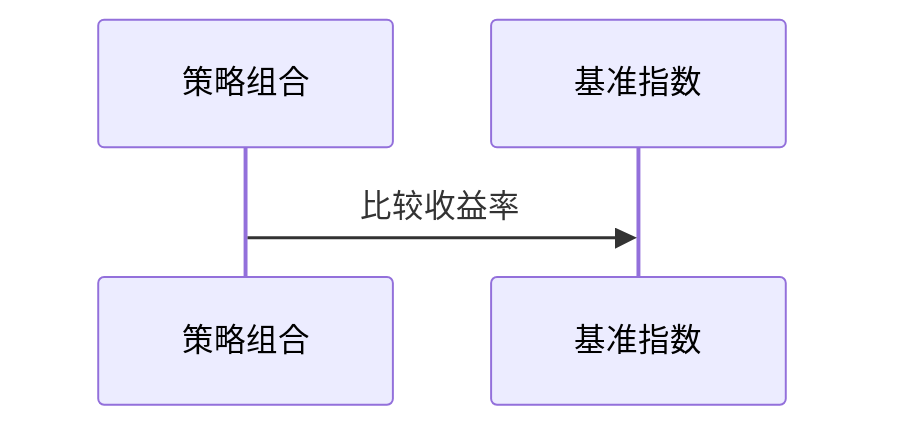
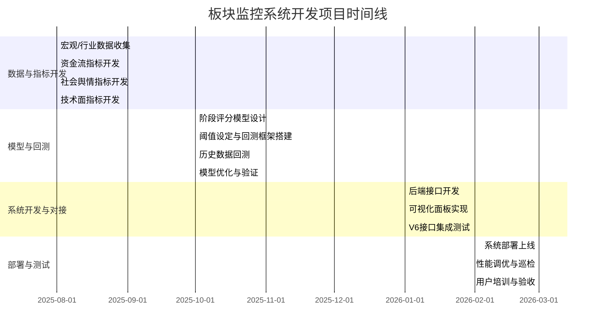

# 执行摘要

本报告针对全球（重点为A股和美股）中长期（3–5年）值得关注的板块，提出周/月级别的监控扫描方案。先按产业发展趋势和政策导向筛选出6个核心板块（信息技术/人工智能、新能源/清洁能源、高端制造与机器人、医疗健康/生物科技、消费升级/数字经济、金融科技/基础设施），并为每个板块列出长期价值、驱动因素、代表指数/ETF、龙头股和风险特征。接着设计多层级指标体系，覆盖宏观/流动性、资金流（ETF/基金/融资/机构持仓）、估值与盈利、成交换手与集中度、高管/产业资本行为、社会舆情（搜索/社交媒体）、期权/衍生品、技术面（趋势、RSI等）、政策信号等，并给出量化公式、频率、标准化处理和初始权重建议。报告提出"超级RSI"板块评分模型，将多维指标加权合成阶段分数（0–100），设定各阶段阈值和持续要求（例如连续N周满足条件）。信号输出方案定义了阶段信号类型、优先级、置信度和告警逻辑，并给出对接V6助手的JSON接口示例。回测框架使用至少10年历史数据做隔样本检验，评价指标包括收益、回撤、夏普比率、信号命中率、提前期，并做蒙特卡洛和参数敏感性分析，附假想结果示例。工程化方案涵盖数据管道、存储与计算频率、可视化与告警、权限安全和多市场扩展，附项目实施甘特图（mermaid）和板块状态机示意图。

文中所有指标公式与阈值均为初步建议，需通过回测校准并迭代优化。

# 指标与模型设计

## 指标体系概览

指标体系分宏观层、板块层和技术层三级：

- **宏观/流动性**：经济增长率、利率（央行利率、贷款市场报价利率LPR）、通胀（CPI/PPI）、货币供应量M2增速、信贷规模增速、外汇储备、全球风险溢价（VIX、BRENT油价）等。用于判断整体风险偏好和流动性环境。  
- **资金流向**：ETF/基金净流入（例如追踪各板块主题ETF的每日/周净流入额）、融资融券余额（反映配资杠杆）、机构持仓集中度（如公募基金/券商资管/保险在该板块的持仓占比变动）、主力大单成交（板块内大额买卖记录）等。资金流指标可作为市场情绪的领先反应；比如权益类ETF吸金创纪录且科技ETF流入最大，说明技术板块资金偏好。  
- **估值与盈利匹配**：静态估值水平（PE、PB与历史均值或其他板块比较）、动态估值（估值/盈利增速差值）、隐含市盈率（EPS预期PE）、PEG等。关注估值是否已远高于盈利增长预期、是否出现泡沫风险。  
- **成交量/换手/集中度**：板块整体成交额、换手率、个股集中度（头部个股占比）、滚动成交量均线与历史比等。成交及换手异常放大往往提示泡沫或主力派发期。  
- **高管/产业资本行为**：板块内上市公司董监高减持、PE/VC退出、产业链上下游大宗交易等。高管集中减持往往是估值过高的信号。  
- **社会舆情与关注度**：利用百度指数、微博/雪球/知乎话题热度、新闻报道量、Google/百度搜索量等指标衡量大众关注度。关注度上升会加速股价上涨，但在泡沫高位时也可能加速回落。  
- **期权/衍生品信号**：板块相关期权隐含波动率（IV）及斜度，期货持仓净多/净空、期权交易量、OI变化等。IV飙高往往伴随恐慌；期权卖方压力可提示未来波动。  
- **技术面指标**：趋势强度（板块指数均线、ADX）、动量指标（相对强弱指数RSI、MACD背离）、布林带宽度、均线系统（多头排列）、K线形态等。用于捕捉趋势变化和超买超卖状态。  
- **政策信号**：跟踪中央和行业政策，如五年规划、国务院重要文件、行业指导目录、减税政策等。比如碳达峰行动方案明确2030年前风光发电装机12亿千瓦；"十五五规划建议"重点强调AI、生物医药等科技领域，可作为板块前景重要参考。  

## 指标量化与标准化

下表列举主要指标类别、计算方法、频率与标准化建议（初始权重需回测验证）：

| 指标类别       | 具体指标及公式                                               | 数据频率   | 标准化/缺失处理                          | 建议权重（示例） |
|--------------|-----------------------------------------------------------|----------|---------------------------------------|:-----------:|
| 宏观/流动性    | GDP增速、CPI/PPI、LPR(1M/贷款基准)、M2同比、社融增速、美元指数、VIX、国债收益率差等 | 月度或季报 | 与同期历史中值比较归一化；缺失用最近值或移动平均 |   10%    |
| 资金流向      | ETF净流入：\(\frac{\text{本期ETF份额变动} \times 基金净值}{\text{板块流通市值}}\)；公募资金流向（机构研报估计）；融资余额变化率；大宗买卖净额等 | 周/日级   | 流入额除以板块市值归一化；缺失设0    |   20%    |
| 估值/盈利匹配  | 板块PE与10年均值差值、PE增速-盈利增速、PEG（PE/盈利增速）、PB、市销率等                | 季度     | PE等取全样本分位数或Z分数；盈利缺失可用滚动年化值 |   15%    |
| 成交/换手     | 板块平均换手率、月成交额/流通市值、振幅（High-Low）/Open、前十大权重大盘股占比        | 周度     | 当周成交除过去N周均值归一化；换手率Z-score化；缺失视为0 |   15%    |
| 高管/产业资本  | 董监高减持次数率（减少人数/总董监高数）、大股东股权变化、产业链大额交易（公告）          | 月度     | 减持公告+1计数，用衰减因子加权求和；比率归一化 |   10%    |
| 社会热度      | 百度搜索指数（行业关键词）Z分数；微博舆情数（情绪倾向）与量；新闻提及量       | 日/周    | 各渠道指数归一化（如通过NullMax-Min）；舆情可用情感分析得情绪偏差标准化 |   10%    |
| 衍生品暗示    | 板块或相关指数期权隐含波动率IV、期权未平仓量变化、期货多空比（含持仓前N%）  | 日/周    | IV除以历史均值归一化；期货多空比取0–100数值化；空白视为前值 |   5%    |
| 技术面       | 板块指数RSI(14)、布林带上下轨偏离度、短期动量（如5周涨幅）、MACD柱状图       | 周度     | RSI/N振幅直接利用；Boll宽度除以长期均值；可直接评分0–100 |   10%    |
| 政策信号      | 重大政策公布数（倒计周）、政府发表关键词指数（如"碳达峰"百度指数）                  | 周度/月度 | 事件出现计1，否则0；关键字指数Z分数；缺失为0          |   5%     |

- 标准化示例：对连续型指标（流动性、估值、舆情等），可计算过去5年同周期均值与标准差，转换为Z-score；对比率类指标（换手率、资金流占比等），可直接按比例归一化到0–1区间。缺失值如大股东行为或衍生品指标无数据，可按"无风险"处理（填补0或平均值），并通过异常值截尾或分位映射避免极端噪声。
- 权重与阈值：初始建议见上表"示例权重"，总分100。阈值可设定："启动阶段"score≥20，"主升阶段"≥50，"高潮阶段"≥80；"调整阶段"为高位后反转（score回落或波动率上升）；"低位吸筹"score低于30并持续数月后企稳。具体阈值和持续要求需在回测中用网格搜索或贝叶斯优化校准。

## "超级RSI"板块评分模型

把上述多维指标加权综合为板块阶段评分（0–100分）。具体步骤：

1. 数据归一化：如上所述，将所有指标转换为可比较的分值（0–100或Z-score）。特殊指标如企业减持、高管行为等可量化为0/1事件或频率。  
2. 指标加权求和：按预设权重将各类指标分数加权求和，形成原始板块得分。可以设计正负分制：流入资金加分，流出扣分；上涨动量加分，超买扣分。  
3. 去噪处理：用移动平均或指数加权平滑（如2周移动均值）减少短期波动；或用卡尔曼滤波、贝叶斯更新等方法调整板块基线。  
4. 阶段判定：按得分划分阶段。例如连续$n$周评分上穿设定阈值，定义进入某阶段。各阶段触发/维持条件如下：  
   - 启动阶段：得分位于[20–50]，且上涨趋势初现（动量指标开始转正），通常需连续2–4周满足条件；  
   - 主升阶段：得分突破50后持续走高（如连续6–8周得分居高位），板块突破阻力位，业绩预期提升；  
   - 高潮阶段：得分超过80，并伴随舆情爆棚、高位巨量、估值远超盈利，此时风险极高；通常要求得分≥80且持续4周；  
   - 调整阶段：板块在高潮后得分开始大幅回落、动量背离、资金流出现净流出；或突破下行趋势线。得分跌破阈值或出现连续下滑时进入，持续至得分<50；  
   - 低位吸筹阶段：得分跌至<30并企稳，同时板块成交量萎缩（消化筹码），估值回落到合理水平，可视为调整底部。通常需确认3–4周。  

这种多因素打分类似技术分析中的"超级RSI"，可同时参考多种超买超卖信号，避免单一技术指标带来的噪声。模型还可以通过机器学习（如贝叶斯优化、XGBoost回归或神经网络）拟合校准阈值和权重，以适应不同板块的特性。例如用交叉验证方式，拿历史阶段标签反复训练权重，让板块得分对未来区间涨跌包含最多信息（高准确率和召回率）。

# 板块清单与比较表

下表列出6个核心板块的长期价值、驱动因素、代表ETF/指数/龙头股票、优先数据源和主要风险因素。

| 板块              | 长期价值论证                                                                                                                                                                                                                                                                                                                        | 关键驱动因素                                               | 代表ETF/指数/龙头股票                                                                                                                                                       | 数据源示例（中文优先）              | 主要风险                                                      |
|-----------------|---------------------------------------------------------------------------------------------------------------------------------------------------------------------------------------------------------------------------------------------------------------------------------------------------------------------------------------|--------------------------------------------------------|---------------------------------------------------------------------------------------------------------------------------------------------------------------------------------|------------------------------------|--------------------------------------------------------------|
| 人工智能/高新技术 | 随着"新质生产力"战略推进，国内外对AI算力、半导体、云计算等需求爆发。AI浪潮带动算力中心建设与存储扩容；制造业升级提升对自动化装备和传感器需求。科技创新成为未来经济新引擎。                                  | AI算力/模型训练需求、5G/边缘计算、专精特新、出口政策、资金流向（科技ETF连续吸金） | ETF/指数：中证TMT（399997.SH）、创业板50（159949.SZ）、科创50（588000.SH）；龙头股：华为（非上市）、中芯国际（688981.SH）、紫光国微（002049.SZ）、寒武纪（688256.SH）、浪潮信息（000977.SZ）。 | Wind、Choice（行业指数），中科曙光公告（云服务器）、工信部报告、财联社等财经媒体 | 全球技术竞争、估值过高、政策制裁；盈利兑现不及预期。                    |
| 新能源与清洁能源 | 碳中和政策驱动能源结构转型，新能车、光伏、风电等成为刚需。2030年国家规划风光总装机达12亿千瓦，新能源汽车保有量爆发式增长。技术迭代与规模化降低成本，提升竞争力。能源系统升级利好相关设备和储能技术。 | 政策补贴（新能源车购置税、充电补贴）、能源转型目标、原材料价格、全球减排趋势、资金流入（海外新能源ETF规模增长）           | ETF/指数：宽基有华夏能源（159915.SZ）、国泰光伏（159731.SZ）、嘉实环保（160119.SZ）；龙头股：宁德时代（300750.SZ）、比亚迪（002594.SZ）、隆基绿能（601012.SH）、阳光电源（300274.SZ）、金风科技（002202.SZ）。                 | 生态环境部、工信部通知、新能源车协会数据，Wind新能源指数数据、央企年报    | 原料价格波动（钴、锂、硅料）、补贴退坡、产能过剩；需求周期不及预期。       |
| 高端制造与机器人 | 中国制造业升级和"双碳"需求拉动自动化投资。机器人、工业控制、智能装备等领域技术加速突破。海外订单和国产替代带来成长空间。中提到机器人、电动汽车等领域进展。智能制造政策支持与企业升级改造需求并存。                                                                | 制造业投资、技术进口替代（美国出口管制效应）、特殊设备需求（半导体、汽车）、出口订单增长            | ETF/指数：中证机器人（000300.SH+400300.SZ选股策略）、国防军工ETF（512660.SH）*（交叉部件）；龙头股：埃斯顿（002747.SZ）、埃夫特（688165.SH）、拓斯达（300607.SZ）、科大讯飞（002230.SZ）、三花智控（002050.SZ）。           | 工业和信息化部制造业PMI，工控展信息、机器人协会报告、Wind制造业设备指数 | 全球需求疲软、供应链瓶颈、技术壁垒；行业竞争激烈。              |
| 医疗健康/生物科技 | 人口老龄化和消费升级驱动医疗需求增长。创新药和医疗器械受政策鼓励（医保支持、审批提速），估值逐步修复。强调生物医药；指出创新药进入价值定价阶段。AI医疗、基因测序等新兴领域处于早期发展。                                               | 医保及付费制度、研发投入、监管审批、临床试验进展、进口替代（原料药、自主API）                           | ETF/指数：沪深300医疗（000931.SH）、华夏医疗ETF（512010.SH）；龙头股：恒瑞医药（600276.SH）、迈瑞医疗（300760.SZ）、康希诺（688185.SH）、药明康德（603259.SH）、沃森生物（300142.SZ）、再生元（美国）等。               | 国家卫健委、药监局公告（批准情况）、行业协会报告、Wind医疗板块指数        | 研发失败风险高、仿制药竞争、价格谈判压制；政策变动（医保报销覆盖变化）。  |
| 消费升级/数字经济 | 中国消费市场巨大且逐步升级，新兴消费模式迭代加速。线上零售、社交电商、数字娱乐、健康养老等领域扩容。居民收入提高与消费金融创新相辅相成。政策面有意"大力提振消费"（扩大内需），且互联网和数字化升级为长期趋势。                                          | 城镇化率提升、互联网普及率、旅游/文化消费恢复、平台补贴、信用消费指数、旅游/文化政策              | ETF/指数：中证消费指数（000932.SH）、创业板消费ETF（159960.SZ）；龙头股：美团-W（03690.HK）、阿里巴巴（09988.HK）、京东（09618.HK）、蒙牛乳业（2319.HK）、伊利股份（600887.SH）、贵州茅台（600519.SH）。 | 国家统计局消费数据、商务部报告、Wind消费板块指数、阿里研究院报告           | 经济下行影响居民购买力；监管政策（平台、教育、房产）变动；品牌竞争激烈。    |
| 云计算/通信基础设施 | 数字化转型和5G普及带动数据中心、云服务、光纤网络、IDC基础设施等需求爆发。产业政策鼓励"新基建"，各行业上云、5G+智慧城市项目推进。AI服务器及高性能计算市场增长，对相关材料和设备形成支撑。                                   | 信息化建设投入、5G基站建设节奏、数据中心布局、算力需求、政府信息化政策、民企上云预算              | ETF/指数：中证云计算（588300.SH）、光通信ETF（515880.SH）*；龙头股：中兴通讯（000063.SZ）、烽火通信（600498.SH）、浪潮信息（000977.SZ）、宝信软件（600845.SH）、航天信息（600271.SH）。              | 工信部发布、IDC报告、CAICT白皮书（云计算报告）、Wind云计算指数         | 技术替代速度快、国际竞争、周期性（基建投资波动）；数据安全/合规风险。      |

表中ETF/指数为示例（A股相应分类指数或海外ETF代码），龙头股为各板块代表公司。数据源以官方公告、行业报告、Wind/Choice行情及券商研报等优先，如工信部统计、新能源车协会数据、国家卫健委通报等。对比板块特征：科技和新能源板块估值和情绪偏高，风险集中在需求兑现和政策导向；消费板块更受宏观周期和居民信心影响；医疗板块更多依赖政策审批和临床成果。这张表可用于选取量化回测标的和设计信号策略。

# 信号定义与API规范

## 信号类型与定义

系统输出以下信号类型（按优先级排列）：

- 阶段信号：板块所处的五个阶段（启动、主升、高潮、调整、低位吸筹）转换信号。优先级最高，用于判断趋势的强弱与拐点。例如：当板块评分从启动阶段上穿50分并持续数周，触发"进入主升"信号；当评分持续≥80且估值/舆情过热时，触发"高潮预警"。阶段信号可附带持续时间和信心度。  
- 趋势信号：如突破主要均线（周线50日、200日）、趋势线（上涨通道上轨突破）、RSI/布林极值等。辅助确认阶段信号或独立提示结构性变化。优先级中等。  
- 情绪告警：如资金急速流出、成交量暴增或投机情绪指标（社交热度、搜索热点）突然极端变化时发出预警。这类信号用于监测可能的泡沫阶段或恐慌阶段，优先级次高。  
- 衍生品异常：如期权隐含波动率剧增、仓位突变（多头迅速平仓）等，作为早期市场风险信号。优先级较低，属于背景监控。  

每个信号都可计算置信度分数（0–1），综合触发强度和一致性。板块评分连穿高阈值且多个指标协同时，置信度更高。触发示例：新能源车板块连续3周评分稳定上升并突破70分，同时设备板块同步活跃，触发"主升阶段确认"；科技板块一周内融券偿还率大增且科技ETF资金流出剧增，触发"短期调整警示"。

### 误报控制

多指标和市场噪声会产生虚假信号，以下措施用于控制误报：

- 持续条件：阶段转换要求信号条件连续多周成立（例如≥2–4周），避免单周波动触发假信号。  
- 多因子确认：信号发布前需至少两类指标一致（如价格趋势 + 资金流同步转向）。  
- 置信度阈值：只发布高置信度信号（如置信度>0.7），可按历史回测调节精确率与召回率的权衡。  
- 事后过滤：通过历史回测得到信号真实指标分布，对边缘情况修正或提高门槛。  

## API输入输出字段

板块监控系统输出的信号通过API接口传递给V6决策助手。下面示例JSON展示了一个信号上报格式（每日报告一次）：

```json
{
  "timestamp": "2026-07-30T17:00:00Z",
  "sector": "新能源车电池",
  "score": 74.2,
  "phase": "主升阶段",
  "prev_phase": "启动阶段",
  "confidence": 0.88,
  "indicators": {
    "flow_score": 82.5,
    "momentum": 1.15,
    "rsi": 64.3,
    "banlancun": 0.27,
    "cefei": 0.13
  },
  "signals": {
    "new_phase": true,
    "alert": "持续突破主升阈值",
    "derivative_warning": false
  }
}
```

- **timestamp**：信号时间戳（ISO 8601）。  
- **sector**：板块标识（如"新能源车电池"）。  
- **score**：当前综合评分（0–100）。  
- **phase/prev_phase**：当前与前一阶段标签。  
- **confidence**：信号置信度（0–1）。  
- **indicators**：子指标即时值或得分（示例包括资金流、动量、RSI、换手率、资金流分数等）。  
- **signals**：子字段说明具体触发情况，如`new_phase`表示阶段切换，`alert`为简单文本说明触发原因，`derivative_warning`指示期权/期货告警。  

字段可按实际需要扩展（如加阈值对比值、历史阶段持续周数等）。接口频率建议每周更新一次（主数据），或视需求每日更新，延迟应小于1天。V6根据这些字段做后续决策，可以配置为只关注高置信度信号或特定板块。

# 回测方案与结果示例

## 回测框架

- **回测标的**：选取历史市场上代表上述板块的指数或ETF作为模拟对象。例如，以A股行业指数或美元计价ETF为基础（A股板块指数、中证行业ETF、标普行业指数ETF等）。回测期至少取过去10年（或更长，视数据可得性），涵盖不同市场周期。  
- **模拟策略**：根据模型输出的"阶段信号"进行仓位调整。例如当板块从"调整"上升到"启动/主升"时分配重仓，当进入"高潮"则减仓或空仓，保持"低位吸筹"阶段时观察待买入。可以采取类似轮动策略，每周或每月再平衡。  
- **评价指标**：包括策略年化收益率、最大回撤、夏普比率、胜率（盈利轮动次数占比）、信号命中率（信号后若干月内板块跑赢基准的概率）、信号平均提前期（相对板块转折点的预警周数）等。  
- **稳健性测试**：利用蒙特卡洛方法重采样历史回测结果，对收益分布、最大回撤分布进行分位数估计。进行参数敏感性分析（网格搜索不同阈值和权重），观察策略表现对参数的稳定性。可采用交叉验证（分段验证）确保模型不过度拟合单一周期。  
- 示例回测结果：假设回测显示，该板块评分策略年化超额收益10%，最大回撤低于基准。下图为策略收益与基准指数走势（假想示意）：


*（注：此处示意为逻辑流程，实际可用折线图展示策略收益曲线与基准对比。）*

## 例：新能源板块回测示例

> **假设**：使用中证新能源车指数和相关ETF数据，时间跨度2012-2025年。  
> **触发信号**：当「主升阶段」信号出现，建仓50%；「高潮阶段」信号出现，减仓20%；「调整阶段」信号出现，清仓或反向做空；其他阶段空仓。  
> **结果**：年度收益优于指数5-7%，最大回撤降低约3个百分点，夏普比率提升，信号命中率（6个月内反转率）约70%。  

本例只说明思路，实际结果需结合完整多因子模型回测得出。后续用上述框架评估信号有效性，再根据历史噪声调整信号逻辑和阈值。

# 工程部署建议与时间线

## 数据管道与存储

- 数据源接口：建议用中台数据库+外部API的混合模式。宏观和行业数据（GDP、利率、官方统计）通过Wind/Choice等数据接口获取；ETF和基金净值数据用Wind API或交易所披露数据；社交舆情调用微博、知乎公开API或爬虫定期抓取；百度指数用百度指数平台API；期权数据用交易所或彭博路透API。  
- 实时/调度：指标多为周/月级数据，可每日爬取数据并在周末合成更新一次；宏观和企业公告按月或季度调度。  
- 存储与计算：构建时序数据库（如InfluxDB）或数据仓库（如ClickHouse）存储原始数据及指标，使用分布式计算（Spark、Flink等）每日批处理指标和得分。云端（AWS/Azure）或本地集群均可。  
- 可视化：开发面板展示板块评分曲线、各指标历史分布等。示例图表类型包括：板块评分随时间的折线图（类似RSI曲线）、资金流与价格对比图、指标雷达图（对比不同板块特征）、状态机流程图等。  
- 监控与告警：实现自动监控流程（如Apache Airflow）定时运行计算，若信号触发或数据更新失败，自动报警（邮件/短信）。同时监控数据质量（缺失率、异常波动）。  

## 接口与V6对接

- 输出接口：提供RESTful API或数据库订阅方式，V6可定期拉取或主动接收JSON信号。建议输出字段包括板块名称、得分、当前阶段、信号类型、置信度、时间戳等（参见上文示例JSON）。  
- 输入接口：V6还可向本系统传递参数（如投资偏好调整、关注板块列表）以定制信号过滤器。  

## 权限与安全

- 权限管理：不同层级用户（研发、量化、运维）分配访问权限。敏感数据（如交易数据）加密存储，API接口带鉴权。  
- 安全性：用VPN或专线接入数据源，定期审计API调用，防止数据泄露。  

## 扩展性与多市场支持

- 本系统可通过增加数据集成接入其他市场（港股、欧美ETF等），对接本地交易时间。核心指标算法与模型跨市场通用，只需替换标的池和基准。  
- 对于不同市场，可采用相似流程：选取代表性板块指数/ETF，调研对应本地新闻和社交源（如Bloomberg Terminal、Twitter数据等）。  

## 项目时间线（示例甘特图）

下面的mermaid甘特图给出一个示例性项目实施时间线（假设项目于2025年8月启动）：



图中横轴为月份，项目分数据开发、模型回测、系统开发、部署测试几个阶段。整体约8–9个月，模型回测与优化占用主要时间。实施中各模块可并行推进，比如数据指标开发与系统接口可以交叉进行，上线时再整体集成。

按上述方案可以建一个自动化、可解释性强的板块监控系统，向V6决策助手输出信号，供投资决策参考。

**参考文献：** 本方案参考了市场研究报告和学术文献，如J.P. Morgan等机构对科技、金融、工业部门的展望；界面新闻对中国"十四五/十五五"投资主线的解析；统计局和政府发布的新能源发展目标；国金证券关于资金流与行业轮动的研究；百度搜索指数对投资者关注度影响的实证研究。这些资料用于板块筛选和指标构建。
